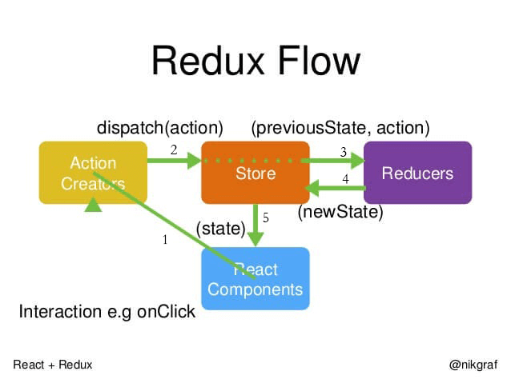

# 十、React
## 1、生命周期（16.8之前hooks）
- componentWillMount：在创建组件之后但在将其渲染到DOM中之前调用
- componentDidMount：在第一个渲染之后调用；组件的DOM元素现在可用
- componentWillReceiveProps：当属性更新时调用
- shouldComponentUpdate：当收到新props时，此方法可以防止重新渲染以优化性能
- componentWillUpdate：在收到新的props并且ComponentUpdate返回true时调用
- componentDidUpdate：在组件更新后调用
- componentWillUnmount：在组件从DOM中移除之前调用，允许您清理事件侦听器之类
的内容
  

## 2、声明式编程、命令式编程、 函数式编程
声明式编程的编写方式描述了应该做什么，而命令式编程描述了如何做。在声明式编程中，让编译器决定如何做事情。声明性程序很容易推理，因为代码本身描述了它在做什么。

函数式编程是声明式编程的一部分。javascript中的函数是第一类公民，这意味着函数是数据，你可以像保存变量一样在应用程序中保存、检索和传递这些函数。

## 3、函数式编程的好处是什么？
1 函数式编程让我们的代码更清晰，每个功能都是一个函数。
2 函数是数据，你可以像保存变量一样在应用程序中保存、检索和传递这些函数。
3 函数式编程为我们的代码测试代理了极大的方便，更容易实现前端自动化测试。 


## 4、JS? diff算法?
JSX是javascript的语法扩展。它就像一个拥有javascript全部功能的模板语言。它生成React元素，这些元素将在DOM中呈现。React建议在组件使用JSX。在JSX中，我们结合了javascript和HTML，并生成了可以在DOM中呈现的react元素。

把树形结构按照层级分解，只比较同级元素。
给列表结构的每个单元添加唯一的key属性，方便比较。

## 5、如何提高性能
 - 适当地使用shouldComponentUpdate生命周期方法。 它避免了子组件的不必要的渲染。 如果树中有100个组件，则不重新渲染整个组件树来提高应用程序性能
 - 使用create-react-app来构建项目，这会创建整个项目结构，并进行大量优化
 - 不可变性是提高性能的关键。不要对数据进行修改，而是始终在现有集合的基础上创建新的集合，以保持尽可能少的复制，从而提高性能
 - 在显示列表或表格时始终使用 Keys，这会让 React 的更新速度更快
 - 代码分离是将代码插入到单独的文件中，只加载模块或部分所需的文件的技术


## 6、Immutable.js
 ```js
Immutable数据就是一旦创建，就不能更改的数据。
每当对Immutable对象进行修改的时候，就会返回一个新的Immutable对象，以此来保证数据的不可变

import { fromJS } from "immutable"
fromJS将一个js数据转换为Immutable类型的数据
const dafaultState = fromJS({
    focused: false,
    mouseIn: false,
    list:[],
    page:1,
    totalPage:1,
});

 ```
 ## 7、redux工作流程

 

 ### （React）setState为什么异步？能不能同步？什么时候异步？什么时候同步？
- setState 只在合成事件和钩子函数中是“异步”的，在原生事件和 setTimeout 中都是同步的。

- 合成事件：就是react 在组件中的onClick等都是属于它自定义的合成事件

- 原生事件：比如通过addeventListener添加的，dom中的原生事件

### 8、Redux-thunk
使用了redux-thunk后，store中reducer就不仅仅接受一个action对象了，它可以接受一个函数了

简单的action作为函数，在action进行异步操作，发出新的action。

```js
//actionCreators
//普通action
export const getInitListData = (value) => ({
  type: INIT_LIST_DATA,
  value
})
// 函数
export const getTodoList = () => {
  return (dispatch) => {
    axios
      .get('/api/list.json')
      .then((res) => {
        const list = res.data;
        const action = getInitListData(list);
        dispatch(action);
      })
  }
}
```


## 9、Redux-saga
Redux-saga是一个用于管理 Redux 应用异步操作的中间件
本质都是为了解决异步action的问题

## 10、vue和React异同
- react与Vue只有框架的骨架，其他的功能如路由、状态管理等是框架分离的组件
- 都使用虚拟dom
- React与Vue都鼓励组件化应用

- 1.react是类式的写法;vue是声明式的写法
- 2.react通过js来操作一切jsx语法
- 3.react数据是不是可变的;vue的思想是响应式的，也就是基于是数据可变


react整体的思路就是函数式，所以推崇纯组件，数据不可变，单向数据流，而vue是基于可变数据的，支持双向绑定。
react组件的扩展一般是通过高阶组件，而vue组件会使用mixin。
vue内置了很多功能，而react做的很少，很多都是由社区来完成的。
vue追求的是开发的简单，而react更在乎方式是否正确


## 11、Why Hook?
### 优点
- 不需要基于类的组件、生命周期钩子和 this 关键字
- 通过将公共函数抽象到定制钩子中，使重用逻辑变得更容易
- 通过能够将逻辑与组件本身分离出来，使代码更具可读性和可测试性

### Class Component的问题
- 组件复用困局
- Javascript Class的缺陷
- Function Component缺失的功能
  - Function Component是纯函数，利于组件复用和测试
  - Function Component的问题是只是单纯地接收props、绑定事件、返回jsx，本身是无状态的组件，依赖props传入的handle来响应数据（状态）的变更，所以Function Component不能脱离Class Comnent来存在
  - 所以，Function Comonent是否能脱离Class Component独立存在，关键在于让Function Comonent自身具备状态处理能力，即在组件首次render之后，“组件自身能够通过某种机制再触发状态的变更并且引起re-render”，而这种“机制”就是Hooks！ 

 ## 12、React diff 原理
  - 把树形结构按照层级分解，只比较同级元素。
- 列表结构的每个单元添加唯一的 key 属性，方便比较。
- React 只会匹配相同 class 的 component（这里面的 class 指的是组件的名字）
- 合并操作，调用 component 的 setState 方法的时候, React 将其标记为 dirty 到每一个事件循环结束, React 检查所有标记 dirty 的 component 重新绘制.
- 选择性子树渲染。开发人员可以重写 shouldComponentUpdate 提高 diff 的性能
