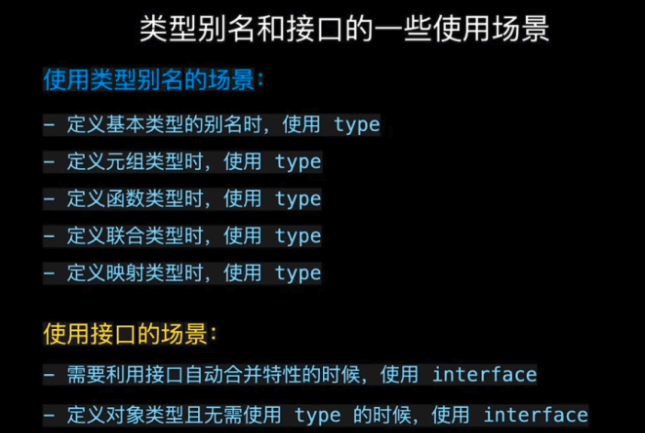

# 十一、TypeScript

## 1、特点

- 静态类型检查：TypeScript 使用静态类型并帮助在编译时进行类型检查。因此，在编写代码时发现编译时错
- 提高可维护性
- 提高协同开发的效率
- 支持强类型、接口、泛型、模块


## 2、手写体：使用TypeScript 实现一个 get 函数来获取它的属性值
```js
const data = { name: 'tom', age: 18, address: 'xxx' }
```

```js
const get = <T extends object, K extends keyof T>(obj: T, key: K): T[K] => {
  return obj[key]
}
```

## 3、any 、 unknown 的区别？
- any：变量如果是 any 类型，绕过所有类型检查，直接可使用
- unknown：变量如果是 unknow 类型，需要判断完是什么类型之后才能使用

## 4、keyof？
将一个interface的所有key，汇聚成一个联合类型，可以用来对传入key的限制，比如：
```js
interface Target {
  name: string,
  age: number
}

const fn = (obj: Target, key: keyof Target) => {}

const obj: Target = { name: 'sunshine', age: 18 }

fn(obj, name) // 成功
fn(obj, age) // 成功
fn(obj, height) // 报错
```

## 5、type 和 interface 区别？

### 一、相同点
#### 1.都可以声明对象、函数
```js
// 类型别名 type
type Point = { x: number, y: number };
type SetPoint = ( x: number, y: number ) => void;

// 接口 interface
interface Point { x: number, y: number };
interface SetPoint {
  ( x: number, y: number ): void;
} 
```

#### 2.都支持拓展 
```js
// 类型别名 type -> 通过交叉运算符 & 拓展
type T1 = { name: string };
type T2 = T1 & { honey: boolean };
const t: T2 = getBear();
t.name;
t.honey;

// 接口 interface -> 通过 extends 拓展
interface I1 { name: string };
interface I2 extends I1 {
  honey: boolean;
}

// 接口 interface 通过 extends 拓展类型别名 type
interface I2 extends T1 {
  honey: boolean;
}

// 类型别名通过交叉运算符 & 拓展接口 interface
type T2 = I1 & { honey: boolean };
```

### 二.不同点
#### 1.类型别名 type 用于声明基本类型、联合类型、元组类型，而接口 interface 不行
```js
type T1 = number;
type T2 = string | number;
type T3 = [number, number];
```

#### 2.同名接口 interface 会自动合并，而类型别名 type 不会 
```js
// 同名接口合并
interface User { name: string };
interface User { age: number };

let user: User = { name: 'leo', age: 18 };
user.name; // 'leo'
user.age;  // 18

// 同名类型别名会冲突
type User = { name: string };
type User = { age : number };
```

### 3.使用场景



## 6、修饰符public, private, protected，static，abstract
- public：在类的内部和外部都可以访问，可以继承、实例化
- private：私有属性只能在基类中访问，不能在实例、派生类中访问
- protected：受保护的，可以被继承，在派生类中可以访问，子类、父类都不能实例访问
- static 只能通过基类、子类访问，实例不能访问
- abstract 抽象类中的抽象方法不包含具体实现并且必须在派生类中实现

## 7、泛型

> 泛型（Generics）是指在定义函数、接口或类的时候，不预先指定具体的类型，而在使用的时候再指定类型的一种特性。

简单来说泛型就是解决类，接口，方法的复用性（传入什么类型就返回什么类型），以及对不特定数据类型的支持
### 泛型函数
```js
function createArray2 <T> (value: T, count: number) {
  const arr: Array<T> = []
  for (let index = 0; index < count; index++) {
    arr.push(value)
  }
  return arr
}
const arr3 = createArray2<number>(11, 3)
console.log(arr3[0].toFixed())
// console.log(arr3[0].split('')) // error
const arr4 = createArray2<string>('aa', 3)
console.log(arr4[0].split(''))
// console.log(arr4[0].toFixed()) // error
```
### 泛型类
在定义类时, 为类中的属性或方法定义泛型类型 在创建类的实例时, 再指定特定的泛型类型
```js
class GenericNumber<T> {
  zeroValue: T
  add: (x: T, y: T) => T
}

let myGenericNumber = new GenericNumber<number>()
myGenericNumber.zeroValue = 0
myGenericNumber.add = function(x, y) {
  return x + y 
}

let myGenericString = new GenericNumber<string>()
myGenericString.zeroValue = 'abc'
myGenericString.add = function(x, y) { 
  return x + y
}

console.log(myGenericString.add(myGenericString.zeroValue, 'test'))
console.log(myGenericNumber.add(myGenericNumber.zeroValue, 12))
```

### 泛型接口

在定义接口时, 为接口中的属性或方法定义泛型类型
在使用接口时, 再指定具体的泛型类型
```js
interface IbaseCRUD <T> {
  data: T[]
  add: (t: T) => void
  getById: (id: number) => T
}

class User {
  id?: number; //id主键自增
  name: string; //姓名
  age: number; //年龄

  constructor (name, age) {
    this.name = name
    this.age = age
  }
}

class UserCRUD implements IbaseCRUD <User> {
  data: User[] = []
  
  add(user: User): void {
    user = {...user, id: Date.now()}
    this.data.push(user)
    console.log('保存user', user.id)
  }

  getById(id: number): User {
    return this.data.find(item => item.id===id)
  }
}


const userCRUD = new UserCRUD()
userCRUD.add(new User('tom', 12))
userCRUD.add(new User('tom2', 13))
console.log(userCRUD.data)
```

### 泛型约束
如果我们直接对一个泛型参数取 length 属性, 会报错, 因为这个泛型根本就不知道它有这个属性
```js
// 没有泛型约束
function fn <T>(x: T): void {
  // console.log(x.length)  // error
}
```

我们可以使用泛型约束来实现
```js
interface Lengthwise {
  length: number;
}

// 指定泛型约束
function fn2 <T extends Lengthwise>(x: T): void {
  console.log(x.length)
}
```

我们需要传入符合约束类型的值，必须包含必须 length 属性
```js
fn2('abc')
// fn2(123) // error  number没有length属性
```
#### keyof
同样的，我们有时候会访问一些自定义的属性，就像下面的代码

```js
function getProprty<T, K> (obj: T, key: K) {
    return obj[key]
}
const people = { name: 'xiaozhanng', age: 16 }
getProprty(people, 'name')
```
我们代码的意图是，通过传入一个泛型的对象，或者什么其他的变量，然后再传入另外一个泛型的变量，找到obj下面的key属性。
这个时候就你的编辑器就会报这样的错
> 类型“K”无法用于索引类型“T”。

意思是，我们传入的泛型key变量，不一定是存在于泛型obj中的属性。这样就会让代码不够严谨，为解决这一问题，我们可以使用keyof，他可以拿到一个类型下所有的属性，就像这样


按照这个思路，我们就可以利用泛型约束，对上面的代码做修改
```js
function getProprty<T, K extends keyof T> (obj: T, key: K) {
    return obj[key]
}
const people = { name: 'xiaozhanng', age: 16 }
getProprty(people, 'name')
// keyof 获取对象的所有属性

```

## 8、常用内置工具类型

#### 1.Partial
把已有的类型属性,变成一个新类型的可选属性
```js
interface Props{
    id:number,
    name:string
}
// 语法 : type 新类型 = partial<老类型>
type PartialProps = Partial<Props>

// 使用后 PartialProps里的所有属性都变成可选 即
type PartialProps = {
    id?: number | undefined;
    name?: string | undefined;
}
```


#### 2.Readonly
把已有类型全部转换为只读类型
```js
interface Props{
    id:number,
    name:string
}
 type ReadonlyProps = Readonly<Props>
 let props : ReadonlyProps = {id:1,name:'xxx'}
//  props.name='w3f'  这句话 此时会报错

// 使用Readonly后，对象里面的属性只可读，不可以改变。此时ReadonlyProps为
type ReadonlyProps = {
    readonly id: number;
    readonly name: string;
}

```

#### 3.Pick
从已有类型中选一些属性来构造新的类型
```js
//两个变量表示：1）表示谁的属性 2）表示选择哪一个属性，此属性只能是前面第一个变量传入的类型变量中的属性
 interface Props2{
    id:number,
    name:string,
    age:number
}

// 语法 : type 新类型 = partial<老类型,属性|属性2>
type PickProps = Pick<Props2,'id'|'age'>  //构造出来的新类型PickProps 只有id age两个属性类型

// 表示在旧的类型中选择一部分属性，讲选择的属性来重新构造成一个新的类型。此时PickProps为：
type PickProps = {
    id: number;
    age: number;
}
```

#### 4.Record<keys,type> 构造一个对象类型，属性键为keys,属性类型为type
```js
  //两个变量表示：1）表示对象有哪些属性 2）表示对象属性的类型
  type RecordObj = Record<'a'|'b'|'c',string>  //此处表示 此类型变量有a b c三个键，并且三个的属性值都是string类型
  let obj :RecordObj = {
    a:'1',
    b:'2',
    c:'3'
  }
  
type RecordObj = {
    a: string;
    b: string;
    c: string;
}
```