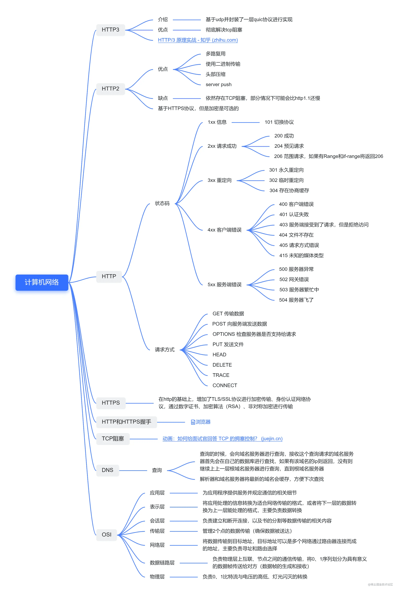

# HTTP

- TCP协议（传输控制协议）:应用程序之间的通信
- IP协议（网际协议）:计算机之间的通信
- HTTP协议（HyperText Transfer Protocol，超文本传输协议）是用于从服务器传输超文本到本地浏览器的传输协议。

HTTPS主要作用是：
对数据进行加密，并建立一个信息安全通道，来保证传输过程中的数据安全
对网站服务器进行真实身份认证

### 1、HTTP 与 HTTPS 的区别 

- HTTP 是明文传输，HTTPS 通过 **TLS/SSL协议** 进行了加密
- HTTP 的端口号是 80，HTTPS 是 443
- HTTPS 需要到 CA 申请证书，一般免费证书很少，需要交费
- HTTP 的连接很简单，是无状态的；HTTPS 协议是由 SSL+HTTP 协议构建的可进行加密传输、身份认证的网络协议，比 HTTP 协议安全。

#### 为什么HTTPS安全？特点？
基于HTTP协议，通过SSL或TLS提供加密处理数据、验证对方身份以及数据完整性保护
- 内容加密:混合加密-对称加密与非对称加密;
> **混合加密**结合非对称加密和对称加密技术。客户端使用**对称加密**生成密钥对传输数据进行加密，然后使用**非对称加密**的公钥再对秘钥进行加密，所以网络上传输的数据是被秘钥加密的密文和用公钥加密后的秘密秘钥，因此即使被黑客截取，由于没有私钥，无法获取到加密明文的秘钥，便无法获取到明文数据.
- 验证身份:CA数字证书;
- 保护数据完整性:加钥算法md5防止传输的内容被中间人冒充或者篡改;

#### HTTP2
- 1.多路复用（TCP连接的多路复用）
  在一个连接里，**客户端和浏览器都可以同时发送多个请求或回应**，而且不用按照顺序一一对应，这样就避免了”队头堵塞”
  > HTTP 1.1 中 浏览器请求 url -> 解析域名 -> 建立 HTTP 连接 -> 服务器处理文件 -> 返回数据 -> 浏览器解析、渲染文件，每次请求都需要建立一次 HTTP 连接，3次握手4次挥手，耗时长，TTP 1.1提供了Keep-Alive，允许我们建立一次 HTTP 连接，来返回多次请求数据
  问题：
   - HTTP 1.1 基于串行文件传输数据，因此这些请求必须是有序的，所以实际上我们只是节省了建立连接的时间，而获取数据的时间并没有减少
   - 最大并发数问题，假设我们在 Apache 中设置了最大并发数 300，而因为浏览器本身的限制，最大请求数为 6，那么服务器能承载的最高并发数是 50

   >1.HTTP/2 引入二进制数据帧和流的概念，其中帧对数据进行顺序标识，这样浏览器收到数据之后，就可以按照序列对数据进行合并，而不会出现合并后数据错乱的情况。同样是因为有了序列，服务器就可以并行的传输数据。2.HTTP/2 对同一域名下所有请求都是基于流，也就是说同一域名不管访问多少文件，也只建立一路连接。同样Apache的最大连接数为300，因为有了这个新特性，最大的并发就可以提升到300，比原来提升了6倍;

- 2.请求头压缩：
  HTTP2.0使用encoder来减少需要传输的header大小，通讯双方各自cache一份header fields表，既避免了重复header的传输，又减小了需要传输的大小
- 3.二进制传输 ：
  HTTP1.x的解析是基于文本。基于文本协议的格式解析存在天然缺陷，文本的表现形式有多样性，要做到健壮性考虑的场景必然很多，二进制则不同，只认0和1的组合。基于这种考虑HTTP2.0的协议解析决定采用二进制格式，实现方便且健壮
- 4.服务端推送（server push）：
  服务端可以在客户端某个请求后，主动推送其他资源

#### HTTP3
- 虽然 HTTP/2 解决了很多之前旧版本的问题，但是它还是存在一个巨大的问题，虽然这个问题并不是它本身造成的，而是底层支撑的 TCP 协议的问题。
- 因为 HTTP/2 使用了多路复用，一般来说同一域名下只需要使用一个 TCP 连接。当这个连接中出现了丢包的情况，那就会导致 HTTP/2 的表现情况反倒不如 HTTP/1 了。
- 因为在出现丢包的情况下，整个 TCP 都要开始等待重传，也就导致了后面的所有数据都被阻塞了。但是对于 HTTP/1 来说，可以开启多个 TCP 连接，出现这种情况反到只会影响其中一个连接，剩余的 TCP 连接还可以正常传输数据。
那么可能就会有人考虑到去修改 TCP 协议，其实这已经是一件不可能完成的任务了。因为 TCP 存在的时间实在太长，已经充斥在各种设备中，并且这个协议是由操作系统实现的，更新起来不大现实。
- 基于这个原因，Google 就更起炉灶搞了一个基于 UDP 协议的 QUIC 协议，并且使用在了 HTTP/3 上，当然 HTTP/3 之前名为 HTTP-over-QUIC，从这个名字中我们也可以发现，HTTP/3 最大的改造就是使用了 QUIC，接下来我们就来学习关于这个协议的内容

### 2、三次握手
- 第一次握手：客户端给服务器发送一个 SYN 报文。
- 第二次握手：服务器收到 SYN 报文之后，会应答一个 SYN+ACK 报文。
- 第三次握手：客户端收到 SYN+ACK 报文之后，会回应一个 ACK 报文。

### 3、四次挥手
- 第一次挥手：客户端发送一个 FIN 报文，报文中会指定一个序列号。此时客户端处于FIN_WAIT1状态。
- 服务端收到 FIN 之后，会发送 ACK 报文，且把客户端的序列号值 + 1 作为 ACK 报文的序列号值，表明已经收到客户端的报文了，此时服务端处于 CLOSE_WAIT状态。
- 第三次挥手：如果服务端也想断开连接了，和客户端的第一次挥手一样，发给 FIN 报文，且指定一个序列号。此时服务端处于 LAST_ACK 的状态
- 第四次挥手：客户端收到 FIN 之后，一样发送一个 ACK 报文作为应答，且把服务端的序列号值 + 1 作为自己 ACK 报文的序列号值，此时客户端处于 TIME_WAIT 状态。需要过一阵子以确保服务端收到自己的 ACK 报文之后才会进入 CLOSED 状态
- 服务端收到 ACK 报文之后，就处于关闭连接了，处于 CLOSED 状态

### 4、从输入URL到看到页面发生的全过程
三个进程负责:主进程、渲染进程、网络进程；

- 1.浏览器输入URL
- 2.浏览器查找当前URL是否存在缓存，并比较缓存是否过期
- 3.DNS域名解析:解析出IP地址后，根据IP地址和默认80端口，和服务器建立TCP连接
- 4.根据IP建立TCP连接（三次握手）
- 5.HTTP发起请求：浏览器发起读取文件的HTTP请求，该请求报文作为TCP三次握手的第三次数据发送给服务器
- 6.服务器处理请求，浏览器接收HTTP响应
- 7.浏览器渲染页面：客户端（浏览器）解析HTML内容并渲染出来。
- 8.关闭TCP连接：通过四次挥手释放TCP连接）

- 浏览器接收到数据包后的解析流程为：
  - 1.构建DOM树：解析HTML，构建DOM树
  - 2.构建CSS规则树：解析CSS，生成CSS规则树
  - 3.构建render树：合并DOM树和CSS规则，生成render树（render tree）
  - 4.布局（Layout）：布局render树（Layout/reflow），负责各元素尺寸、位置的计算
  - 5.绘制（Painting）：即遍历render树，绘制页面像素信息 
  - 6.浏览器会将各层的信息发送给GPU，GPU会将各层合成（composite），显示在屏幕上

- reflow：也称作layout，中文叫回流，一般意味着元素的内容、结构、位置或尺寸发生了变化，需要重新计算样式和渲染树，这个过程称为reflow。
- repaint：中文重绘，意味着元素发生的改变只是影响了元素的一些外观之类的时候(例如：背景色，边框颜色，文字颜色等)，此时只需要应用新样式绘制这个元素就可以了。
css解析不会阻塞html解析,会阻塞html渲染

### 5、http状态码

- 2XX：成功状态码
  - **200** OK 正常返回信息
  - **201** Created 请求成功并且服务器创建了新的资源
  - **202** Accepted 服务器已接受请求，但尚未处理
- 3XX：重定向
  - **301** Moved Permanently 请求的网页已永久移动到新位置。
  - **302** Found 临时性重定向。
  - **303** See Other 临时性重定向，且总是使用 GET 请求新的 URI。
  - **304** Not Modified 自从上次请求后，请求的网页未修改过。
- 4XX：客户端错误
  - **400** Bad Request 服务器无法理解请求的格式，客户端不应当尝试再次使用相同的内容发起请求。
  - **401** Unauthorized 请求未授权。
  - **403** Forbidden 禁止访问。
  - **404** Not Found 找不到如何与 URI 相匹配的资源。
- 5XX: 服务器错误
  - **500** Internal Server Error 最常见的服务器端错误。
  - **503** Service Unavailable 服务器端暂时无法处理请求（可能是过载或维护）。

### 6、跨域
跨域:只要协议、域名、端口有任何一个不同，都被当作是不同的域.
同源策略:同源策略是一种约定.它是浏览器最核心也最基本的安全功能，如果缺少了同源策略，浏览器很容易受到等攻击.
跨域解决方案:
- 通过jsonp跨域。jsonp原理：ajax请求受同源策略影响，不允许进行跨域请求，而 script 标签 src 属性中的链接却可以访问跨域的js脚本，利用这个特性，服务端不再返回JSON格式的数据，而是返回一段调用某个函数的js代码，在src中进行了调用，这样实现了跨域。
- nginx代理跨域
- CORS CORS(Cross-origin resource sharing)跨域资源共享 服务器设置对CORS的支持原理：服务器设置Access-Control-Allow-Origin HTTP响应头之后，浏览器将会允许跨域请求

 
