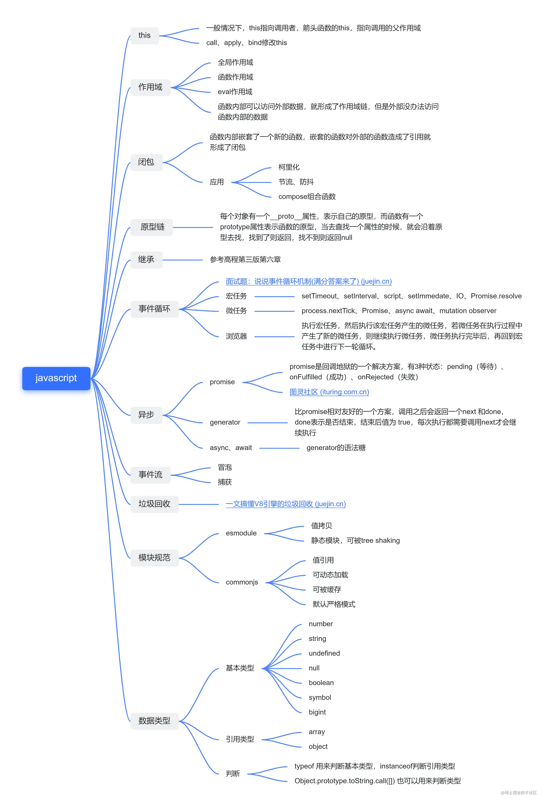
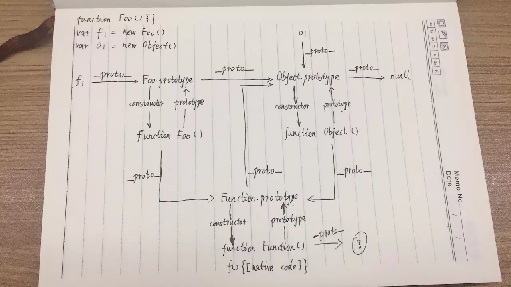

# JS

[深入理解 javascript 原型和闭包系列](https://dojay.cn/fe/yuanxing.html) 。

## 1、数据类型及区别

基本类型： number string boolean null undefined symbol bigint

引用数据类型：Object 包含 Object、Function、Array、Date、RegExp、Math

### 请分别介绍它们之间的区别和优劣Object.prototype.toString.call() 、 instanceof 以及 Array.isArray()

> 1.typeof

`typeof` 对于基本类型，除了 `null` 都可以显示正确的类型 可以返回7种数据类型：number、string、boolean、undefined、object、function ，以及 ES6 新增的 symbol
```js
typeof 1; // 'number'
typeof "1"; // 'string'
typeof undefined; // 'undefined'
typeof true; // 'boolean'
typeof Symbol(); // 'symbol'
typeof b; // b 没有声明，但是还会显示 undefined
typeof function b(){} // 'function'
```

`typeof` 对于对象，除了函数都会显示 `object`
```js
typeof []; // 'object'
typeof {}; // 'object'
typeof console.log; // 'function'
```

对于 `null` 来说，虽然它是基本类型，但是会显示 `object`，这是一个存在很久了的 Bug
```js
typeof null; // 'object'
```
> 2.instanceof
- instanceof 判断对象的原型链上是否存在构造函数的原型prototype；
- instanceof 常用来判断 A 是否为 B 的实例
```js
[]  instanceof Array; // true
```
但 instanceof 只能判断引用类型。并且所有对象类型 instanceof Object 都是 true
```js
[]  instanceof Object; // true
```

> 3.Object.prototype.toString.call()
```js
Object.prototype.toString.call("mx"); //[object String]
Object.prototype.toString.call(12); //[object Number]
Object.prototype.toString.call({ name: "jerry" }); //[object Object]
Object.prototype.toString.call([]); //[object Array]
Object.prototype.toString.call(function() {}); //[object Function]
Object.prototype.toString.call(true); //[object Boolean]
Object.prototype.toString.call(undefined); //[object Undefined]
Object.prototype.toString.call(null); //[object Null]
```
Object.prototype.toString.call() 常用于判断浏览器内置对象时。


### 类型转换

- 数字转字符串
  - toString()iba
  - String()
  - +' '
- 字符串转数字
  - parseInt()
  - parseFloat()
  - Number()

## 2、原型 && 原型链




#### 原型链：每个对象都有**proto**属性，我们称之为原型，原型也可能是一个对象，如果它是一个对象，也有**proto**属性，这样就形成了一条线型的链，我们称之为原型链。
- 所有对象都有一个属性 __proto__ 指向一个对象，也就是原型
- 每个对象的原型都可以通过 constructor 找到构造函数，构造函数也可以通过 prototype 找到原型
- 所有函数都可以通过 __proto__ 找到 Function 对象
- 所有对象都可以通过 __proto__ 找到 Object 对象
- 对象之间通过 __proto__ 连接起来，这样称之为原型链。当前对象上不存在的属性可以通过原型链一层层往上查找，直到顶层 Object 对象

```js
var Obj = function(){};   //构造函数
var o = new Obj();        //实例
o.__proto__ === Obj.prototype;  //=> true 
o.__proto__.constructor === Obj; //=> true

Obj.__proto__ === Function.prototype; //=> true 
Obj.__proto__.constructor === Function; //=> true

Object.prototype.constructor.__proto__ === Function.prototype // true
Function.prototype.__proto__ === Object.prototype // true
Object.prototype.__proto__ === null // true

```

## 3、this指向

### JS 中 this 的五种情况
- 1.作为普通函数执行时，this指向window。
- 2.当函数作为对象的方法被调用时，this就会指向该对象。
- 3.构造器调用，this指向返回的这个对象。
- 4.箭头函数 箭头函数的this绑定看的是this所在函数定义在哪个对象下，就绑定哪个对象。如果有嵌套的情况，则this绑定到最近的一层对象上。
- 5.基于Function.prototype上的 apply 、 call 和 bind 调用模式，这三个方法都可以显示的指定调用函数的 this 指向。apply接收参数的是数组，call接受参数列表，`` bind方法通过传入一个对象，返回一个 this 绑定了传入对象的新函数。这个函数的 this指向除了使用new `时会被改变，其他情况下都不会改变。若为空默认是指向全局对象window


#### 1、全局环境

```js
var name = "张三";
function say() {
  console.log(this); //window
  console.log(this.name); //张三
}
say();
```

#### 2、对象环境

```js
var obj = {
  name: "张三",
  say: function() {
    console.log(this.name); //张三
  }
};
obj.say();

//经典面试题1
var name = "张三";
var obj = {
  name: "李四",
  say: function() {
    console.log(this);
    console.log(this.name);
  }
};
var fun = obj.say;
obj.say(); //obj,李四
fun(); //window,张三 -->fun定义在全局环境下，即window.fun()

//经典面试题2

var name = "张三";
var obj = {
  name: "李四",
  say: function() {
    return function() {
      console.log(this.name);
    };
  }
};
var fun = obj.say;
obj.say()(); //张三
fun()(); //张三
```

#### 3、构造函数环境

构造函数中的 this 会指向创建出来的实例对象，使用 new 调用构造函数时，会先创建出一个空对象，然后用 call 函数把构造函数中的 this 指针修改为指向这个空对象。执行完环境后，空对象也就有了相关的属性，然后将对象返回出去，所以说就不用我们自己手动返回

```js
function Person() {
  this.name = "张三";
}
var p = new Person();
console.log(p.name); //张三
```

### 如何改变 this 的指向

```js
var obj = {
  Name: "张三",
  getAge: function() {
    var b = this.Name; //张三
    var fn = function() {
      return this.Name;
    };
    return fn();
  }
};
console.log(obj.getAge()); //underfined

//1.that 来接盘 this

var obj = {
  Name: "张三",
  getAge: function() {
    var b = this.Name; //张三
    var that = this; // 将 this 指向丢给 that
    var fn = function() {
      return that.Name;
    };
    return fn();
  }
};
console.log(obj.getAge()); //张三

//2 箭头函数
var obj = {
  Name: "张三",
  getAge: function() {
    var b = this.Name; //张三
    var fn = () => this.Name;
    return fn();
  }
};
console.log(obj.getAge()); //张三

//利用call()
var obj = {
  Name: "张三",
  getAge: function() {
    var b = this.Name; //张三
    var fn = function() {
      return this.Name;
    };
    return fn.call(obj); //改变fn中this指向，此时fn的this指向调用者obj
  }
};
console.log(obj.getAge()); //张三
```

## 4、new

### 通过 new 创建对象经历 4 个步骤：

- 创建一个新对象 var obj = {};
- 设置新对象的_proto_属性指向构造函数的 prototype 对象 obj. _proto_ = ClassA.prototype;
- 使用新对象调用函数，函数中的 this 被指向新实例对象 ClassA.call(obj);　　//{}.构造函数()
- 返回新对象
```js
    //实现一个new
function _new(fn, ...arg) {
    const obj = Object.create(fn.prototype);  //第二步Object.create（）第一个参数为 新创建对象的原型对象
    const ret = fn.apply(obj, arg);           //第三步
    return ret instanceof Object ? ret : obj;
}


```

## 5、call apply bind

### 概念：

#### call、apply 和 bind 是 Function 对象自带的三个方法，都是为了改变函数体内部 this 的指向。

#### apply 、 call 、bind 三者第一个参数都是 this 要指向的对象，也就是想指定的上下文；

#### apply 、 call 、bind 三者都可以利用后续参数传参。apply、call 二者而言，作用完全一样，只是接受参数的方式不太一样。func.call(this, arg1, arg2); func.apply(this, [arg1, arg2])。bind 是返回对应函数，便于稍后调用；apply 、call 则是立即调用 。

### 代码更加直观：

```js
//有一只猫拥有吃鱼的技能
 const cat = {
        name: '猫',
        eatFish(...args) {
            console.log('this指向=>', this);
            console.log('...args', args);
            console.log(this.name + '吃鱼');
        },
    }
//  有一只猫拥有吃鱼的技能
const dog = {
        name: '狗',
        eatBone(...args) {
            console.log('this指向=>', this);
            console.log('...args', args);
            console.log(this.name + '吃骨头');
        },
 console.log('=================== call =========================');
 //1.狗调用call,在猫的帮助下吃鱼
 cat.eatFish.call(dog, '狗', 'call')
 // this指向=>dog这个对象
 // ...args ["狗", "call"]
 // 狗吃鱼

 //2.猫调用call,在狗的帮助下吃骨头
 dog.eatBone.call(cat,'猫','call')
  // this指向=>cat这个对象
 // ...args ["猫", "call"]
 // 猫吃骨头

 // console.log('=================== apply =========================');
 //3.狗调用apply,在猫的帮助下吃鱼
   cat.eatFish.apply(dog,['狗','apply'])
 // this指向=>dog这个对象
 // ...args ["狗", "apply"]
 // 狗吃鱼

 //4.猫调用apply,在狗的帮助下吃骨头
   dog.eatBone.cat(dog,['猫','apply'])
 // this指向=>cat这个对象
 // ...args ["猫", "apply"]
 // 猫吃骨头

 // console.log('=================== bind =========================');
 //狗学会了吃鱼这个技能，猫学会了吃骨头这个技能
   const test1 = cat.eatFish.bind(dog, '狗', 'bind')
   const test2 = dog.eatBone.bind(cat, '猫', 'bind')
   test1()
 // this指向=>dog这个对象
 // ...args ["狗", "bind"]
 // 狗吃鱼
   test2()
// this指向=>cat这个对象
 // ...args ["猫", "bind"]
 // 猫吃骨头

```

### 拓展
`实现一个call函数`
```js
 // 原理：利用 context.xxx = self obj.xx = func-->obj.xx()
 Function.prototype.myCall = function (obj) {
                obj = obj || window
                obj.fn = this
                let arg = [...arguments].slice(1)
                let result = obj.fn(...arg)
                delete obj.fn
                return result
 } 

Function.prototype.myCall = function(context = window, ...args) {
  // 在context上加一个唯一值不影响context上的属性
  let key = Symbol('key')
  context[key] = this; // context为调用的上下文,this此处为函数，将这个函数作为context的方法
  // let args = [...arguments].slice(1)   //第一个参数为obj所以删除,伪数组转为数组
  let result = context[key](...args);
  delete context[key]; // 不删除会导致context属性越来越多
  return result;
};
 
```

`实现一个apply函数`
```js
  Function.prototype.myApply = function (obj) {
                    obj = obj || window;
                    obj.fn = this;
                    let result = arguments[1] ? obj.fn(...arguments[1]): obj.fn()
                    delete obj.fn;
                    return result;
}
Function.prototype.myApply = function(context = window, ...args) {
  let key = Symbol('key')
  context[key] = this; // context为调用的上下文,this此处为函数，将这个函数作为context的方法
  // let args = [...arguments[1]]   //第一个参数为obj所以删除,伪数组转为数组
  let result = context[key](args); // 这里和call传参不一样
  delete context[key]; // 不删除会导致context属性越来越多
  return result;
}

```

`实现一个bind函数`

```js
Function.prototype.myBind = function (obj) {
    let arg = [...arguments].slice(1)
    //var arg = Array.prototype.slice.call(arguments, 1)
    // Array.prototype.slice.call(arguments)能将具有length属性的对象转成数组
    var result = this
    return function () {
        arg = arg.concat([...arguments])
        //arg = arg.concat(Array.prototype.slice.call(arguments))
        return result.apply(obj, arg)
    }
}

Function.prototype.myBind = function (context, ...outerArgs) {
  // this->func context->obj outerArgs->[10,20]
  let self = this
  // 返回一个函数
  return function F(...innerArgs) { //返回了一个函数，...innerArgs为实际调用时传入的参数
    // 把func执行，并且改变this即可
    return self.apply(context, [...outerArgs, ...innerArgs]) //返回改变了this的函数，参数合并
  }
}
```

```js
//测试
        let test = {
            name: 'test'
        }
        let o = {
            name: 'o',
            fn: function () {
                console.log(this.name, ...arguments);  //这里把参数显示一下
            }
        }
        o.fn(1, 2, 3) // "o" 1 2 3
        o.fn.call(test, 1, 2, 3,4) // "test" 1 2 3 4
        o.fn.myCall(test, 1, 2, 3,4) // "test" 1 2 3 4
        o.fn.apply(test,[1,2,4])    //test 1 2  4
        o.fn.myApply(test,[1,2,4])  //test 1 2  4
        o.fn.bind(test,1,6,7)()    //test 1 6 7
        o.fn.myBind(test,1,6,7)()  //test 1 6 7
```


## 6、闭包

#### 闭包就是能够读取其他函数内部变量的函数。 本质上，闭包是将函数内部和函数外部连接起来的桥梁
- 创建闭包的最常见的方式就是在一个函数内创建另一个函数，通过另一个函数访问这个函数的局部变量,利用闭包可以突破作用链域

```js
//手写一个闭包
function f1() {
  let num = 10;
  function f2() {
    console.log(num);
  }
  return f2();
}
f1();
```
#### 优缺点
用处？
- 1、读取函数内部的变量；
- 2、让这些变量的值始终保持在内存中。不会再f1调用后被自动清除；

优点？
- 1、变量长期驻扎在内存中；
- 2、避免全局污染；
- 3、私有成员的存在，能够实现封装和缓存等；

缺点？
- 1.由于闭包会使得函数中的变量都被保存在内存中，内存消耗很大，所以不能滥用闭包，否则会造成网页的性能问题，在IE中可能导致内存泄露。解决方法是，在退出函数之前，将不使用的局部变量全部删除。
- 2.闭包会在父函数外部，改变父函数内部变量的值。所以，如果你把父函数当作对象（object）使用，把闭包当作它的公用方法（Public Method），把内部变量当作它的私有属性（private value），这时一定要小心，不要随便改变父函数内部变量的值。

### 应用
```js
   for (let i = 0; i < 5; i++) {
         (function (i) {  // j = i
            setTimeout(function () {
                console.log(i);
            }, 1000);
        })(i);
    }
```
### 函数柯里化
```js
function add(a) {
            function sum(b) { // 使用闭包
                a = a + b; // 累加
                return sum;
            }
            sum.toString = function () { // 重写toSting() 方法
                return a;
            }
            return sum; // 返回一个函数
        }

console.log(add(1)(3)(5)) // 9


最后再扩展一道经典面试题
// 实现一个add方法，使计算结果能够满足如下预期：
add(1)(2)(3) = 6;
add(1, 2, 3)(4) = 10;
add(1)(2)(3)(4)(5) = 15;

function add() {
    // 第一次执行时，定义一个数组专门用来存储所有的参数
    var _args = Array.prototype.slice.call(arguments);

    // 在内部声明一个函数，利用闭包的特性保存_args并收集所有的参数值
    var _adder = function() {
        _args.push(...arguments);
        return _adder;
    };

    // 利用toString隐式转换的特性，当最后执行时隐式转换，并计算最终的值返回
    _adder.toString = function () {
        return _args.reduce(function (a, b) {
            return a + b;
        });
    }
    return _adder;
}

add(1)(2)(3)                // 6
add(1, 2, 3)(4)             // 10
add(1)(2)(3)(4)(5)          // 15
add(2, 6)(1)                // 9
```

## 7、继承

### 手写几种继承

```js
//https://juejin.im/post/5c1f9fc0f265da6125781973utm_medium=hao.caibaojian.com&utm_source=hao.caibaojian.com
//以一个父类为前提条件，列举 js 继承的继承方式：
function Person (age) {
  this.age = age || 18
}
Person.prototype.sleep = function () {
  console.log('sleeping')
}

1.原型继承
function Programmer() {}

Programmer.prototype = new Person ()  //实现继承
Programmer.prototype.code = function () {
  console.log('coding')
}

let jon = new Programmer()
jon.code() // coding
jon.sleep() // sleeping

jon instanceof Person // true
jon instanceof Programmer // true

Object.getPrototypeOf(jon) // Person {age: 18, code: ƒ}
jon.__proto__ // Person {age: 18, code: ƒ}

// 特点：继承了父类的模板，又继承了父类的原型对象
// 缺点：来自原型对象的所有属性被所有实例共享,创建子类实例时 无法向父类构造函数传参
```

```js
2.构造函数继承
function Programmer(name) {
  Person.call(this)
  this.name = name
}
let jon = new Programmer('jon')
jon.name // jon
jon.age // 18

jon.sleep() // Uncaught TypeError: jon.sleep is not a function
jon instanceof Person // false
jon instanceof Programmer // true
a2.sleep()  //undinfind 父类的原型对象并没有继承
// 优点：
// 特点：继承了父类的模板，不继承了父类的原型对象
```

```js
3.组合继承（原型+构造函数）
//父类
function Father(name,age){
    this.name = name ;
    this.age = age;
}
//父类的原型对象
Father.protoType.id = 24;

//子类
function Son(name,age,sex){
   father.call(this,name,age)
   this.sex = sex
}

//实现继承
Son.protoType = new Father()
let a3 = new Son('张三',18,'男')
console.log(a3.name); //张三
console.log(a3.age);  //18
a3.sleep() //sleeping
// 特点：既继承了父类的模板，又继承了父类的原型对象。缺点就是son.pertotype = new father()
// 函数又实例一次，函数内部变量又重复实例一次，大程序时候会很好性能。
```

```js
4.ES6继承
//父类
class Father {
    constructor(name,age){
        this.name = name
        this.age = age
    }
    eat(){
        return `${this.name}${this.age}岁了,再吃东西`
    }
}
//子类
class Son extends Father{
    constructor(name,age,sex){
        super(name,age) //调用父类的constructor
        this.sex = sex
    }
    drink(){
           return `${this.name},性别${this.sex},${this.age}岁了,在喝东西`
    }
}
let a4 = new Son('张三',19,'女')
console.log(a4.eat());   //张三19岁了,在吃东西
console.log(a4.drink()); //张三,性别女,19岁了,在喝东西

```

## 8、深浅拷贝

```js
let a = {
  age: 1
};
let b = a;
b.age = 2;
console.log(a.age); //2
```

从上述例子中我们可以发现，如果给一个变量赋值一个对象，那么两者的值会是同一个引用，其中一方改变，另一方也会相应改变。
通常在开发中我们不希望出现这样的问题，我们可以使用浅拷贝来解决这个问题。

### 浅拷贝

### 浅拷贝只复制引用，而未复制真正的值

- 1 通过 Object.assign 来解决这个问题

```js
let a = {
  age: 1
};
let b = Object.assign({}, a);
b.age = 2;
console.log(a.age); // 1
```

- 2 通过展开运算符（…）来解决

```js
let a = {
  age: 1
};
let b = { ...a };
b.age = 2;
console.log(a.age); // 1
```

### 通常浅拷贝就能解决大部分问题了，但是当我们遇到如下情况就需要使用到深拷贝了。

```js
let a = {
  age: 1,
  job: {
    first: "web"
  }
};
let b = Object.assign({}, a);
b.job.first = "java";
console.log(a.job.first); // java
```

浅拷贝只解决了第一层的问题，如果接下去的值中还有对象的话，两者享有相同的引用。此时我们需要引入深拷贝

### 深拷贝

#### 深拷贝就是对目标的完全拷贝，不像浅拷贝那样只是复制了一层引用，就连值也都复制了。只要进行了深拷贝，它们老死不相往来，谁也不会影响谁。

- 1 通过 JSON.parse(JSON.stringify(object)) 来解决

```js
let a = {
  age: 1,
  job: {
    first: "web"
  }
};
let b = JSON.parse(JSON.stringify(a));
b.job.first = "java";
console.log(a.job.first); // web
```

- 2 递归调用”浅拷贝”

```js
对每一层的数据都实现一次 创建对象->对象赋值 的操作

function deepClone(obj){
    var newObj= obj instanceof Array?[]:{};
    for(var i in obj){
       newObj[i] =typeof obj[i]=='object'?  
       deepClone(obj[i]):obj[i];    
    }
    return newObj;
}

function deepClone(source){
    const targetObj = source.constructor === Array ? [] : {}; // 判断复制的目标是数组还是对象
    for(let keys in source){ // 遍历目标
      if(source.hasOwnProperty(keys)){
          if(source[keys] && typeof source[keys] === 'object'){ // 如果值是对象，就递归一下
            argetObj[keys] = source[keys].constructor === Array ? [] : {};
            targetObj[keys] = deepClone(source[keys]);
          }else{ // 如果不是，就直接赋值
            targetObj[keys] = source[keys];
        }
      }
   }
    return targetObj;
}

```

## 9、事件委托、冒泡

1.基本概念？
捕获：自顶向下
冒泡：自底向上
2.window.addEventListener第三个参数默认是false 属于冒泡阶段
第三个参数是true 属于捕获阶段

#### 事件委托：利用事件冒泡原理，给父元素绑定事件，用来监听子元素的冒泡事件，并找到是哪个子元素的事件。`好处是避免对每个字元素添加事件监听器，减少操作 DOM 节点的次数，提高代码的性能。

#### 事件冒泡：当一个元素接收到事件的时候 会把他接收到的事件传给自己的父级，一直到 window

```js
<ul id="ul1">
  <li>测试1</li>
  <li>测试2</li>
  <li>测试3</li>
</ul>;
var allLi = document.getElementsByTagName("li");
for (let i = 0; i < allLi.length; i++) {
  allLi[i].onclick = function(e) {
    alert(e.target.innerHTML);
  };
  // for(let i = 0 ;i < allLi.length;i++){
  //   allLi[i].addEventListener('click',function(e){
  //     alert(`${e.target.innerHTML},索引为：${i}`);
  //   })
  // }
}

//利用事件委托
var oUl = document.getElementById("ul1");
oUl.onclick = function(e) {
  alert(e.target.innerHTML);
};
// oUl.addEventListener('click',function(e){
//   const target = e.target
//   if(target.tagName.toLowerCase() === 'li'){
//     const liList = document.querySelectorAll('li')
//     const index = Array.prototype.indexOf.call(liList,target)
//     alert(`${e.target.innerHTML},索引为：${index}`);
//   }
// })

//案例：给每一个访问的元素添加一个属性 banned = true 不能点击
window.addEventLister('click',function(e){
  if(banner === true){
    e.stopProgagtion()
  }
}，true)


```


### 9、递归、回调

#### 递归函数：如果一个函数在其主体中直接或间接调用其本身(自己调用自己)，则这样的函数则称为"递归函数"

```js
function fn1(num) {
  if (num == 1) {
    return 1;
  }
  return num * fn1(num - 1);
}
console.log(fn1(5)); //120


//递归求0-100之后
function calc(number) {       
    if (number === 1) {  
      return 1;         
    }
    return number + calc(number - 1); 
 }

```


### 回调函数:一段可执行的代码段，它作为一个参数传递给其他的代码(函数当做参数传递)，其作用是在需要的时候方便调用这段（回调函数）代码

```js
function example(callback) {
  callback();
  console.log("我是主函数");
}

function fn() {
  setTimeout(_ => {
    console.log("我是回调函数");
  }, 1000);
}
example(fn); // 我是主函数 我是回调函数
```

## 10、垃圾回收机制
### 垃圾回收
- 标记清除（mark and sweep）
> - 这是JavaScript最常见的垃圾回收方式，当变量进入执行环境的时候，比如函数中声明一个变量，垃圾回收器将其标记为“进入环境”，当变量离开环境的时候（函数执行结束）将其标记为“离开环境”
> - 垃圾回收器会在运行的时候给存储在内存中的所有变量加上标记，然后去掉环境中的变量以及被环境中变量所引用的变量（闭包），在这些完成之后仍存在标记的就是要删除的变量了
- 引用计数(reference counting)
> 在低版本IE中经常会出现内存泄露，很多时候就是因为其采用引用计数方式进行垃圾回收。引用计数的策略是跟踪记录每个值被使用的次数，当声明了一个 变量并将一个引用类型赋值给该变量的时候这个值的引用次数就加1，如果该变量的值变成了另外一个，则这个值得引用次数减1，当这个值的引用次数变为0的时 候，说明没有变量在使用，这个值没法被访问了，因此可以将其占用的空间回收，这样垃圾回收器会在运行的时候清理掉引用次数为0的值占用的空间
