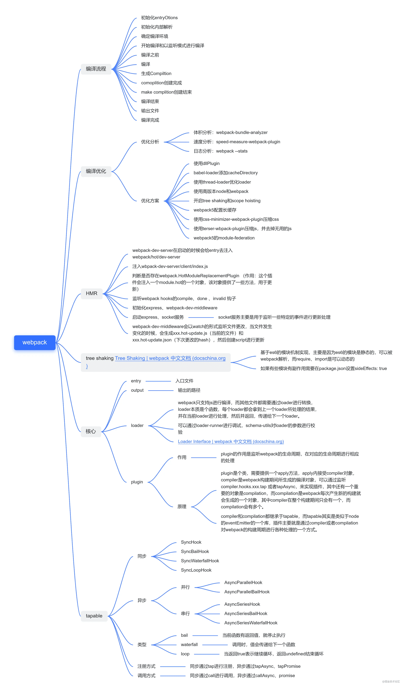
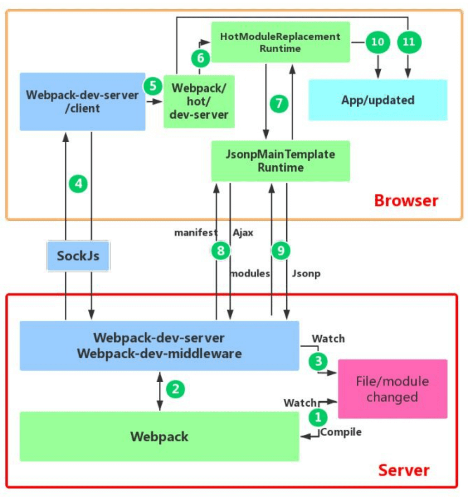

# 二、webpack



## 1、概念
webpack是一个模块打包工具，可以使用它管理项目中的模块依赖，并编译输出模块所需的静态文件。它可以很好地管理、打包开发中所用到的HTML,CSS,JavaScript和静态文件（图片，字体）等，让开发更高效。对于不同类型的依赖，webpack有对应的模块加载器，而且会分析模块间的依赖关系，最后合并生成优化的静态资源。

## 2、打包原理
webpack是收把项目当作一个整体，通过一个给定的的主文件，webpack将从这个文件开始找到你的项目的所有依赖文件，使用loaders处理它们，将所有依赖打包成一个bundle.js，通过代码分割成单元片段按需加载。

## 3、webpack的基本功能和工作原理？
- 代码转换：TypeScript 编译成 JavaScript、SCSS 编译成 CSS 等等
- 文件优化：压缩 JavaScript、CSS、HTML 代码，压缩合并图片等
- 代码分割：提取多个页面的公共代码、提取首屏不需要执行部分的代码让其异步加载
- 模块合并：在采用模块化的项目有很多模块和文件，需要构建功能把模块分类合并成一个文件
- 自动刷新：监听本地源代码的变化，自动构建，刷新浏览器
- 自动发布：更新完代码后，自动构建出线上发布代码并传输给发布系统

## 4、webpack构建流程
- 1.初始化参数：从配置文件和 Shell 语句中读取与合并参数，得出最终的参数；
- 2.开始编译：用上一步得到的参数初始化 Compiler 对象，加载所有配置的插件，执行对象的 run 方法开始执行编译；
- 3.确定入口：根据配置中的 entry 找出所有的入口文件；
- 4.编译模块：从入口文件出发，调用所有配置的 Loader 对模块进行翻译，再找出该模块依赖的模块，再递归本步骤直到所有入口依赖的文件都经过了本步骤的处理；
- 5.完成模块编译：在经过第4步使用 Loader 翻译完所有模块后，得到了每个模块被翻译后的最终内容以及它们之间的依赖关系；
- 6.输出资源：根据入口和模块之间的依赖关系，组装成一个个包含多个模块的 Chunk，再把每个 Chunk 转换成一个单独的文件加入到输出列表，这步是可以修改输出内容的最后机会；
- 7.输出完成：在确定好输出内容后，根据配置确定输出的路径和文件名，把文件内容写入到文件系统。
  
## 5、有哪些常见的Loader？他们是解决什么问题的？  
> loader实现对不同格式文件的处理;Loader的作用是让webpack拥有了加载和解析非JavaScript文件的能力
- 1.babel-loader 用babel来转换ES6文件到ES5
- 2.less-loader 处理less sass-loader 处理sass
- 3.css-loader：加载 CSS，⽀持模块化、压缩、⽂件导⼊等特性 
- 4.style-loader：把 CSS 代码注⼊到 JavaScript 中，通过 DOM 操作去加载 CSS。 
- 5.url-loader：打包图片


**注意：**在Webpack中，loader的执行顺序是**从右向左**执行的。因为webpack选择了**compose这样的函数式编程方式**，这种方式的表达式执行是从右向左的。


## 6、有哪些常见的Plugin？他们是解决什么问题的？ 
> Plugin直译为"插件",Plugin可以扩展webpack的功能，让webpack具有更多的灵活性
- 1.commons-chunk-plugin：提取公共代码
- 2.uglifyjs-webpack-plugin：压缩js
- 3.optimize-css-assets-webpack-plugin:压缩css
- 4.extract-text-webpack-plugin该插件的主要是为了抽离css样式


## 7、**Loader**和**Plugin**的不同？ 

**不同的作⽤**
- **Loader**直译为"加载器"。Webpack将⼀切⽂件视为模块，但是webpack原⽣是只能解析js⽂件，如果想将其他⽂件也打包的话，就会⽤到 loader 。 所以Loader的作⽤是让webpack拥有了加载和解析⾮JavaScript⽂件的能⼒。 
- **Plugin**直译为"插件"。Plugin可以扩展webpack的功能，让webpack具有更多的灵活性。 在 Webpack 运⾏的⽣命周期中会⼴播出许多事件，Plugin 可以监听这些事件，在合适的时机通过 Webpack 提供的 API 改变输出结果。


**不同的⽤法
- **Loader**在 module.rules 中配置，也就是说他作为模块的解析规则⽽存在。 类型为数组，每⼀项都是⼀个 Object ，⾥⾯描述了对于什么类型的⽂件（ test ），使⽤什么加载( loader )和使⽤的参数（ options ） 
- **Plugin**在 plugins 中单独配置。 类型为数组，每⼀项是⼀个 plugin 的实例，参数都通过构造函数传⼊。


## 8、 **bundle**，**chunk**，**module**是什么？

- bundle：是由webpack打包出来的⽂件； 
- chunk：代码块，⼀个chunk由多个模块组合⽽成，⽤于代码的合并和分割；
- module：是开发中的单个模块，在webpack的世界，⼀切皆模块，⼀个模块对应⼀个⽂件，webpack会从配置的 entry中递归开始找出所有依赖的模块。


## 9、webpack优化（重点）

### A.构建速度
- 1. 缩小文件的搜索范围  
  resolve字段告诉webpack怎么去搜索文件
- 2. 通过 externals 配置来提取常⽤库，将不怎么需要更新的第三⽅库脱离webpack打包，不被打⼊bundle中，从⽽减少打包时间，⽐如jQuery⽤script标签引⼊；使用CDN(区分环境)
- 3. 使用HappyPack开启多进程Loader加速编译，⽤进程并⾏编译loader,利⽤缓存来使得 rebuild 更快,遗憾的是作者表示已经不会继续开发此项⽬,类似的替代者是thread-loader
```js
npm i -D happypack
// webpack.config.json
const path = require('path');
const HappyPack = require('happypack');

module.exports = {
    //...
    module:{
        rules:[{
                test:/\.js$/，
                use:['happypack/loader?id=babel']
                exclude:path.resolve(__dirname, 'node_modules')
            },{
                test:/\.css/,
                use:['happypack/loader?id=css']
            }],
        plugins:[
            new HappyPack({
                id:'babel',
                loaders:['babel-loader?cacheDirectory']
            }),
            new HappyPack({
                id:'css',
                loaders:['css-loader']
            })
        ]
    }
}

```
- 4. ⽤ webpack-uglify-parallel 来提升 uglifyPlugin 的压缩速度。 原理上 webpack-uglify-parallel 采⽤了多核并⾏压缩来提升压缩速度
```js
（1）ParallelUglifyPlugin插件安装：
     $ npm i -D webpack-parallel-uglify-plugin
（2）webpack.prod.conf.js 文件进行配置
    const ParallelUglifyPlugin =require('webpack-parallel-uglify-plugin');
    plugins: [
    new ParallelUglifyPlugin({
      cacheDir: '.cache/',
      uglifyJs:{
        compress: {
          warnings: false
        },
        sourceMap: true
      }
     }),
    ]

```
- 5. ⽤webpack的 DllPlugin 引⼊dll，让⼀些基本不会改动的代码先打包成静态资源，避免反复编译浪费时间
```js
// 1.在build文件里面新建一个webpack.dll.js增加配置，配置内容如下
const path = require('path');
const webpack = require('webpack');
const config = require('../config');
 
module.exports = {
  entry:{
    vender : ['vue','vue-router','axios','element-ui','v-viewer','echarts'],
  },
  output:{
    path:path.join(__dirname, '../static/js'),
    filename:'[name].dll.js',
    library:'[name]_library'
  },
  //DllPlugin 插件有三个配置项参数如下：
  //context(可选)： manifest文件中请求的上下文，默认为该webpack文件上下文。
  //name: 公开的dll函数的名称，和 output.library保持一致。
  //path: manifest.json 生成文件的位置和文件名称。
  plugins:[
    new webpack.DllPlugin({
      path:path.join(__dirname,'.','[name]-manifest.join'),
      name:'[name]_library'
    })
  ]
}

// 2.在package.json里面新加一条命令用来跑dll配置：
"dll":"webpack --config build/webpack.dll.js"

// 3.webpack.config.js添加
 plugins: [
    new webpack.DllReferencePlugin({
      manifest: path.resolve(__dirname, 'dist/manifest.json')
    }),
    new AddAssetHtmlPlugin({ filepath: path.resolve(__dirname, 'dist/react.dll.js') })
  ]

```

### B.打包体积
- 1.将 productionSourceMap 设为 false
- 2.通过image-webpack-loader可将大的图片进行压缩从而缩小打包体积(区分环境)
- 3.公共代码抽离(区分环境)
```js
// 公共代码抽离
config.optimization = {
    splitChunks: {
        cacheGroups: {
            vendor: {
                chunks: 'all',
                test: /node_modules/,
                name: 'vendor',
                minChunks: 1,
                maxInitialRequests: 5,
                minSize: 0,
                priority: 100
            },
            common: {
                chunks: 'all',
                test: /[\\/]src[\\/]js[\\/]/,
                name: 'common',
                minChunks: 2,
                maxInitialRequests: 5,
                minSize: 0,
                priority: 60
            },
            styles: {
                name: 'styles',
                test: /\.(sa|sc|c)ss$/,
                chunks: 'all',
                enforce: true
            },
            runtimeChunk: {
                name: 'manifest'
            }
        }
    }
}
```
- 4.使用Tree Shaking剔除JS死代码

### C.其他
- 1.noParse
在引入一些第三方模块时，如jq等，我们知道其内部肯定不会依赖其他模块，因为我们用到的只是一个单独的js或者css文件，所以此时如果webpack再去解析他们的内部依赖关系，其实是非常浪费时间的，就需要阻止webpack浪费精力去解析这些明知道没有依赖的库，可以在webpack的配置文件的module节点下加上noParse，并配置正则来确定不需要解析依赖关系的模块
- 2.IgnorePlugin
IgnorePlugin 在引入一些第三方模块时，例如momentJS、dayJS，其内部会做i18n处理，所以会包含很多语言包，而语言包打包时会比较占用空间，如果项目只需要用到中文或者少数语言，可以忽略掉所有的语言包，然后按需引入语言包，从而使得构建效率更高，打包生成的文件更小
- 3.开启Gzip
- 4.webpack4.0设置mode="prodution"默认开启Tree Shaking

### D.完整vue.config.js
```js
// 代码压缩
const UglifyJsPlugin = require('uglifyjs-webpack-plugin')

// gzip压缩
const CompressionWebpackPlugin = require('compression-webpack-plugin')

// 是否为生产环境
const isProduction = process.env.NODE_ENV !== 'development'

// 本地环境是否需要使用cdn
const devNeedCdn = true

// cdn链接
const cdn = {
    // cdn：模块名称和模块作用域命名（对应window里面挂载的变量名称）
    externals: {
        vue: 'Vue',
        vuex: 'Vuex',
        'vue-router': 'VueRouter'
    },
    // cdn的css链接
    css: [],
    // cdn的js链接
    js: [
        'https://cdn.staticfile.org/vue/2.6.10/vue.min.js',
        'https://cdn.staticfile.org/vuex/3.0.1/vuex.min.js',
        'https://cdn.staticfile.org/vue-router/3.0.3/vue-router.min.js'
    ]
}
module.exports = {
    productionSourceMap: false,
    chainWebpack: config => {
        // ============压缩图片 start============
        config.module
            .rule('images')
            .use('image-webpack-loader')
            .loader('image-webpack-loader')
            .options({ bypassOnDebug: true })
            .end()
        // ============压缩图片 end============

        // ============注入cdn start============
        config.plugin('html').tap(args => {
            // 生产环境或本地需要cdn时，才注入cdn
            if (isProduction || devNeedCdn) args[0].cdn = cdn
            return args
        })
        // ============注入cdn start============
    },
    configureWebpack: config => {
      // 用cdn方式引入，则构建时要忽略相关资源
        if (isProduction || devNeedCdn) config.externals = cdn.externals

        // 生产环境相关配置
        if (isProduction) {
            // 代码压缩
            config.plugins.push(
                new UglifyJsPlugin({
                    uglifyOptions: {
                        //生产环境自动删除console
                        compress: {
                            warnings: false, // 若打包错误，则注释这行
                            drop_debugger: true,
                            drop_console: true,
                            pure_funcs: ['console.log']
                        }
                    },
                    sourceMap: false,
                    parallel: true
                })
            )

            // gzip压缩
            const productionGzipExtensions = ['html', 'js', 'css']
            config.plugins.push(
                new CompressionWebpackPlugin({
                    filename: '[path].gz[query]',
                    algorithm: 'gzip',
                    test: new RegExp(
                        '\\.(' + productionGzipExtensions.join('|') + ')$'
                         ),
                    threshold: 10240, // 只有大小大于该值的资源会被处理 10240
                    minRatio: 0.8, // 只有压缩率小于这个值的资源才会被处理
                    deleteOriginalAssets: false // 删除原文件
                })
            )

            // 公共代码抽离
            config.optimization = {
                splitChunks: {
                    cacheGroups: {
                        vendor: {
                            chunks: 'all',
                            test: /node_modules/,
                            name: 'vendor',
                            minChunks: 1,
                            maxInitialRequests: 5,
                            minSize: 0,
                            priority: 100
                        },
                        common: {
                            chunks: 'all',
                            test: /[\\/]src[\\/]js[\\/]/,
                            name: 'common',
                            minChunks: 2,
                            maxInitialRequests: 5,
                            minSize: 0,
                            priority: 60
                        },
                        styles: {
                            name: 'styles',
                            test: /\.(sa|sc|c)ss$/,
                            chunks: 'all',
                            enforce: true
                        },
                        runtimeChunk: {
                            name: 'manifest'
                        }
                    }
                }
            }
        }
    }
}

```

### E. 如何⽤**webpack**来优化前端性能？ 

⽤webpack优化前端性能是指优化webpack的输出结果，让打包的最终结果在浏览器运⾏快速⾼效。 

- **压缩代码**：删除多余的代码、注释、简化代码的写法等等⽅式。可以利⽤webpack的 UglifyJsPlugin 和 ParallelUglifyPlugin 来压缩JS⽂件， 利⽤ cssnano （css-loader?minimize）来压缩css 
- **利⽤****CDN****加速**: 在构建过程中，将引⽤的静态资源路径修改为CDN上对应的路径。可以利⽤webpack对于 output 参数和各loader的 publicPath 参数来修改资源路径 
- **Tree Shaking**: 将代码中永远不会⾛到的⽚段删除掉。可以通过在启动webpack时追加参数 --optimize-minimize 来实现
- **Code Splitting:** 将代码按路由维度或者组件分块(chunk),这样做到按需加载,同时可以充分利⽤浏览器缓存 
- **提取公共第三⽅库**: SplitChunksPlugin插件来进⾏公共模块抽取,利⽤浏览器缓存可以⻓期缓存这些⽆需频繁变动的公共代码 

## 10、webpack编写一个插件plugins
```js
//loader是一个函数，插件是一个类
class CopyrightWebpackPlugin {
　　/**
　　* compiler是webpack的一个实例，这个实例存储了webpack各种信息，所有打包信息
　　* https://webpack.js.org/api/compiler-hooks
　　* 官网里面介绍了compiler里面有个hooks这样的概念
　　* hooks是钩子的意思，里面定义了时刻值
　　*/
　　apply(compiler) {
　　/**
　　* 用到了hooks，emit这个时刻，在输出资源之前，这里官网告诉我们是一个异步函数
　　* compilation是这一次的打包信息，所以跟compiler是不一样的
　　* tapAsync接受两个参数，第一个是名字，
　　*/
　　compiler.hooks.emit.tapAsync('CopyrightWebpackPlugin',(compilation, cb)=>{
　　　　debugger;
　　　　compilation.assets['copyright.txt'] = {
　　　　　　source: function(){
　　　　　　　　return 'copyright by q'
　　　　　　},
　　　　　　size: function() {
　　　　　　　　return 15
　　　　　　}
　　　　};
　　　　// 最后一定要调用cb
　　　　cb();
　　})
　　/**
　　* 同步的时刻跟同步的时刻写代码的方式不一样
　　* 同步的时刻，后面只要一个参数就可以了
　　*/
　　compiler.hooks.done.tap('CopyrightWebpackPlugin',(compilation) => {
　　　　console.log('compiler');
　　})
　　}
}
module.exports = CopyrightWebpackPlugin;
```

## 11、webpack编写一个插件loader
```js
   // webpack.config.js
      module.exports = {
        //...
        module: {
          rules: [
            {
              test: /\.txt$/,
              use: {
                loader: path.resolve(__dirname, './txt-loader.js'),
                options: {
                  name: 'YOLO'
                }
              }
            }
          ]
        }
      }


	// txt-loader.js
   var utils = require('loader-utils')
  //（格式很简单，重点在于loader-utils，loaderUitls.getOptions可获取webpack配置rules中的options以供使用 ）
   module.exports = function (source) {
   const options = utils.getOptions(this)|| {} ; //

   source = source.replace(/\[name\]/g, options.name);
   return source
   }

```

## 12、webpack与gulp、rollup 区别
前端开发和其他开发工作的主要区别，首先是前端是基于多语言、多层次的编码和组织工作，其次前端产品的交付是基于浏览器，这些资源是通过增量加载的方式运行到浏览器端，如何在开发环境组织好这些碎片化的代码和资源，并且保证他们在浏览器端快速、优雅的加载和更新，就需要一个模块化系统，这个理想中的模块化系统是前端工程师多年来一直探索的难题

- Gulp 就是为了规范前端开发流程，实现前后端分离、模块化开发、版本控制、文件合并与压缩、mock数据等功能的一个前端自动化构建工具。说的形象点，“Gulp就像是一个产品的流水线，整个产品从无到有，都要受流水线的控制，在流水线上我们可以对产品进行管理。”另外，Gulp是通过task对整个开发过程进行构建。

- Webpack 是前端资源模块化管理和打包工具。它可以将许多松散的模块按照依赖和规则打包成符合生产环境部署的前端资源。还可以将按需加载的模块进行代码分隔，等到实际需要的时候再异步加载。通过 loader的转换，任何形式的资源都可以视作模块，比如 CommonJs 模块、AMD 模块、ES6 模块、CSS、图片、JSON、Coffeescript、LESS 等。
  
- rollup适⽤于基础库的打包，如vue、d3等: Rollup 就是将各个模块打包进⼀个⽂件中，并且通过 Tree-shaking 来删除⽆⽤的代码,可以最⼤程度上降低代码体积,但是rollup没有webpack如此多的的如代码分割、按需加载等⾼级功能，其更聚焦于库的打包，因此更适合库的开发。

### Gulp和Webpack功能实现对比
Gulp侧重于前端开发的 整个过程 的控制管理（像是流水线），我们可以通过给gulp配置不同的task（通过Gulp中的gulp.task()方法配置，比如启动server、sass/less预编译、文件的合并压缩等等）来让gulp实现不同的功能，从而构建整个前端开发流程。

Webpack有人也称之为 模块打包机 ，由此也可以看出Webpack更侧重于模块打包，当然我们可以把开发中的所有资源（图片、js文件、css文件等）都可以看成模块，最初Webpack本身就是为前端JS代码打包而设计的，后来被扩展到其他资源的打包处理。Webpack是通过loader（加载器）和plugins（插件）对资源进行处理的

### 组件化开发和模块化
### 对比
 | 类别        | 目的    |  特点  |  接口  |  成果  |  特点  |
 | --------    | -----:  | :----: | :----: | :----: | :----: |
 | 组件        | 重用、解耦      |   高重用、松耦合    | 无统一接口 | 基础库、基础组件 |纵向分层 |
 | 模块        | 隔离/封装     |   高内聚、松耦合   | 统一接口| 业务框架、业务模块| 横向分块|

### import和require的区别
node编程中最重要的思想就是模块化，import和require都是被模块化所使用。

### 遵循规范
- require 是 AMD规范引入方式
- import是es6的一个语法标准

### 调用时间
- require是运行时调用，所以require理论上可以运用在代码的任何地方
- import是编译时调用，所以必须放在文件开头

### 本质
- require是赋值过程，其实require的结果就是对象、数字、字符串、函数等，再把require的结果赋值给某个变量
- import是解构过程，但是目前所有的引擎都还没有实现import，我们在node中使用babel支持ES6，也仅仅是将ES6转码为ES5再执行，import语法会被转码为require


## 13、webpack的热更新是如何做到的？说明其原理？ 

webpack的热更新⼜称热替换（Hot Module Replacement），缩写为HMR。 这个机制可以做到不⽤刷新浏览器⽽将新变更的模块替换掉旧的模块。 


原理： 



⾸先要知道server端和client端都做了处理⼯作：

1. 第⼀步，在 webpack 的 watch 模式下，⽂件系统中某⼀个⽂件发⽣修改，webpack 监听到⽂件变化，根据配置⽂ 

件对模块重新编译打包，并将打包后的代码通过简单的 JavaScript 对象保存在内存中。 

1. 第⼆步是 webpack-dev-server 和 webpack 之间的接⼝交互，⽽在这⼀步，主要是 dev-server 的中间件 webpack- dev-middleware 和 webpack 之间的交互，webpack-dev-middleware 调⽤ webpack 暴露的 API对代码变化进⾏监 控，并且告诉 webpack，将代码打包到内存中。 
2. 第三步是 webpack-dev-server 对⽂件变化的⼀个监控，这⼀步不同于第⼀步，并不是监控代码变化重新打包。当我们在配置⽂件中配置了devServer.watchContentBase 为 true 的时候，Server 会监听这些配置⽂件夹中静态⽂件的变化，变化后会通知浏览器端对应⽤进⾏ live reload。注意，这⼉是浏览器刷新，和 HMR 是两个概念。 
3. 第四步也是 webpack-dev-server 代码的⼯作，该步骤主要是通过 sockjs（webpack-dev-server 的依赖）在浏览器端和服务端之间建⽴⼀个 websocket ⻓连接，将 webpack 编译打包的各个阶段的状态信息告知浏览器端，同时也包括第三步中 Server 监听静态⽂件变化的信息。浏览器端根据这些 socket 消息进⾏不同的操作。当然服务端传递的最主要信息还是新模块的 hash 值，后⾯的步骤根据这⼀ hash 值来进⾏模块热替换。 
4. webpack-dev-server/client 端并不能够请求更新的代码，也不会执⾏热更模块操作，⽽把这些⼯作⼜交回给了webpack，webpack/hot/dev-server 的⼯作就是根据 webpack-dev-server/client 传给它的信息以及 dev-server 的配置决定是刷新浏览器呢还是进⾏模块热更新。当然如果仅仅是刷新浏览器，也就没有后⾯那些步骤了。 
5. HotModuleReplacement.runtime 是客户端 HMR 的中枢，它接收到上⼀步传递给他的新模块的 hash 值，它通过JsonpMainTemplate.runtime 向 server 端发送 Ajax 请求，服务端返回⼀个 json，该 json 包含了所有要更新的模块的 hash 值，获取到更新列表后，该模块再次通过 jsonp 请求，获取到最新的模块代码。这就是上图中 7、8、9 步骤。 
6. ⽽第 10 步是决定 HMR 成功与否的关键步骤，在该步骤中，HotModulePlugin 将会对新旧模块进⾏对⽐，决定是否更新模块，在决定更新模块后，检查模块之间的依赖关系，更新模块的同时更新模块间的依赖引⽤。 
7. 最后⼀步，当 HMR 失败后，回退到 live reload 操作，也就是进⾏浏览器刷新来获取最新打包代码。