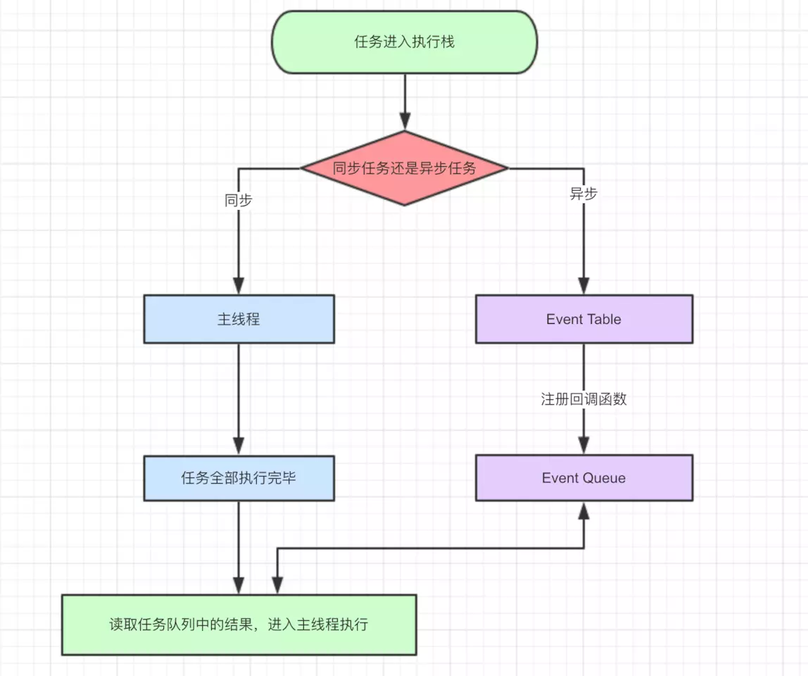

# JS执行机制

### 1.关于javascript
> javascript是一门单线程语言。
- 单线程: 程序同一时间只能做一件事。
- 多线程: 程序可以同一时间做几件事。

### 2.JS单线程又是如何实现异步的呢？
> 如果JS中不存在异步，只能自上而下执行，如果上一行解析时间很长，那么下面的代码就会被阻塞。 对于用户而言，阻塞就意味着"卡死"，这样就导致了很差的用户体验。
- 是通过的事件循环(event loop)实现异步，理解了event loop机制，就理解了JS的执行机制。

### 3.任务队列
- 1.所有同步任务都在主线程上执行，形成一个执行栈(execution context stack)。
- 2.主线程之外，还存在一个"任务队列"(task queue)。只要异步任务有了运行结果，就在"任务队列"之中放置一个事件。
- 3.一旦"执行栈"中的所有同步任务执行完毕，系统就会读取"任务队列"，看看里面有哪些事件。那些对应的异步任务，于是结束等待状态，进入执行栈，开始执行。
- 4.主线程不断重复上面的第三步。

### 4.javascript的同步和异步
> 所有任务可以分成两种，一种是同步任务（synchronous），另一种是异步任务（asynchronous）。同步任务指的是，在主线程上排队执行的任务，只有前一个任务执行完毕，才能执行后一个任务；异步任务指的是，不进入主线程、而进入"任务队列"（task queue）的任务，只有"任务队列"通知主线程，某个异步任务可以执行了，该任务才会进入主线程执行



- 1、同步和异步任务分别进入不同的执行"场所"，同步的进入主线程，异步的进入Event Table并注册函数。
- 2、当Event Table中指定的事情完成时，会将这个函数移入Event Queue。
- 3、主线程内的任务执行完毕为空，会去Event Queue读取对应的函数，进入主线程执行。
- 4、上述过程会不断重复，也就是常说的Event Loop(事件循环)。
- 5、我们不禁要问了，那怎么知道主线程执行栈为空啊？js引擎存在monitoring process进程，会持续不断的检查主线程执行栈是否为空，一旦为空，就会去Event Queue那里检查是否有等待被调用的函数

### 5.异步任务又分为宏任务和微任务

#### 宏任务
(macro)task（又称之为宏任务），可以理解是每次执行栈执行的代码就是一个宏任务（包括每次从事件队列中获取一个事件回调并放到执行栈中执行）。
#### 微任务
microtask（又称为微任务），可以理解是在当前 task 执行结束后立即执行的任务。也就是说，在当前task任务后，下一个task之前，在渲染之前。

> 事件循环中的异步队列有两种：macro（宏任务）队列和 micro（微任务）队列。宏任务队列可以有多个，微任务队列只有一个。
                           
- 常见的 macro-task 比如：setTimeout、setInterval、 setImmediate、script（整体代码）、 I/O 操作、UI 渲染等
- 常见的 micro-task 比如: new Promise().then(回调)、async/await、process.nextTick等
> Promise(async/await)  => Promise并不是完全的同步，在promise中是同步任务，执行resolve或者reject回调的时候，此时是异步操作，会先将then/catch等放到微任务队列。当主栈完成后，才会再去调用resolve/reject方法执行。

#### 运行机制

**执行宏任务的过程中，遇到微任务，依次加入微任务队列。当某个宏任务执行完后,会查看是否有微任务队列。如果有，先执行微任务队列中的所有任务，如果没有，会读取宏任务队列中排在最前的任务。栈空后，再次读取微任务队列里的任务，依次类推。**


### 6.案例

#### 案例1
```js
//字节题
//1-1
//请写出输出内容
async function async1() {
    console.log('async1 start');
    await async2();
    console.log('async1 end');
}
async function async2() {
    console.log('async2');
}

console.log('script start');

setTimeout(function() {
    console.log('setTimeout');
}, 0)

async1();

new Promise(function(resolve) {
    console.log('promise1');
    resolve();
}).then(function() {
    console.log('promise2');
});
console.log('script end');

/*输出结果：
script start
async1 start
async2
promise1
script end
async1 end
promise2
setTimeout
*/

//1-2
console.log('start')
 setTimeout(()=>{
    console.log("children2")
    Promise.resolve().then(()=>{
        console.log("children3")
    })
 },0)
 new Promise(function(resolve,reject){
     console.log('children4')
     setTimeout(()=>{ //重点
        console.log("children5")
        resolve("children6")
     },0 )
 }).then(res=>{
     console.log("children7")
     setTimeout(()=>{
        console.log(res)
     },0)
 })
 //start
 //children4
 //第一轮宏任务结束 尝试清空微任务队列 没有微任务
 //children2
 //第二轮宏任务结束 尝试清空微任务队列 
 //children3
 //第三轮
 //children5
 //children7
 //children6

```
#### 案例1-1分析
- 1. 首先，事件循环从宏任务(macrotask)队列开始，这个时候，宏任务队列中，只有一个script(整体代码)任务；当遇到任务源(task source)时，则会先分发任务到对应的任务队列中去。

- 2. 然后我们看到首先定义了两个async函数，接着往下看，然后遇到了 `console` 语句，直接输出 `script start`。输出之后，script 任务继续往下执行，遇到 `setTimeout`，其作为一个宏任务源，则会先将其任务分发到对应的队列中。

- 3. script 任务继续往下执行，执行了async1()函数，前面讲过async函数中在await之前的代码是立即执行的，所以会立即输出`async1 start`。
遇到了await时，会将await后面的表达式执行一遍，所以就紧接着输出`async2`，然后将await后面的代码也就是`console.log('async1 end')`加入到microtask中的Promise队列中，接着跳出async1函数来执行后面的代码。

- 4. script任务继续往下执行，遇到Promise实例。由于Promise中的函数是立即执行的，而后续的 `.then` 则会被分发到 microtask 的 `Promise` 队列中去。所以会先输出 `promise1`，然后执行 `resolve`，将 `promise2` 分配到对应队列。

- 5. script任务继续往下执行，最后只有一句输出了 `script end`，至此，全局任务就执行完毕了。
根据上述，每次执行完一个宏任务之后，会去检查是否存在 Microtasks；如果有，则执行 Microtasks 直至清空 Microtask Queue。
因而在script任务执行完毕之后，开始查找清空微任务队列。此时，微任务中， `Promise` 队列有的两个任务`async1 end`和`promise2`，因此按先后顺序输出 `async1 end，promise2`。当所有的 Microtasks 执行完毕之后，表示第一轮的循环就结束了。

- 6. 第二轮循环依旧从宏任务队列开始。此时宏任务中只有一个 `setTimeout`，取出直接输出即可，至此整个流程结束。

#### 案例2
```js
async function async1() {
    console.log('async1 start');
    await async2();
    console.log('async1 end');
}
async function async2() {
    //async2做出如下更改：
    new Promise(function(resolve) {
    console.log('promise1');
    resolve();
}).then(function() {
    console.log('promise2');
    });
}
console.log('script start');

setTimeout(function() {
    console.log('setTimeout');
}, 0)
async1();

new Promise(function(resolve) {
    console.log('promise3');
    resolve();
}).then(function() {
    console.log('promise4');
});

console.log('script end');

/*
script start
async1 start
promise1
promise3
script end
promise2
async1 end
promis4
setTimeout
*/
```

#### 案例3
```js
async function async1() {
    console.log('async1 start');
    await async2();
    //更改如下：
    setTimeout(function() {
        console.log('setTimeout1')
    },0)
}
async function async2() {
    //更改如下：
    setTimeout(function() {
        console.log('setTimeout2')
    },0)
}
console.log('script start');

setTimeout(function() {
    console.log('setTimeout3');
}, 0)
async1();

new Promise(function(resolve) {
    console.log('promise1');
    resolve();
}).then(function() {
    console.log('promise2');
});
console.log('script end');

/*
script start
async1 start
promise1
script end
promise2
setTimeout3
setTimeout2
setTimeout1
*/
```

#### 案例4
```js
async function a1 () {
    console.log('a1 start')
    await a2()
    console.log('a1 end')
}
async function a2 () {
    console.log('a2')
}

console.log('script start')

setTimeout(() => {
    console.log('setTimeout')
}, 0)

Promise.resolve().then(() => {
    console.log('promise1')
})

a1()

let promise2 = new Promise((resolve) => {
    resolve('promise2.then')
    console.log('promise2')
})

promise2.then((res) => {
    console.log(res)
    Promise.resolve().then(() => {
        console.log('promise3')
    })
})
console.log('script end')

/*
script start
a1 start
a2
promise2
script end
promise1
a1 end
promise2.then
promise3
setTimeout
*/
```

#### 案例5

```js
console.log('1');
 
setTimeout(function() {
    console.log('2');
    process.nextTick(function() {
        console.log('3');
    })
    new Promise(function(resolve) {
        console.log('4');
        resolve();
    }).then(function() {
        console.log('5')
    })
})
process.nextTick(function() {
    console.log('6');
})
new Promise(function(resolve) {
    console.log('7');
    resolve();
}).then(function() {
    console.log('8')
})
 
setTimeout(function() {
    console.log('9');
    process.nextTick(function() {
        console.log('10');
    })
    new Promise(function(resolve) {
        console.log('11');
        resolve();
    }).then(function() {
        console.log('12')
    })
})

/*
1、 第一轮事件循环流程分析如下：
    整体script作为第一个宏任务进入主线程，遇到console.log，输出1。
    遇到setTimeout，其回调函数被分发到宏任务Event Queue中。我们暂且记为setTimeout1。
    遇到process.nextTick()，其回调函数被分发到微任务Event Queue中。我们记为process1。
    遇到Promise，new Promise直接执行，输出7。then被分发到微任务Event Queue中。我们记为then1。
    又遇到了setTimeout，其回调函数被分发到宏任务Event Queue中，我们记为setTimeout2。
         
    宏任务Event Queue   微任务Event Queue
    setTimeout1         process1
    setTimeout2         then1
     
    上表是第一轮事件循环宏任务结束时各Event Queue的情况，此时已经输出了1和7。
    我们发现了process1和then1两个微任务。
    执行process1,输出6。
    执行then1，输出8。
     
    好了，第一轮事件循环正式结束，这一轮的结果是输出1，7，6，8。
     
2、 那么第二轮时间循环从setTimeout1宏任务开始：
     
    首先输出2。接下来遇到了process.nextTick()，同样将其分发到微任务Event Queue中，
记为process2。new Promise立即执行输出4，then也分发到微任务Event Queue中，记为then2。
     
    宏任务Event Queue     微任务Event Queue
    setTimeout2           process2
                          then2
                           
    第二轮事件循环宏任务结束，我们发现有process2和then2两个微任务可以执行。
        输出3。
        输出5。
        第二轮事件循环结束，第二轮输出2，4，3，5。
 
3、 第三轮事件循环开始，此时只剩setTimeout2了，执行。
        直接输出9。
        将process.nextTick()分发到微任务Event Queue中。记为process3。
        直接执行new Promise，输出11。
        将then分发到微任务Event Queue中，记为then3。
         
    宏任务Event Queue     微任务Event Queue
                            process3
                            then3     
    第三轮事件循环宏任务执行结束，执行两个微任务process3和then3。
        输出10。
        输出12。
        第三轮事件循环结束，第三轮输出9，11，10，12。
 
    整段代码，共进行了三次事件循环，完整的输出为1，7，6，8，2，4，3，5，9，11，10，12。
*/

```
