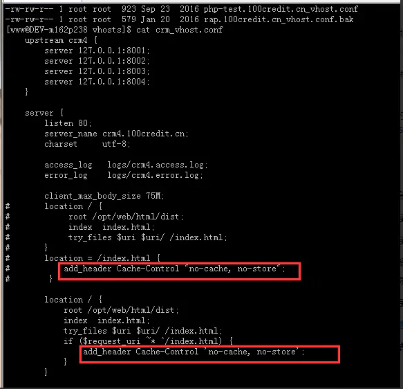

# 缓存
### 优点
- 1.加快了客户端加载网页的速度
- 2.减少服务器的负担，提升网站性能
- 3.减少了不必要的数据传输，节省带宽

## 1、强缓存
直接使用本地的缓存，不用跟服务器进行通信
####  相关header字段
> expires
```js
一个未来时间，代表请求有效期，没有过期之前都使用当前请求。

eg: 
Thu , 15 Apr 2099  20:00:00  GMT  ，代表 2099 年4月16日请求过期，在这之前当前请求都有效。
```
>cache-control,优先级高于 expires
```js
value 是一个时间段，请求有效的最大时间段，限制：1.需要记住请求时间还需要计算是否在这个时间段内 2. 服务器与客户端时间必须一致。

因为它是一个时间段，所以意味着，可以设置一些默认值，常见的默认值设置： 

no-cache：不使用本地缓存。向浏览器发送新鲜度校验请求

pubilc：任何情况下都缓存（即使是HTTP认证的资源）

private：只能被终端用户的浏览器缓存，不允许CDN等中继缓存服务器对其缓存

no-store：禁止浏览器缓存数据，也禁止保存至临时文件中，每次都重新请求，多次设置 cache-control，优先级最高
```
max-age表示缓存的时间是315360000秒（10年），public表示可以被浏览器和代理服务器缓存，代理服务器一般可用nginx来做。immutable表示该资源永远不变，但是实际上该资源并不是永远不变，它这么设置的意思是为了让用户在刷新页面的时候不要去请求服务器！啥意思？就是说，如果你只设置了cahe-control:max-age=315360000,public 这属于强缓存，每次用户正常打开这个页面，浏览器会判断缓存是否过期，没有过期就从缓存中读取数据；但是有一些 "聪明" 的用户会点击浏览器左上角的刷新按钮去刷新页面，这时候就算资源没有过期（10年没这么快过），浏览器也会直接去请求服务器，这就是额外的请求消耗了，这时候就相当于是走协商缓存的流程了（下面会讲到）。如果cahe-control:max-age=315360000,public再加个immutable的话，就算用户刷新页面，浏览器也不会发起请求去服务，浏览器会直接从本地磁盘或者内存中读取缓存并返回200状态，看上图的红色框（from memory cache）。这是2015年facebook团队向制定 HTTP 标准的 IETF 工作组提到的建议：他们希望 HTTP 协议能给 Cache-Control 响应头增加一个属性字段表明该资源永不过期，浏览器就没必要再为这些资源发送条件请求了。

#### 强缓存总结
- 1.cache-control: max-age=xxxx，public
客户端和代理服务器都可以缓存该资源；
客户端在xxx秒的有效期内，如果有请求该资源的需求的话就直接读取缓存,statu code:200 ，如果用户做了刷新操作，就向服务器发起http请求
- 2.cache-control: max-age=xxxx，private
只让客户端可以缓存该资源；代理服务器不缓存
客户端在xxx秒内直接读取缓存,statu code:200
- 3.cache-control: max-age=xxxx，immutable
客户端在xxx秒的有效期内，如果有请求该资源的需求的话就直接读取缓存,statu code:200 ，即使用户做了刷新操作，也不向服务器发起http请求
- 4.cache-control: no-cache
跳过设置强缓存，但是不妨碍设置协商缓存；一般如果你做了强缓存，只有在强缓存失效了才走协商缓存的，设置了no-cache就不会走强缓存了，每次请求都回询问服务端。
- 5.cache-control: no-store
不缓存，这个会让客户端、服务器都不缓存，也就没有所谓的强缓存、协商缓存了。

## 2、协商缓存
将资源一些相关信息返回服务器，让服务器判断浏览器是否能直接使用本地缓存，整个过程至少与服务器通信一次
####  相关header字段
Last-Modified/If-Modified-Since（两个都是时间格式字符串）
```js
过程
1. 浏览器第一次发请求，服务器在返回的 respone 的 header 加上 Last-Modified，表示资源的最后修改时间

2. 再次请求资源，在 requset 的 header 加上 If-Modified-Since ，值就是上一次请求返回的 Last-Modified 值

3. 服务器根据请求传过来的值判断资源是否有变化，没有则返回 304，有变化就正常返回资源内容，更新 Last-Modified 的值

4. 304 从缓存加载资源，否则直接从服务器加载资源
```
Etag/If-None-Match（标识符字符串）
> Etag/If-None-Match（标识符字符串）
与 Last-Modified/If-Modified-Since 不同的是，返回 304 时，ETag 还是会重新生成返回至浏览器,Etag的优先级高于Last-Modified

```js
// response header
etag: '5c20abbd-e2e8'
last-modified: Mon, 24 Dec 2018 09:49:49 GMT

// request header 变为
if-none-matched: '5c20abbd-e2e8'
if-modified-since: Mon, 24 Dec 2018 09:49:49 GMT
```
#### 为什么要有etag？
```js
1.一些文件也许会周期性的更改，但是他的内容并不改变(仅仅改变的修改时间)，这个时候我们并不希望客户端认为这个文件被修改了，而重新get；

2.某些文件修改非常频繁，比如在秒以下的时间内进行修改，(比方说1s内修改了N次)，if-modified-since能检查到的粒度是秒级的，这种修改无法判断(或者说UNIX记录MTIME只能精确到秒)；

3.某些服务器不能精确的得到文件的最后修改时间
```
#### 为什么协商缓存有两个属性一起出现?
协商缓存是浏览器判断资源是否可用，所以需要两个标识，第一个是第一次请求的响应头带上某个字段（Last-Modified或者Etag），第二个则是后续请求带上的对应请求字段（If-Modified-Since或者If-None-Match），两个标识一起出现才有意义，单独则没有什么效果。


#### 怎么设置强缓存与协商缓存
- 1.后端服务器如nodejs:
```js
res.setHeader('max-age': '3600 public')
res.setHeader(etag: '5c20abbd-e2e8')
res.setHeader('last-modified': Mon, 24 Dec 2018 09:49:49 GMT)
```
- 2.nginx配置


#### 怎么去用？
举个例子，像目前用vue-cli打包后生成的单页文件是有一个html，与及一堆js css img资源，怎么去设置这些文件呢，核心需求是

1.要有缓存，毋庸置疑
2.当发新包的时候，要避免加载老的缓存资源

我的做法是：
index.html文件采用协商缓存，理由就是要用户每次请求index.html不拿浏览器缓存，直接请求服务器，这样就保证资源更新了，用户能马上访问到新资源，如果服务端返回304，这时候再拿浏览器的缓存的index.html，切记不要设置强缓存！！！


