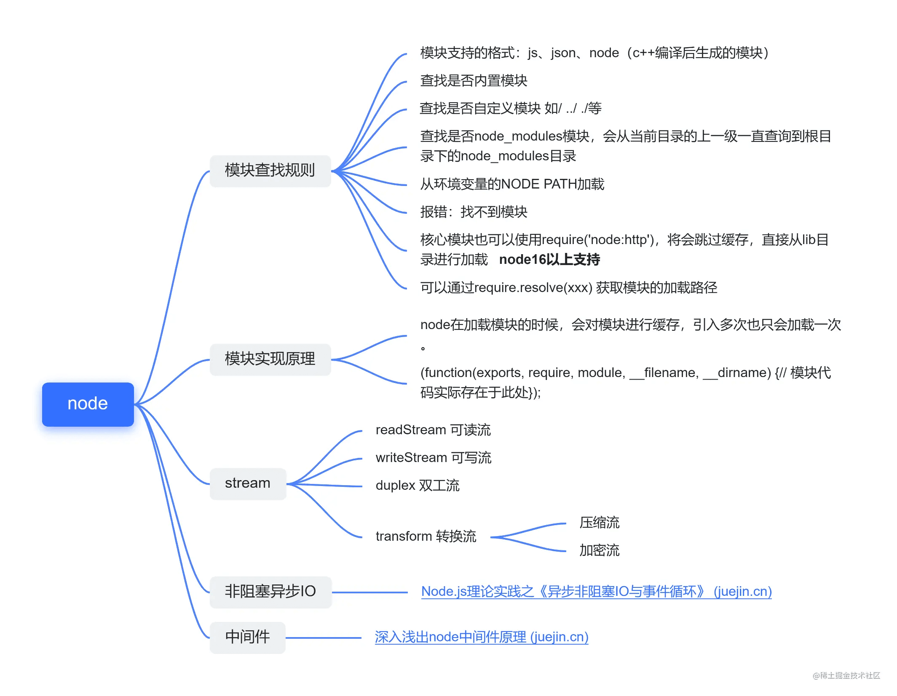
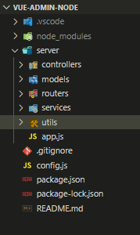

# node


## 特点
- 事件驱动 非阻塞I/O
- 优点:
1.使用js语言，简单，强大，轻量。
2.非阻塞模式，可以分块传输数据，擅长高并发。
3.可拓展性强，有很多的第三方应用组件。

- 缺点：
Node.js 也有它的局限性，它并不适合CPU密集型的任务，比如算法，视频，图片的处理等。

- 适合场景
1.实时性应用，比如网页聊天应用等。
2.以I/O为主的高并发应用，比如客户端提供API，读取数据库。
3.流失应用，比如客户端经常上传文件。
4.前后端分离

> 实际上前两者可以归结为一种，即客户端广泛使用长连接，虽然并发数较高，但其中大部分是空闲连接。

## koa2


koa2完全使用Promise并配合async来实现异步
> 自己的小网站用koa实现接口编码[vue-admin-node](https://github.com/minxiang51574/vue-admin-node)
附上接口示例编写流程。

 


 ```js
 //app.js启动文件
const Koa = require("koa")
const app = new Koa()

const cors = require('koa-cors');
const bodyParser = require('koa-bodyparser')

app.use(cors());


// 解析请求体
app.use(bodyParser())

// 引入路由分发
const routers = require('./routers/index')
//加载中间件
app.use(routers.routes()).use(routers.allowedMethods())

// 启动程序，监听端口
app.listen(3000,()=>{
    console.log("the server is start at port 3000")
})
 ```

## 基础知识
- 互联网基于分层架构实现，包括应用层，传输层，网络层，链路层，物理层。其中前端比较熟悉的是
应用层(HTTP协议)，学习node需要对传输层（TCP），网络层（IP）有一定的了解。