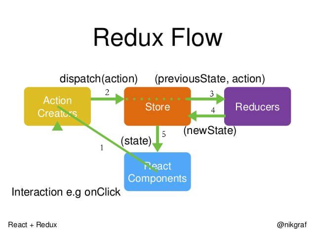

# react

## 1、生命周期（16.8之前hooks）
- componentWillMount：在创建组件之后但在将其渲染到DOM中之前调用
- componentDidMount：在第一个渲染之后调用；组件的DOM元素现在可用
- componentWillReceiveProps：当属性更新时调用
- shouldComponentUpdate：当收到新props时，此方法可以防止重新渲染以优化性能
- componentWillUpdate：在收到新的props并且ComponentUpdate返回true时调用
- componentDidUpdate：在组件更新后调用
- componentWillUnmount：在组件从DOM中移除之前调用，允许您清理事件侦听器之类的内容
 ## 2、react-router-dom
 ```js
 import { BrowserRouter , Route } from "react-router-dom"
 <BrowserRouter>
        <Route path='/' exact component={Home}></Route>
        <Route path="/detail/:id" exact component={Detail}> </Route>
        <Route path='/write' exact component={Write}></Route>
        <Route path="/login" exact component={Login} ></Route>
</BrowserRouter>

 ```

## 3、redux工作流程
  

## 4、Redux-thunk、Redux-saga
使用了redux-thunk后，store中reducer就不仅仅接受一个action对象了，它可以接受一个函数了
简单的action作为函数，在action进行异步操作，发出新的action。

Redux-saga是一个用于管理 Redux 应用异步操作的中间件 本质都是为了解决异步action的问题

```js
Immutable数据就是一旦创建，就不能更改的数据。
每当对Immutable对象进行修改的时候，就会返回一个新的Immutable对象，以此来保证数据的不可变

import { fromJS } from "immutable"
fromJS将一个js数据转换为Immutable类型的数据
const dafaultState = fromJS({
    focused: false,
    mouseIn: false,
    list:[],
    page:1,
    totalPage:1,
});
```
## 5、Why Hook?
### 优点
- 不需要基于类的组件、生命周期钩子和 this 关键字
- 通过将公共函数抽象到定制钩子中，使重用逻辑变得更容易
- 通过能够将逻辑与组件本身分离出来，使代码更具可读性和可测试性

### Class Component的问题
- 组件复用困局
- Javascript Class的缺陷
- Function Component缺失的功能
  - Function Component是纯函数，利于组件复用和测试
  - Function Component的问题是只是单纯地接收props、绑定事件、返回jsx，本身是无状态的组件，依赖props传入的handle来响应数据（状态）的变更，所以Function Component不能脱离Class Comnent来存在
  - 所以，Function Comonent是否能脱离Class Component独立存在，关键在于让Function Comonent自身具备状态处理能力，即在组件首次render之后，“组件自身能够通过某种机制再触发状态的变更并且引起re-render”，而这种“机制”就是Hooks！ 

 ## 6、React diff 原理
  - 把树形结构按照层级分解，只比较同级元素。
- 列表结构的每个单元添加唯一的 key 属性，方便比较。
- React 只会匹配相同 class 的 component（这里面的 class 指的是组件的名字）
- 合并操作，调用 component 的 setState 方法的时候, React 将其标记为 dirty 到每一个事件循环结束, React 检查所有标记 dirty 的 component 重新绘制.
- 选择性子树渲染。开发人员可以重写 shouldComponentUpdate 提高 diff 的性能
