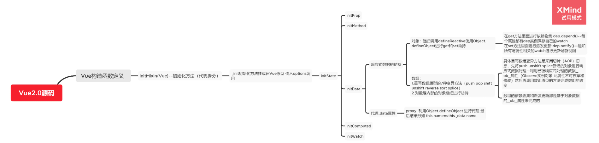
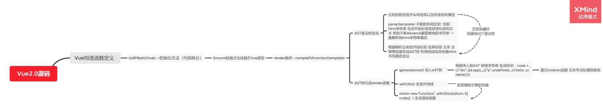
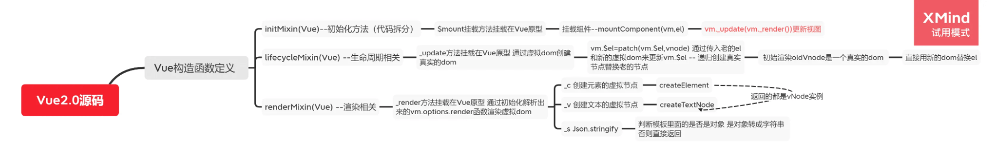
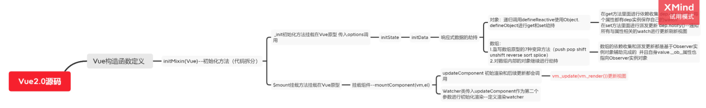
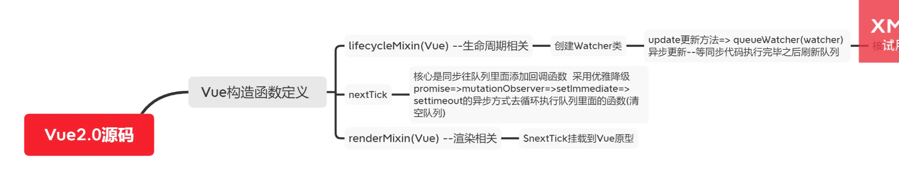

# 一、Vue2


## 1、v-if和v-for哪个优先级更高？同时出现 如何优化？
> 源码位置 compiler/condegen/index.js

- 1.显然v-for的优先级高于v-if (codegenindex源码中顺序为el.once > el.for > el.if)
- 2.如果同时出现，每次渲染都会先执行循环在判断，循环不可避免，浪费性能
- 3.将v-if提到外面一层，内部进行v-for循环

## 2、Vue中的key的作用和工作原理？
> 源码位置 src/core/vdom/patch.js - updateChildren()

- 1.key的主要作用是为了更高效的更新虚拟Dom,其原理是vue在patch过程中通过key可以精准的判断两个节点
是否是同一个，避免频繁更新不同的元素，会让整个patch过程更加高效，减少dom操作，提高性能。
- 2.若不设置key还可能在列表更新引发一些隐藏的bug

## 3、怎么理解vue中的diff算法？
> 源码分析1：必要性 lifecycle.js - mountConponent()
组件中可能存在很多个data中的key使用
> 源码分析2：执行方法 patch.js- patchVnode()
patchVnode是diff发生的地方 整体策略:深度优先，同级比较
> 源码分析3：高效性 patch.js -updateChildren()
 
- 1.diff算法是虚拟DOM的必然产物：通过新旧虚拟DOM作对比，将变化的地方更新在真实的DOM上，
另外，也需要diff高效的执行对比过程。
- 2.vue 2.x中为了降低Watcher粒度，每个组件只有一个watcher与之对应，只有引入diff才能精确找到
变化的地方。
- 3.vue中diff执行的时刻是组件实例执行其更新函数时，它会对比上一次渲染结果的oldVnode和新的渲染结果
newVnode,此过程称为patch。


## 4、nextTick

同步往队列里添加回调函数

```js
// src/observer/scheduler.js
//先同步把 watcher 都放到队列里面去 执行完队列的事件之后再清空队列
import { nextTick } from "../util/next-tick";
let queue = [];
let has = {};
function flushSchedulerQueue() {
  for (let index = 0; index < queue.length; index++) {
    //   调用watcher的run方法 执行真正的更新操作
    queue[index].run();
  }
  // 执行完之后清空队列
  queue = [];
  has = {};
}

// 实现异步队列机制
export function queueWatcher(watcher) {
  const id = watcher.id;
  //   watcher去重
  if (has[id] === undefined) {
    //  同步代码执行 把全部的watcher都放到队列里面去
    queue.push(watcher);
    has[id] = true;
    // 进行异步调用
    nextTick(flushSchedulerQueue);
  }
}

```

采用优雅降级的方式 promise => MutationObserver => setImmediate => setTimeout
微任务=>宏任务
```js
// src/util/next-tick.js
let callbacks = [];
let pending = false;
function flushCallbacks() {
  pending = false; //把标志还原为false
  // 依次执行回调
  for (let i = 0; i < callbacks.length; i++) {
    callbacks[i]();
  }
}
let timerFunc; //定义异步方法  采用优雅降级
if (typeof Promise !== "undefined") {
  // 如果支持promise
  const p = Promise.resolve();
  timerFunc = () => {
    p.then(flushCallbacks);
  };
} else if (typeof MutationObserver !== "undefined") {
  // MutationObserver 主要是监听dom变化 也是一个异步方法
  let counter = 1;
  const observer = new MutationObserver(flushCallbacks);
  const textNode = document.createTextNode(String(counter));
  observer.observe(textNode, {
    characterData: true,
  });
  timerFunc = () => {
    counter = (counter + 1) % 2;
    textNode.data = String(counter);
  };
} else if (typeof setImmediate !== "undefined") {
  // 如果前面都不支持 判断setImmediate
  timerFunc = () => {
    setImmediate(flushCallbacks);
  };
} else {
  // 最后降级采用setTimeout
  timerFunc = () => {
    setTimeout(flushCallbacks, 0);
  };
}

export function nextTick(cb) {
  // 除了渲染watcher  还有用户自己手动调用的nextTick 一起被收集到数组
  callbacks.push(cb);
  if (!pending) {
    // 如果多次调用nextTick  只会执行一次异步 等异步队列清空之后再把标志变为false
    pending = true;
    timerFunc();
  }
}
```


## 5、响应式数据原理

### 1.初始化过程
```js
// src/core/instance/index.js 仓库版本V2.6 目前main分支已ts重构 

import { initMixin } from "./init.js";
// Vue就是一个构造函数 通过new关键字进行实例化
function Vue(options) {
  // 这里开始进行Vue初始化工作
  this._init(options);
}

initMixin(Vue)  //_init _init方法是挂载在Vue原型的方法 通过引入文件的方式进行原型挂载需要传入Vue 此做法有利于代码分割
stateMixin(Vue) //$set $delete $watch
eventsMixin(Vue) // $on $emit $once $off 
lifecycleMixin(Vue) //_update
renderMixin(Vue) //_render
export default Vue;

```

```js
// src/core/instance/init.js
//初始化 
import { initState } from "./state";
export function initMixin(Vue) {
  // initMixin 把_init 方法挂载在 Vue 原型 供 Vue 实例调用
  Vue.prototype._init = function (options) {
    const vm = this;
    // 这里的this代表调用_init方法的对象(实例对象)
    //  this.$options就是用户new Vue的时候传入的属性
    vm.$options = options;
    initState(vm);
    initLifecycle(vm)  // 初始化组件间的父子关系 
    initEvents(vm)     // 更新组件的事件
    initRender(vm)     //初始化_c方法创建虚拟节点
    initInjections(vm) // resolve injections before data/props // 初始化inject
    initState(vm)       // 初始化状态
    initProvide(vm) // resolve provide after data/props / 初始化provide
  };
}

```

```js
// src/core/instance/state.js
import { observe } from "./observer/index.js";

// 初始化状态 注意这里的顺序 比如我经常面试会问到 是否能在data里面直接使用prop的值 为什么？
// 这里初始化的顺序依次是 prop>methods>data>computed>watch
export function initState(vm) {
  // 获取传入的数据对象
  const opts = vm.$options;
  if (opts.props) {
    initProps(vm);
  }
  if (opts.methods) {
    initMethod(vm);
  }
  if (opts.data) {
    // 初始化data
    initData(vm);
  }
  if (opts.computed) {
    initComputed(vm);
  }
  if (opts.watch) {
    initWatch(vm);
  }
}

// 初始化data数据
function initData(vm) {
  let data = vm.$options.data;
  //   实例的_data属性就是传入的data
  // vue组件data推荐使用函数 防止数据在组件之间共享
  data = vm._data = typeof data === "function" ? data.call(vm) : data || {};

  // 把data数据代理到vm 也就是Vue实例上面 我们可以使用this.a来访问this._data.a
  for (let key in data) {
    proxy(vm, `_data`, key);
  }
  // 对数据进行观测 --响应式数据核心
  observe(data);
}
// 数据代理
function proxy(object, sourceKey, key) {
  Object.defineProperty(object, key, {
    get() {
      return object[sourceKey][key];
    },
    set(newValue) {
      object[sourceKey][key] = newValue;
    },
  });
}

```
initState 咱们主要关注 initData 里面的 observe 是响应式数据核心 所以另建 observer 文件夹来专注响应式逻辑 其次我们还做了一层数据代理 把data代理到实例对象this上

### 2.对象的数据劫持
```js
// src/core/obserber/index.js
class Observer {
  // 观测值
  constructor(value) {
    this.walk(value);
  }
  walk(data) {
    // 对象上的所有属性依次进行观测
    let keys = Object.keys(data);
    for (let i = 0; i < keys.length; i++) {
      let key = keys[i];
      let value = data[key];
      defineReactive(data, key, value);
    }
  }
}
// Object.defineProperty数据劫持核心 兼容性在ie9以及以上
function defineReactive(data, key, value) {
  observe(value); // 递归关键
  // --如果value还是一个对象会继续走一遍odefineReactive 层层遍历一直到value不是对象才停止
  //   思考？如果Vue数据嵌套层级过深 >>性能会受影响
  Object.defineProperty(data, key, {
    get() {
      console.log("获取值");
      return value;
    },
    set(newValue) {
      if (newValue === value) return;
      console.log("设置值");
      value = newValue;
    },
  });
}
export function observe(value) {
  // 如果传过来的是对象或者数组 进行属性劫持
  if (
    Object.prototype.toString.call(value) === "[object Object]" ||
    Array.isArray(value)
  ) {
    return new Observer(value);
  }
}
```
数据劫持核心是 defineReactive 函数 主要使用 Object.defineProperty 来对数据 get 和 set 进行劫持 这里就解决了之前的问题 为啥数据变动了会自动更新视图 我们可以在 set 里面去通知视图更新

> 思考 1.这样的数据劫持方式对数组有什么影响？
> 
这样递归的方式其实无论是对象还是数组都进行了观测 但是我们想一下此时如果 data 包含数组比如 a:[1,2,3,4,5] 那么我们根据下标可以直接修改数据也能触发 set 但是如果一个数组里面有上千上万个元素 每一个元素下标都添加 get 和 set 方法 这样对于性能来说是承担不起的 所以此方法只用来劫持对象

> 思考 2.Object.defineProperty 缺点？
> 
对象新增或者删除的属性无法被 set 监听到 只有对象本身存在的属性修改才会被劫持

### 3.数组方法的劫持
```js
// src/core/obserber/index.js
import { arrayMethods } from "./array";
class Observer {
  constructor(value) {
    if (Array.isArray(value)) {
      // 这里对数组做了额外判断
      // 通过重写数组原型方法来对数组的七种方法进行拦截
      value.__proto__ = arrayMethods;
      // 如果数组里面还包含数组 需要递归判断
      this.observeArray(value);
    } else {
      this.walk(value);
    }
  }
  observeArray(items) {
    for (let i = 0; i < items.length; i++) {
      observe(items[i]);
    }
  }
}
// 因为对数组下标的拦截太浪费性能 对 Observer 构造函数传入的数据参数增加了数组的判断
```

重写数组原型方法
```js
// src/core/obserber/array.js
// 先保留数组原型
const arrayProto = Array.prototype;
// 然后将arrayMethods继承自数组原型
// 这里是面向切片编程思想（AOP）--不破坏封装的前提下，动态的扩展功能
export const arrayMethods = Object.create(arrayProto);
let methodsToPatch = [
  "push",
  "pop",
  "shift",
  "unshift",
  "splice",
  "reverse",
  "sort",
];
methodsToPatch.forEach((method) => {
  arrayMethods[method] = function (...args) {
    //   这里保留原型方法的执行结果
    const result = arrayProto[method].apply(this, args);
    // 这句话是关键
    // this代表的就是数据本身 比如数据是{a:[1,2,3]} 那么我们使用a.push(4)  this就是a  ob就是a.__ob__ 这个属性就是上段代码增加的 代表的是该数据已经被响应式观察过了指向Observer实例
    const ob = this.__ob__;

    // 这里的标志就是代表数组有新增操作
    let inserted;
    switch (method) {
      case "push":
      case "unshift":
        inserted = args;
        break;
      case "splice":
        inserted = args.slice(2);
      default:
        break;
    }
    // 如果有新增的元素 inserted是一个数组 调用Observer实例的observeArray对数组每一项进行观测
    if (inserted) ob.observeArray(inserted);
    // 之后咱们还可以在这里检测到数组改变了之后从而触发视图更新的操作--后续源码会揭晓
    return result;
  };
});

```

理解上面代码中的__ob__很关键
```js
// src/core/obserber/index.js
class Observer {
  // 观测值
  constructor(value) {
    Object.defineProperty(value, "__ob__", {
      //  值指代的就是Observer的实例
      value: this,
      //  不可枚举
      enumerable: false,
      writable: true,
      configurable: true,
    });
  }
}
// 这段代码的意思就是给每个响应式数据增加了一个不可枚举的__ob__属性 并且指向了 Observer 实例 那么我们首先可以根据这个属性来防止已经被响应式观察的数据反复被观测 其次 响应式数据可以使用__ob__来获取 Observer 实例的相关方法 这对数组很关键
。
```


## 6、模板编译原理

### 1.模板编译入口
```js
// src/init.js

import { initState } from "./state";
import { compileToFunctions } from "./compiler/index";
export function initMixin(Vue) {
  Vue.prototype._init = function (options) {
    const vm = this;
    // 这里的this代表调用_init方法的对象(实例对象)
    //  this.$options就是用户new Vue的时候传入的属性
    vm.$options = options;
    // 初始化状态
    initState(vm);

    // 如果有el属性 进行模板渲染
    if (vm.$options.el) {
      vm.$mount(vm.$options.el);
    }
  };

  // 这块代码在源码里面的位置其实是放在entry-runtime-with-compiler.js里面
  // 代表的是Vue源码里面包含了compile编译功能 这个和runtime-only版本需要区分开
  Vue.prototype.$mount = function (el) {
    const vm = this;
    const options = vm.$options;
    el = document.querySelector(el);

    // 如果不存在render属性
    if (!options.render) {
      // 如果存在template属性
      let template = options.template;

      if (!template && el) {
        // 如果不存在render和template 但是存在el属性 直接将模板赋值到el所在的外层html结构（就是el本身 并不是父元素）
        template = el.outerHTML;
      }

      // 最终需要把tempalte模板转化成render函数
      if (template) {
        const render = compileToFunctions(template);
        options.render = render;
      }
    }
  };
}
```
### 2.模板转化核心方法 compileToFunctions
```js
// src/compiler/index.js

import { parse } from "./parse";
import { generate } from "./codegen";
export function compileToFunctions(template) {
  // 我们需要把html字符串变成render函数
  // 1.把html代码转成ast语法树  ast用来描述代码本身形成树结构 不仅可以描述html 也能描述css以及js语法
  // 很多库都运用到了ast 比如 webpack babel eslint等等
  let ast = parse(template);
  // 2.优化静态节点
  // 这个有兴趣的可以去看源码  不影响核心功能就不实现了
  //   if (options.optimize !== false) {
  //     optimize(ast, options);
  //   }

  // 3.通过ast 重新生成代码
  // 我们最后生成的代码需要和render函数一样
  // 类似_c('div',{id:"app"},_c('div',undefined,_v("hello"+_s(name)),_c('span',undefined,_v("world"))))
  // _c代表创建元素 _v代表创建文本 _s代表文Json.stringify--把对象解析成文本
  let code = generate(ast);
  //   使用with语法改变作用域为this  之后调用render函数可以使用call改变this 方便code里面的变量取值
  let renderFn = new Function(`with(this){return ${code}}`);
  return renderFn;
}
```
主要有三个步骤 
- 1.生成 ast 
- 2.优化静态节点 
- 3.根据 ast 生成 render 函数

### 3.解析 html 并生成 ast
```js
// src/compiler/parse.js

// 以下为源码的正则  对正则表达式不清楚的同学可以参考小编之前写的文章(前端进阶高薪必看 - 正则篇);
const ncname = `[a-zA-Z_][\\-\\.0-9_a-zA-Z]*`; //匹配标签名 形如 abc-123
const qnameCapture = `((?:${ncname}\\:)?${ncname})`; //匹配特殊标签 形如 abc:234 前面的abc:可有可无
const startTagOpen = new RegExp(`^<${qnameCapture}`); // 匹配标签开始 形如 <abc-123 捕获里面的标签名
const startTagClose = /^\s*(\/?)>/; // 匹配标签结束  >
const endTag = new RegExp(`^<\\/${qnameCapture}[^>]*>`); // 匹配标签结尾 如 </abc-123> 捕获里面的标签名
const attribute = /^\s*([^\s"'<>\/=]+)(?:\s*(=)\s*(?:"([^"]*)"+|'([^']*)'+|([^\s"'=<>`]+)))?/; // 匹配属性  形如 id="app"

let root, currentParent; //代表根节点 和当前父节点
// 栈结构 来表示开始和结束标签
let stack = [];
// 标识元素和文本type
const ELEMENT_TYPE = 1;
const TEXT_TYPE = 3;
// 生成ast方法
function createASTElement(tagName, attrs) {
  return {
    tag: tagName,
    type: ELEMENT_TYPE,
    children: [],
    attrs,
    parent: null,
  };
}

// 对开始标签进行处理
function handleStartTag({ tagName, attrs }) {
  let element = createASTElement(tagName, attrs);
  if (!root) {
    root = element;
  }
  currentParent = element;
  stack.push(element);
}

// 对结束标签进行处理
function handleEndTag(tagName) {
  // 栈结构 []
  // 比如 <div><span></span></div> 当遇到第一个结束标签</span>时 会匹配到栈顶<span>元素对应的ast 并取出来
  let element = stack.pop();
  // 当前父元素就是栈顶的上一个元素 在这里就类似div
  currentParent = stack[stack.length - 1];
  // 建立parent和children关系
  if (currentParent) {
    element.parent = currentParent;
    currentParent.children.push(element);
  }
}

// 对文本进行处理
function handleChars(text) {
  // 去掉空格
  text = text.replace(/\s/g, "");
  if (text) {
    currentParent.children.push({
      type: TEXT_TYPE,
      text,
    });
  }
}

// 解析标签生成ast核心
export function parse(html) {
  while (html) {
    // 查找<
    let textEnd = html.indexOf("<");
    // 如果<在第一个 那么证明接下来就是一个标签 不管是开始还是结束标签
    if (textEnd === 0) {
      // 如果开始标签解析有结果
      const startTagMatch = parseStartTag();
      if (startTagMatch) {
        // 把解析好的标签名和属性解析生成ast
        handleStartTag(startTagMatch);
        continue;
      }

      // 匹配结束标签</
      const endTagMatch = html.match(endTag);
      if (endTagMatch) {
        advance(endTagMatch[0].length);
        handleEndTag(endTagMatch[1]);
        continue;
      }
    }

    let text;
    // 形如 hello<div></div>
    if (textEnd >= 0) {
      // 获取文本
      text = html.substring(0, textEnd);
    }
    if (text) {
      advance(text.length);
      handleChars(text);
    }
  }

  // 匹配开始标签
  function parseStartTag() {
    const start = html.match(startTagOpen);

    if (start) {
      const match = {
        tagName: start[1],
        attrs: [],
      };
      //匹配到了开始标签 就截取掉
      advance(start[0].length);

      // 开始匹配属性
      // end代表结束符号>  如果不是匹配到了结束标签
      // attr 表示匹配的属性
      let end, attr;
      while (
        !(end = html.match(startTagClose)) &&
        (attr = html.match(attribute))
      ) {
        advance(attr[0].length);
        attr = {
          name: attr[1],
          value: attr[3] || attr[4] || attr[5], //这里是因为正则捕获支持双引号 单引号 和无引号的属性值
        };
        match.attrs.push(attr);
      }
      if (end) {
        //   代表一个标签匹配到结束的>了 代表开始标签解析完毕
        advance(1);
        return match;
      }
    }
  }
  //截取html字符串 每次匹配到了就往前继续匹配
  function advance(n) {
    html = html.substring(n);
  }
  //   返回生成的ast
  return root;
}
```
利用正则 匹配 html 字符串 遇到开始标签 结束标签和文本 解析完毕之后生成对应的 ast 并建立相应的父子关联 不断的 advance 截取剩余的字符串 直到 html 全部解析完毕 咱们这里主要写了对于开始标签里面的属性的处理--parseStartTag

### 4.根据 ast 重新生成代码
```js
// src/compiler/codegen.js

const defaultTagRE = /\{\{((?:.|\r?\n)+?)\}\}/g; //匹配花括号 {{  }} 捕获花括号里面的内容

function gen(node) {
  // 判断节点类型
  // 主要包含处理文本核心
  // 源码这块包含了复杂的处理  比如 v-once v-for v-if 自定义指令 slot等等  咱们这里只考虑普通文本和变量表达式{{}}的处理

  // 如果是元素类型
  if (node.type == 1) {
    //   递归创建
    return generate(node);
  } else {
    //   如果是文本节点
    let text = node.text;
    // 不存在花括号变量表达式
    if (!defaultTagRE.test(text)) {
      return `_v(${JSON.stringify(text)})`;
    }
    // 正则是全局模式 每次需要重置正则的lastIndex属性  不然会引发匹配bug
    let lastIndex = (defaultTagRE.lastIndex = 0);
    let tokens = [];
    let match, index;

    while ((match = defaultTagRE.exec(text))) {
      // index代表匹配到的位置
      index = match.index;
      if (index > lastIndex) {
        //   匹配到的{{位置  在tokens里面放入普通文本
        tokens.push(JSON.stringify(text.slice(lastIndex, index)));
      }
      //   放入捕获到的变量内容
      tokens.push(`_s(${match[1].trim()})`);
      //   匹配指针后移
      lastIndex = index + match[0].length;
    }
    // 如果匹配完了花括号  text里面还有剩余的普通文本 那么继续push
    if (lastIndex < text.length) {
      tokens.push(JSON.stringify(text.slice(lastIndex)));
    }
    // _v表示创建文本
    return `_v(${tokens.join("+")})`;
  }
}

// 处理attrs属性
function genProps(attrs) {
  let str = "";
  for (let i = 0; i < attrs.length; i++) {
    let attr = attrs[i];
    // 对attrs属性里面的style做特殊处理
    if (attr.name === "style") {
      let obj = {};
      attr.value.split(";").forEach((item) => {
        let [key, value] = item.split(":");
        obj[key] = value;
      });
      attr.value = obj;
    }
    str += `${attr.name}:${JSON.stringify(attr.value)},`;
  }
  return `{${str.slice(0, -1)}}`;
}

// 生成子节点 调用gen函数进行递归创建
function getChildren(el) {
  const children = el.children;
  if (children) {
    return `${children.map((c) => gen(c)).join(",")}`;
  }
}
// 递归创建生成code
export function generate(el) {
  let children = getChildren(el);
  let code = `_c('${el.tag}',${
    el.attrs.length ? `${genProps(el.attrs)}` : "undefined"
  }${children ? `,${children}` : ""})`;
  return code;
}
```
拿到生成好的 ast 之后 需要把 ast 转化成类似_c('div',{id:"app"},_c('div',undefined,_v("hello"+_s(name)),_c('span',undefined,_v("world"))))这样的字符串

### 5.code 字符串生成 render 函数
```js
export function compileToFunctions(template) {
  let code = generate(ast);
  // 使用with语法改变作用域为this  之后调用render函数可以使用call改变this 方便code里面的变量取值 比如 name值就变成了this.name
  let renderFn = new Function(`with(this){return ${code}}`);
  return renderFn;
}
```


## 7、初始化渲染

### 1.组件挂载入口
```js
// src/init.js

Vue.prototype.$mount = function (el) {
  const vm = this;
  const options = vm.$options;
  el = document.querySelector(el);

  // 如果不存在render属性
  if (!options.render) {
    // 如果存在template属性
    let template = options.template;

    if (!template && el) {
      // 如果不存在render和template 但是存在el属性 直接将模板赋值到el所在的外层html结构（就是el本身 并不是父元素）
      template = el.outerHTML;
    }

    // 最终需要把tempalte模板转化成render函数
    if (template) {
      const render = compileToFunctions(template);
      options.render = render;
    }
  }

  // 将当前组件实例挂载到真实的el节点上面
  return mountComponent(vm, el);
};
```
接着看$mount 方法 我们主要关注最后一句话 mountComponent 就是组件实例挂载的入口函数
这个方法放在源码的 lifecycle 文件里面 代表了与生命周期相关 因为我们组件初始渲染前后对应有 beforeMount 和 mounted 生命周期钩子

### 2.组件挂载核心方法 mountComponent
```js
// src/lifecycle.js
export function mountComponent(vm, el) {
  // 上一步模板编译解析生成了render函数
  // 下一步就是执行vm._render()方法 调用生成的render函数 生成虚拟dom
  // 最后使用vm._update()方法把虚拟dom渲染到页面

  // 真实的el选项赋值给实例的$el属性 为之后虚拟dom产生的新的dom替换老的dom做铺垫
  vm.$el = el;
  //   _update和._render方法都是挂载在Vue原型的方法  类似_init
  vm._update(vm._render());
}
// 要使用 vm._update(vm._render())方法进行实例挂载
```

### 3.render 函数转化成虚拟 dom 核心方法 _render
```js
// src/render.js

import { createElement, createTextNode } from "./vdom/index";

export function renderMixin(Vue) {
  Vue.prototype._render = function () {
    const vm = this;
    // 获取模板编译生成的render方法
    const { render } = vm.$options;
    // 生成vnode--虚拟dom
    const vnode = render.call(vm);
    return vnode;
  };

  // render函数里面有_c _v _s方法需要定义
  Vue.prototype._c = function (...args) {
    // 创建虚拟dom元素
    return createElement(...args);
  };

  Vue.prototype._v = function (text) {
    // 创建虚拟dom文本
    return createTextNode(text);
  };
  Vue.prototype._s = function (val) {
    // 如果模板里面的是一个对象  需要JSON.stringify
    return val == null
      ? ""
      : typeof val === "object"
      ? JSON.stringify(val)
      : val;
  };
}
```
主要在原型定义了_render 方法 然后执行了 render 函数 我们知道模板编译出来的 render 函数核心代码主要 return 了 类似于_c('div',{id:"app"},_c('div',undefined,_v("hello"+_s(name)),_c('span',undefined,_v("world"))))这样的代码 那么我们还需要定义一下_c _v _s 这些函数才能最终转化成为虚拟 dom

```js
// src/vdom/index.js

// 定义Vnode类
export default class Vnode {
  constructor(tag, data, key, children, text) {
    this.tag = tag;
    this.data = data;
    this.key = key;
    this.children = children;
    this.text = text;
  }
}

// 创建元素vnode 等于render函数里面的 h=>h(App)
export function createElement(tag, data = {}, ...children) {
  let key = data.key;
  return new Vnode(tag, data, key, children);
}

// 创建文本vnode
export function createTextNode(text) {
  return new Vnode(undefined, undefined, undefined, undefined, text);
}
```
新建 vdom 文件夹 代表虚拟 dom 相关功能 定义 Vnode 类 以及 createElement 和 createTextNode 方法最后都返回 vnode

### 4.虚拟 dom 转化成真实 dom 核心方法 _update
```js
// src/lifecycle.js

import { patch } from "./vdom/patch";
export function lifecycleMixin(Vue) {
  // 把_update挂载在Vue的原型
  Vue.prototype._update = function (vnode) {
    const vm = this;
    // patch是渲染vnode为真实dom核心
    patch(vm.$el, vnode);
  };
}
```
```js
// src/vdom/patch.js

// patch用来渲染和更新视图 今天只介绍初次渲染的逻辑
export function patch(oldVnode, vnode) {
  // 判断传入的oldVnode是否是一个真实元素
  // 这里很关键  初次渲染 传入的vm.$el就是咱们传入的el选项  所以是真实dom
  // 如果不是初始渲染而是视图更新的时候  vm.$el就被替换成了更新之前的老的虚拟dom
  const isRealElement = oldVnode.nodeType;
  if (isRealElement) {
    // 这里是初次渲染的逻辑
    const oldElm = oldVnode;
    const parentElm = oldElm.parentNode;
    // 将虚拟dom转化成真实dom节点
    let el = createElm(vnode);
    // 插入到 老的el节点下一个节点的前面 就相当于插入到老的el节点的后面
    // 这里不直接使用父元素appendChild是为了不破坏替换的位置
    parentElm.insertBefore(el, oldElm.nextSibling);
    // 删除老的el节点
    parentElm.removeChild(oldVnode);
    return el;
  }
}
// 虚拟dom转成真实dom 就是调用原生方法生成dom树
function createElm(vnode) {
  let { tag, data, key, children, text } = vnode;
  //   判断虚拟dom 是元素节点还是文本节点
  if (typeof tag === "string") {
    //   虚拟dom的el属性指向真实dom
    vnode.el = document.createElement(tag);
    // 解析虚拟dom属性
    updateProperties(vnode);
    // 如果有子节点就递归插入到父节点里面
    children.forEach((child) => {
      return vnode.el.appendChild(createElm(child));
    });
  } else {
    //   文本节点
    vnode.el = document.createTextNode(text);
  }
  return vnode.el;
}

// 解析vnode的data属性 映射到真实dom上
function updateProperties(vnode) {
  let newProps = vnode.data || {};
  let el = vnode.el; //真实节点
  for (let key in newProps) {
    // style需要特殊处理下
    if (key === "style") {
      for (let styleName in newProps.style) {
        el.style[styleName] = newProps.style[styleName];
      }
    } else if (key === "class") {
      el.className = newProps.class;
    } else {
      // 给这个元素添加属性 值就是对应的值
      el.setAttribute(key, newProps[key]);
    }
  }
}
```
_update 核心方法就是 patch 初始渲染和后续更新都是共用这一个方法 只是传入的第一个参数不同 初始渲染总体思路就是根据虚拟 dom(vnode) 调用原生 js 方法创建真实 dom 节点并替换掉 el 选项的位置

### 5._render 和_update 原型方法的混入
```js
// src/index.js

import { initMixin } from "./init.js";
import { lifecycleMixin } from "./lifecycle";
import { renderMixin } from "./render";
// Vue就是一个构造函数 通过new关键字进行实例化
function Vue(options) {
  // 这里开始进行Vue初始化工作
  this._init(options);
}
// _init方法是挂载在Vue原型的方法 通过引入文件的方式进行原型挂载需要传入Vue
// 此做法有利于代码分割
initMixin(Vue);

// 混入_render
renderMixin(Vue);
// 混入_update
lifecycleMixin(Vue);
export default Vue;
```



## 8、渲染更新原理

```js
    <script>
      // Vue实例化
      let vm = new Vue({
        el: "#app",
        data() {
          return {
            a: 123,
          };
        },
        // render(h) {
        //   return h('div',{id:'a'},'hello')
        // },
        template: `<div id="a">hello {{a}}</div>`,
      });

        // 我们在这里模拟更新
      setTimeout(() => {
        vm.a = 456;
        // 此方法是刷新视图的核心
        vm._update(vm._render());
      }, 1000);
    </script>
    // vm._update(vm._render())来实现更新功能
```

### 1.定义 Watcher
```js
// src/observer/watcher.js

// 全局变量id  每次new Watcher都会自增
let id = 0;

export default class Watcher {
  constructor(vm, exprOrFn, cb, options) {
    this.vm = vm;
    this.exprOrFn = exprOrFn;
    this.cb = cb; //回调函数 比如在watcher更新之前可以执行beforeUpdate方法
    this.options = options; //额外的选项 true代表渲染watcher
    this.id = id++; // watcher的唯一标识
    // 如果表达式是一个函数
    if (typeof exprOrFn === "function") {
      this.getter = exprOrFn;
    }
    // 实例化就会默认调用get方法
    this.get();
  }
  get() {
    this.getter();
  }
}
```
在 observer 文件夹下新建 watcher.js 代表和观察者相关 这里首先介绍 Vue 里面使用到的观察者模式 我们可以把 Watcher 当做观察者 它需要订阅数据的变动 当数据变动之后 通知它去执行某些方法 其实本质就是一个构造函数 初始化的时候会去执行 get 方法


### 2.创建渲染 Watcher
```js
// src/lifecycle.js
export function mountComponent(vm, el) {
  //   _update和._render方法都是挂载在Vue原型的方法  类似_init

  // 引入watcher的概念 这里注册一个渲染watcher 执行vm._update(vm._render())方法渲染视图

  let updateComponent = () => {
    console.log("刷新页面");
    vm._update(vm._render());
  };
  new Watcher(vm, updateComponent, null, true);
}
```

我们在组件挂载方法里面 定义一个渲染 Watcher 主要功能就是执行核心渲染页面的方法

### 3.定义 Dep
```js
// src/observer/dep.js

// dep和watcher是多对多的关系

// 每个属性都有自己的dep

let id = 0; //dep实例的唯一标识
export default class Dep {
  constructor() {
    this.id = id++;
    this.subs = []; // 这个是存放watcher的容器
  }
}
// 默认Dep.target为null
Dep.target = null;
```
Dep 也是一个构造函数 可以把他理解为观察者模式里面的被观察者 在 subs 里面收集 watcher 当数据变动的时候通知自身 subs 所有的 watcher 更新

Dep.target 是一个全局 Watcher 指向 初始状态是 null


### 4.对象的依赖收集
```js
// src/observer/index.js

// Object.defineProperty数据劫持核心 兼容性在ie9以及以上
function defineReactive(data, key, value) {
  observe(value);

  let dep = new Dep(); // 为每个属性实例化一个Dep

  Object.defineProperty(data, key, {
    get() {
      // 页面取值的时候 可以把watcher收集到dep里面--依赖收集
      if (Dep.target) {
        // 如果有watcher dep就会保存watcher 同时watcher也会保存dep
        dep.depend();
      }
      return value;
    },
    set(newValue) {
      if (newValue === value) return;
      // 如果赋值的新值也是一个对象  需要观测
      observe(newValue);
      value = newValue;
      dep.notify(); // 通知渲染watcher去更新--派发更新
    },
  });
}
```
上诉代码就是依赖收集和派发更新的核心 其实就是在数据被访问的时候 把我们定义好的渲染 Watcher 放到 dep 的 subs 数组里面 同时把 dep 实例对象也放到渲染 Watcher 里面去 数据更新时就可以通知 dep 的 subs 存储的 watcher 更新

### 5.完善 watcher
```js
// src/observer/watcher.js

import { pushTarget, popTarget } from "./dep";

// 全局变量id  每次new Watcher都会自增
let id = 0;

export default class Watcher {
  constructor(vm, exprOrFn, cb, options) {
    this.vm = vm;
    this.exprOrFn = exprOrFn;
    this.cb = cb; //回调函数 比如在watcher更新之前可以执行beforeUpdate方法
    this.options = options; //额外的选项 true代表渲染watcher
    this.id = id++; // watcher的唯一标识
    this.deps = []; //存放dep的容器
    this.depsId = new Set(); //用来去重dep
    // 如果表达式是一个函数
    if (typeof exprOrFn === "function") {
      this.getter = exprOrFn;
    }
    // 实例化就会默认调用get方法
    this.get();
  }
  get() {
    pushTarget(this); // 在调用方法之前先把当前watcher实例推到全局Dep.target上
    this.getter(); //如果watcher是渲染watcher 那么就相当于执行  vm._update(vm._render()) 这个方法在render函数执行的时候会取值 从而实现依赖收集
    popTarget(); // 在调用方法之后把当前watcher实例从全局Dep.target移除
  }
  //   把dep放到deps里面 同时保证同一个dep只被保存到watcher一次  同样的  同一个watcher也只会保存在dep一次
  addDep(dep) {
    let id = dep.id;
    if (!this.depsId.has(id)) {
      this.depsId.add(id);
      this.deps.push(dep);
      //   直接调用dep的addSub方法  把自己--watcher实例添加到dep的subs容器里面
      dep.addSub(this);
    }
  }
  //   这里简单的就执行以下get方法  之后涉及到计算属性就不一样了
  update() {
    this.get();
  }
}
```
watcher 在调用 getter 方法前后分别把自身赋值给 Dep.target 方便进行依赖收集 update 方法用来更新

### 6.完善 dep
```js
// src/observer/dep.js

// dep和watcher是多对多的关系
// 每个属性都有自己的dep
let id = 0; //dep实例的唯一标识
export default class Dep {
  constructor() {
    this.id = id++;
    this.subs = []; // 这个是存放watcher的容器
  }
  depend() {
    //   如果当前存在watcher
    if (Dep.target) {
      Dep.target.addDep(this); // 把自身-dep实例存放在watcher里面
    }
  }
  notify() {
    //   依次执行subs里面的watcher更新方法
    this.subs.forEach((watcher) => watcher.update());
  }
  addSub(watcher) {
    //   把watcher加入到自身的subs容器
    this.subs.push(watcher);
  }
}
// 默认Dep.target为null
Dep.target = null;
// 栈结构用来存watcher
const targetStack = [];

export function pushTarget(watcher) {
  targetStack.push(watcher);
  Dep.target = watcher; // Dep.target指向当前watcher
}
export function popTarget() {
  targetStack.pop(); // 当前watcher出栈 拿到上一个watcher
  Dep.target = targetStack[targetStack.length - 1];
}
```
定义相关的方法把收集依赖的同时把自身也放到 watcher 的 deps 容器里面去
> 这时对象的更新已经可以满足了 但是如果是数组 类似{a:[1,2,3]} a.push(4) 并不会触发自动更新 因为我们数组并没有收集依赖

### 7.数组的依赖收集
```js
// src/observer/index.js

// Object.defineProperty数据劫持核心 兼容性在ie9以及以上
function defineReactive(data, key, value) {
  let childOb = observe(value); // childOb就是Observer实例

  let dep = new Dep(); // 为每个属性实例化一个Dep

  Object.defineProperty(data, key, {
    get() {
      // 页面取值的时候 可以把watcher收集到dep里面--依赖收集
      if (Dep.target) {
        // 如果有watcher dep就会保存watcher 同时watcher也会保存dep
        dep.depend();
        if (childOb) {
          // 这里表示 属性的值依然是一个对象 包含数组和对象 childOb指代的就是Observer实例对象  里面的dep进行依赖收集
          // 比如{a:[1,2,3]} 属性a对应的值是一个数组 观测数组的返回值就是对应数组的Observer实例对象
          childOb.dep.depend();
          if (Array.isArray(value)) {
            // 如果数据结构类似 {a:[1,2,[3,4,[5,6]]]} 这种数组多层嵌套  数组包含数组的情况  那么我们访问a的时候 只是对第一层的数组进行了依赖收集 里面的数组因为没访问到  所以五大收集依赖  但是如果我们改变了a里面的第二层数组的值  是需要更新页面的  所以需要对数组递归进行依赖收集
            if (Array.isArray(value)) {
              // 如果内部还是数组
              dependArray(value); // 不停的进行依赖收集
            }
          }
        }
      }
      return value;
    },
    set(newValue) {
      if (newValue === value) return;
      // 如果赋值的新值也是一个对象  需要观测
      observe(newValue);
      value = newValue;
      dep.notify(); // 通知渲染watcher去更新--派发更新
    },
  });
}
// 递归收集数组依赖
function dependArray(value) {
  for (let e, i = 0, l = value.length; i < l; i++) {
    e = value[i];
    // e.__ob__代表e已经被响应式观测了 但是没有收集依赖 所以把他们收集到自己的Observer实例的dep里面
    e && e.__ob__ && e.__ob__.dep.depend();
    if (Array.isArray(e)) {
      // 如果数组里面还有数组  就递归去收集依赖
      dependArray(e);
    }
  }
}
```
如果对象属性的值是一个数组 那么执行 childOb.dep.depend()收集数组的依赖 如果数组里面还包含数组 需要递归遍历收集 因为只有访问数据触发了 get 才会去收集依赖 一开始只是递归对数据进行响应式处理无法收集依赖 这两点需要分清

### 8.数组的派发更新
```js
// src/observer/array.js

methodsToPatch.forEach((method) => {
  arrayMethods[method] = function (...args) {
    //   这里保留原型方法的执行结果
    const result = arrayProto[method].apply(this, args);
    // 这句话是关键
    // this代表的就是数据本身 比如数据是{a:[1,2,3]} 那么我们使用a.push(4)  this就是a  ob就是a.__ob__ 这个属性代表的是该数据已经被响应式观察过了 __ob__对象指的就是Observer实例
    const ob = this.__ob__;
    let inserted;
    switch (method) {
      case "push":
      case "unshift":
        inserted = args;
        break;
      case "splice":
        inserted = args.slice(2);
      default:
        break;
    }
    if (inserted) ob.observeArray(inserted); // 对新增的每一项进行观测
    ob.dep.notify(); //数组派发更新 ob指的就是数组对应的Observer实例 我们在get的时候判断如果属性的值还是对象那么就在Observer实例的dep收集依赖 所以这里是一一对应的  可以直接更新
    return result;
  };
});
```
关键代码就是 ob.dep.notify()


## 9、异步更新原理
### 1.watcher 更新的改写
```js
// src/observer/watcher.js

import { queueWatcher } from "./scheduler";
export default class Watcher {
  update() {
    // 每次watcher进行更新的时候  是否可以让他们先缓存起来  之后再一起调用
    // 异步队列机制
    queueWatcher(this);
  }
  run() {
    // 真正的触发更新
    this.get();
  }
}
```

### 2.queueWatcher 实现队列机制
```js
// src/observer/scheduler.js

import { nextTick } from "../util/next-tick";
let queue = [];
let has = {};
function flushSchedulerQueue() {
  for (let index = 0; index < queue.length; index++) {
    //   调用watcher的run方法 执行真正的更新操作
    queue[index].run();
  }
  // 执行完之后清空队列
  queue = [];
  has = {};
}

// 实现异步队列机制
export function queueWatcher(watcher) {
  const id = watcher.id;
  //   watcher去重
  if (has[id] === undefined) {
    //  同步代码执行 把全部的watcher都放到队列里面去
    queue.push(watcher);
    has[id] = true;
    // 进行异步调用
    nextTick(flushSchedulerQueue);
  }
}
}
```
新建 scheduler.js 文件 表示和调度相关 先同步把 watcher 都放到队列里面去 执行完队列的事件之后再清空队列 主要使用 nextTick 来执行 watcher 队列

### 3.nextTick 实现原理
```javascript
// src/util/next-tick.js

let callbacks = [];
let pending = false;
function flushCallbacks() {
  pending = false; //把标志还原为false
  // 依次执行回调
  for (let i = 0; i < callbacks.length; i++) {
    callbacks[i]();
  }
}
let timerFunc; //定义异步方法  采用优雅降级
if (typeof Promise !== "undefined") {
  // 如果支持promise
  const p = Promise.resolve();
  timerFunc = () => {
    p.then(flushCallbacks);
  };
} else if (typeof MutationObserver !== "undefined") {
  // MutationObserver 主要是监听dom变化 也是一个异步方法
  let counter = 1;
  const observer = new MutationObserver(flushCallbacks);
  const textNode = document.createTextNode(String(counter));
  observer.observe(textNode, {
    characterData: true,
  });
  timerFunc = () => {
    counter = (counter + 1) % 2;
    textNode.data = String(counter);
  };
} else if (typeof setImmediate !== "undefined") {
  // 如果前面都不支持 判断setImmediate
  timerFunc = () => {
    setImmediate(flushCallbacks);
  };
} else {
  // 最后降级采用setTimeout
  timerFunc = () => {
    setTimeout(flushCallbacks, 0);
  };
}

export function nextTick(cb) {
  // 除了渲染watcher  还有用户自己手动调用的nextTick 一起被收集到数组
  callbacks.push(cb);
  if (!pending) {
    // 如果多次调用nextTick  只会执行一次异步 等异步队列清空之后再把标志变为false
    pending = true;
    timerFunc();
  }
}
```

### 4.$nextTick 挂载原型
```js
// src/render.js

import { nextTick } from "./util/next-tick";

export function renderMixin(Vue) {
  // 挂载在原型的nextTick方法 可供用户手动调用
  Vue.prototype.$nextTick = nextTick;
}
```

