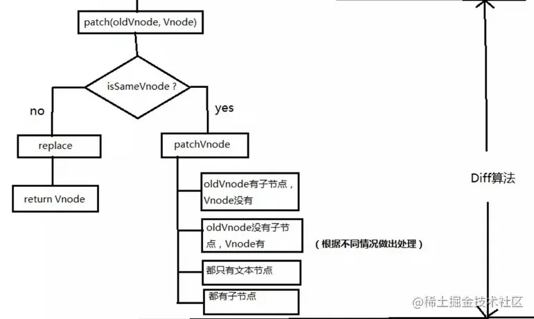
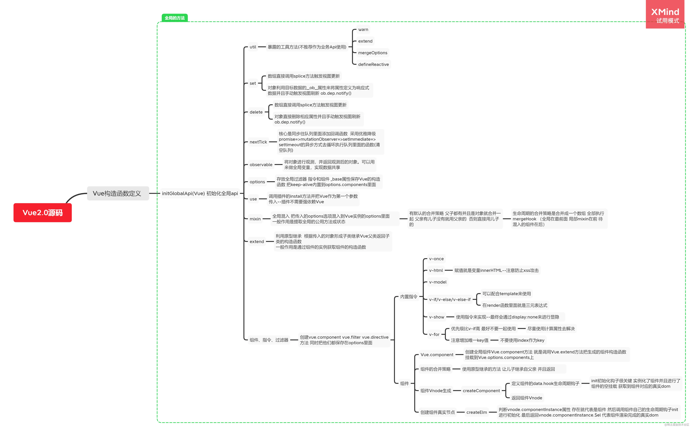

# 一、Vue2

## 1、响应式原理

### 1.初始化过程
```js
// src/core/instance/index.js 仓库版本V2.6 目前main分支已ts重构 

import { initMixin } from "./init.js";
// Vue就是一个构造函数 通过new关键字进行实例化
function Vue(options) {
  // 这里开始进行Vue初始化工作
  this._init(options);
}

initMixin(Vue)  //_init _init方法是挂载在Vue原型的方法 通过引入文件的方式进行原型挂载需要传入Vue 此做法有利于代码分割
stateMixin(Vue) //$set $delete $watch
eventsMixin(Vue) // $on $emit $once $off 
lifecycleMixin(Vue) //_update
renderMixin(Vue) //_render
export default Vue;

```

```js
// src/core/instance/init.js
//初始化 
import { initState } from "./state";
export function initMixin(Vue) {
  // initMixin 把_init 方法挂载在 Vue 原型 供 Vue 实例调用
  Vue.prototype._init = function (options) {
    const vm = this;
    // 这里的this代表调用_init方法的对象(实例对象)
    //  this.$options就是用户new Vue的时候传入的属性
    vm.$options = options;
    initState(vm);
    initLifecycle(vm)  // 初始化组件间的父子关系 
    initEvents(vm)     // 更新组件的事件
    initRender(vm)     //初始化_c方法创建虚拟节点
    initInjections(vm) // resolve injections before data/props // 初始化inject
    initState(vm)       // 初始化状态
    initProvide(vm) // resolve provide after data/props / 初始化provide
  };
}

```

```js
// src/core/instance/state.js
import { observe } from "./observer/index.js";

// 初始化状态 注意这里的顺序 比如我经常面试会问到 是否能在data里面直接使用prop的值 为什么？
// 这里初始化的顺序依次是 prop>methods>data>computed>watch
export function initState(vm) {
  // 获取传入的数据对象
  const opts = vm.$options;
  if (opts.props) {
    initProps(vm);
  }
  if (opts.methods) {
    initMethod(vm);
  }
  if (opts.data) {
    // 初始化data
    initData(vm);
  }
  if (opts.computed) {
    initComputed(vm);
  }
  if (opts.watch) {
    initWatch(vm);
  }
}

// 初始化data数据
function initData(vm) {
  let data = vm.$options.data;
  //   实例的_data属性就是传入的data
  // vue组件data推荐使用函数 防止数据在组件之间共享
  data = vm._data = typeof data === "function" ? data.call(vm) : data || {};

  // 把data数据代理到vm 也就是Vue实例上面 我们可以使用this.a来访问this._data.a
  for (let key in data) {
    proxy(vm, `_data`, key);
  }
  // 对数据进行观测 --响应式数据核心
  observe(data);
}
// 数据代理
function proxy(object, sourceKey, key) {
  Object.defineProperty(object, key, {
    get() {
      return object[sourceKey][key];
    },
    set(newValue) {
      object[sourceKey][key] = newValue;
    },
  });
}

```
initState 咱们主要关注 initData 里面的 observe 是响应式数据核心 所以另建 observer 文件夹来专注响应式逻辑 其次我们还做了一层数据代理 把data代理到实例对象this上

### 2.对象的数据劫持
```js
// src/core/obserber/index.js
class Observer {
  // 观测值
  constructor(value) {
    this.walk(value);
  }
  walk(data) {
    // 对象上的所有属性依次进行观测
    let keys = Object.keys(data);
    for (let i = 0; i < keys.length; i++) {
      let key = keys[i];
      let value = data[key];
      defineReactive(data, key, value);
    }
  }
}
// Object.defineProperty数据劫持核心 兼容性在ie9以及以上
function defineReactive(data, key, value) {
  observe(value); // 递归关键
  // --如果value还是一个对象会继续走一遍odefineReactive 层层遍历一直到value不是对象才停止
  //   思考？如果Vue数据嵌套层级过深 >>性能会受影响
  Object.defineProperty(data, key, {
    get() {
      console.log("获取值");
      return value;
    },
    set(newValue) {
      if (newValue === value) return;
      console.log("设置值");
      value = newValue;
    },
  });
}
export function observe(value) {
  // 如果传过来的是对象或者数组 进行属性劫持
  if (
    Object.prototype.toString.call(value) === "[object Object]" ||
    Array.isArray(value)
  ) {
    return new Observer(value);
  }
}
```
数据劫持核心是 defineReactive 函数 主要使用 Object.defineProperty 来对数据 get 和 set 进行劫持 这里就解决了之前的问题 为啥数据变动了会自动更新视图 我们可以在 set 里面去通知视图更新

> 思考 1.这样的数据劫持方式对数组有什么影响？
> 
这样递归的方式其实无论是对象还是数组都进行了观测 但是我们想一下此时如果 data 包含数组比如 a:[1,2,3,4,5] 那么我们根据下标可以直接修改数据也能触发 set 但是如果一个数组里面有上千上万个元素 每一个元素下标都添加 get 和 set 方法 这样对于性能来说是承担不起的 所以此方法只用来劫持对象

> 思考 2.Object.defineProperty 缺点？
> 
对象新增或者删除的属性无法被 set 监听到 只有对象本身存在的属性修改才会被劫持

### 3.数组方法的劫持
```js
// src/core/obserber/index.js
import { arrayMethods } from "./array";
class Observer {
  constructor(value) {
    if (Array.isArray(value)) {
      // 这里对数组做了额外判断
      // 通过重写数组原型方法来对数组的七种方法进行拦截
      value.__proto__ = arrayMethods;
      // 如果数组里面还包含数组 需要递归判断
      this.observeArray(value);
    } else {
      this.walk(value);
    }
  }
  observeArray(items) {
    for (let i = 0; i < items.length; i++) {
      observe(items[i]);
    }
  }
}
// 因为对数组下标的拦截太浪费性能 对 Observer 构造函数传入的数据参数增加了数组的判断
```

重写数组原型方法
```js
// src/core/obserber/array.js
// 先保留数组原型
const arrayProto = Array.prototype;
// 然后将arrayMethods继承自数组原型
// 这里是面向切片编程思想（AOP）--不破坏封装的前提下，动态的扩展功能
export const arrayMethods = Object.create(arrayProto);
let methodsToPatch = [
  "push",
  "pop",
  "shift",
  "unshift",
  "splice",
  "reverse",
  "sort",
];
methodsToPatch.forEach((method) => {
  arrayMethods[method] = function (...args) {
    //   这里保留原型方法的执行结果
    const result = arrayProto[method].apply(this, args);
    // 这句话是关键
    // this代表的就是数据本身 比如数据是{a:[1,2,3]} 那么我们使用a.push(4)  this就是a  ob就是a.__ob__ 这个属性就是上段代码增加的 代表的是该数据已经被响应式观察过了指向Observer实例
    const ob = this.__ob__;

    // 这里的标志就是代表数组有新增操作
    let inserted;
    switch (method) {
      case "push":
      case "unshift":
        inserted = args;
        break;
      case "splice":
        inserted = args.slice(2);
      default:
        break;
    }
    // 如果有新增的元素 inserted是一个数组 调用Observer实例的observeArray对数组每一项进行观测
    if (inserted) ob.observeArray(inserted);
    // 之后咱们还可以在这里检测到数组改变了之后从而触发视图更新的操作--后续源码会揭晓
    return result;
  };
});

```

理解上面代码中的__ob__很关键
```js
// src/core/obserber/index.js
class Observer {
  // 观测值
  constructor(value) {
    Object.defineProperty(value, "__ob__", {
      //  值指代的就是Observer的实例
      value: this,
      //  不可枚举
      enumerable: false,
      writable: true,
      configurable: true,
    });
  }
}
// 这段代码的意思就是给每个响应式数据增加了一个不可枚举的__ob__属性 并且指向了 Observer 实例 那么我们首先可以根据这个属性来防止已经被响应式观察的数据反复被观测 其次 响应式数据可以使用__ob__来获取 Observer 实例的相关方法 这对数组很关键
。
```


## 2、初始化渲染

### 1.组件挂载入口
```js
// src/init.js

Vue.prototype.$mount = function (el) {
  const vm = this;
  const options = vm.$options;
  el = document.querySelector(el);

  // 如果不存在render属性
  if (!options.render) {
    // 如果存在template属性
    let template = options.template;

    if (!template && el) {
      // 如果不存在render和template 但是存在el属性 直接将模板赋值到el所在的外层html结构（就是el本身 并不是父元素）
      template = el.outerHTML;
    }

    // 最终需要把tempalte模板转化成render函数
    if (template) {
      const render = compileToFunctions(template);
      options.render = render;
    }
  }

  // 将当前组件实例挂载到真实的el节点上面
  return mountComponent(vm, el);
};
```
接着看$mount 方法 我们主要关注最后一句话 mountComponent 就是组件实例挂载的入口函数
这个方法放在源码的 lifecycle 文件里面 代表了与生命周期相关 因为我们组件初始渲染前后对应有 beforeMount 和 mounted 生命周期钩子

### 2.组件挂载核心方法 mountComponent
```js
// src/lifecycle.js
export function mountComponent(vm, el) {
  // 上一步模板编译解析生成了render函数
  // 下一步就是执行vm._render()方法 调用生成的render函数 生成虚拟dom
  // 最后使用vm._update()方法把虚拟dom渲染到页面

  // 真实的el选项赋值给实例的$el属性 为之后虚拟dom产生的新的dom替换老的dom做铺垫
  vm.$el = el;
  //   _update和._render方法都是挂载在Vue原型的方法  类似_init
  vm._update(vm._render());
}
// 要使用 vm._update(vm._render())方法进行实例挂载
```

### 3.render 函数转化成虚拟 dom 核心方法 _render
```js
// src/render.js

import { createElement, createTextNode } from "./vdom/index";

export function renderMixin(Vue) {
  Vue.prototype._render = function () {
    const vm = this;
    // 获取模板编译生成的render方法
    const { render } = vm.$options;
    // 生成vnode--虚拟dom
    const vnode = render.call(vm);
    return vnode;
  };

  // render函数里面有_c _v _s方法需要定义
  Vue.prototype._c = function (...args) {
    // 创建虚拟dom元素
    return createElement(...args);
  };

  Vue.prototype._v = function (text) {
    // 创建虚拟dom文本
    return createTextNode(text);
  };
  Vue.prototype._s = function (val) {
    // 如果模板里面的是一个对象  需要JSON.stringify
    return val == null
      ? ""
      : typeof val === "object"
      ? JSON.stringify(val)
      : val;
  };
}
```
主要在原型定义了_render 方法 然后执行了 render 函数 我们知道模板编译出来的 render 函数核心代码主要 return 了 类似于_c('div',{id:"app"},_c('div',undefined,_v("hello"+_s(name)),_c('span',undefined,_v("world"))))这样的代码 那么我们还需要定义一下_c _v _s 这些函数才能最终转化成为虚拟 dom

```js
// src/vdom/index.js

// 定义Vnode类
export default class Vnode {
  constructor(tag, data, key, children, text) {
    this.tag = tag;
    this.data = data;
    this.key = key;
    this.children = children;
    this.text = text;
  }
}

// 创建元素vnode 等于render函数里面的 h=>h(App)
export function createElement(tag, data = {}, ...children) {
  let key = data.key;
  return new Vnode(tag, data, key, children);
}

// 创建文本vnode
export function createTextNode(text) {
  return new Vnode(undefined, undefined, undefined, undefined, text);
}
```
新建 vdom 文件夹 代表虚拟 dom 相关功能 定义 Vnode 类 以及 createElement 和 createTextNode 方法最后都返回 vnode

### 4.虚拟 dom 转化成真实 dom 核心方法 _update
```js
// src/lifecycle.js

import { patch } from "./vdom/patch";
export function lifecycleMixin(Vue) {
  // 把_update挂载在Vue的原型
  Vue.prototype._update = function (vnode) {
    const vm = this;
    // patch是渲染vnode为真实dom核心
    patch(vm.$el, vnode);
  };
}
```
```js
// src/vdom/patch.js

// patch用来渲染和更新视图 今天只介绍初次渲染的逻辑
export function patch(oldVnode, vnode) {
  // 判断传入的oldVnode是否是一个真实元素
  // 这里很关键  初次渲染 传入的vm.$el就是咱们传入的el选项  所以是真实dom
  // 如果不是初始渲染而是视图更新的时候  vm.$el就被替换成了更新之前的老的虚拟dom
  const isRealElement = oldVnode.nodeType;
  if (isRealElement) {
    // 这里是初次渲染的逻辑
    const oldElm = oldVnode;
    const parentElm = oldElm.parentNode;
    // 将虚拟dom转化成真实dom节点
    let el = createElm(vnode);
    // 插入到 老的el节点下一个节点的前面 就相当于插入到老的el节点的后面
    // 这里不直接使用父元素appendChild是为了不破坏替换的位置
    parentElm.insertBefore(el, oldElm.nextSibling);
    // 删除老的el节点
    parentElm.removeChild(oldVnode);
    return el;
  }
}
// 虚拟dom转成真实dom 就是调用原生方法生成dom树
function createElm(vnode) {
  let { tag, data, key, children, text } = vnode;
  //   判断虚拟dom 是元素节点还是文本节点
  if (typeof tag === "string") {
    //   虚拟dom的el属性指向真实dom
    vnode.el = document.createElement(tag);
    // 解析虚拟dom属性
    updateProperties(vnode);
    // 如果有子节点就递归插入到父节点里面
    children.forEach((child) => {
      return vnode.el.appendChild(createElm(child));
    });
  } else {
    //   文本节点
    vnode.el = document.createTextNode(text);
  }
  return vnode.el;
}

// 解析vnode的data属性 映射到真实dom上
function updateProperties(vnode) {
  let newProps = vnode.data || {};
  let el = vnode.el; //真实节点
  for (let key in newProps) {
    // style需要特殊处理下
    if (key === "style") {
      for (let styleName in newProps.style) {
        el.style[styleName] = newProps.style[styleName];
      }
    } else if (key === "class") {
      el.className = newProps.class;
    } else {
      // 给这个元素添加属性 值就是对应的值
      el.setAttribute(key, newProps[key]);
    }
  }
}
```
_update 核心方法就是 patch 初始渲染和后续更新都是共用这一个方法 只是传入的第一个参数不同 初始渲染总体思路就是根据虚拟 dom(vnode) 调用原生 js 方法创建真实 dom 节点并替换掉 el 选项的位置

### 5._render 和_update 原型方法的混入
```js
// src/index.js

import { initMixin } from "./init.js";
import { lifecycleMixin } from "./lifecycle";
import { renderMixin } from "./render";
// Vue就是一个构造函数 通过new关键字进行实例化
function Vue(options) {
  // 这里开始进行Vue初始化工作
  this._init(options);
}
// _init方法是挂载在Vue原型的方法 通过引入文件的方式进行原型挂载需要传入Vue
// 此做法有利于代码分割
initMixin(Vue);

// 混入_render
renderMixin(Vue);
// 混入_update
lifecycleMixin(Vue);
export default Vue;
```


## 3、渲染更新原理

```js
    <script>
      // Vue实例化
      let vm = new Vue({
        el: "#app",
        data() {
          return {
            a: 123,
          };
        },
        // render(h) {
        //   return h('div',{id:'a'},'hello')
        // },
        template: `<div id="a">hello {{a}}</div>`,
      });

        // 我们在这里模拟更新
      setTimeout(() => {
        vm.a = 456;
        // 此方法是刷新视图的核心
        vm._update(vm._render());
      }, 1000);
    </script>
    // vm._update(vm._render())来实现更新功能
```

### 1.定义 Watcher
```js
// src/observer/watcher.js

// 全局变量id  每次new Watcher都会自增
let id = 0;

export default class Watcher {
  constructor(vm, exprOrFn, cb, options) {
    this.vm = vm;
    this.exprOrFn = exprOrFn;
    this.cb = cb; //回调函数 比如在watcher更新之前可以执行beforeUpdate方法
    this.options = options; //额外的选项 true代表渲染watcher
    this.id = id++; // watcher的唯一标识
    // 如果表达式是一个函数
    if (typeof exprOrFn === "function") {
      this.getter = exprOrFn;
    }
    // 实例化就会默认调用get方法
    this.get();
  }
  get() {
    this.getter();
  }
}
```
在 observer 文件夹下新建 watcher.js 代表和观察者相关 这里首先介绍 Vue 里面使用到的观察者模式 我们可以把 Watcher 当做观察者 它需要订阅数据的变动 当数据变动之后 通知它去执行某些方法 其实本质就是一个构造函数 初始化的时候会去执行 get 方法


### 2.创建渲染 Watcher
```js
// src/lifecycle.js
export function mountComponent(vm, el) {
  //   _update和._render方法都是挂载在Vue原型的方法  类似_init

  // 引入watcher的概念 这里注册一个渲染watcher 执行vm._update(vm._render())方法渲染视图

  let updateComponent = () => {
    console.log("刷新页面");
    vm._update(vm._render());
  };
  new Watcher(vm, updateComponent, null, true);
}
```

我们在组件挂载方法里面 定义一个渲染 Watcher 主要功能就是执行核心渲染页面的方法

### 3.定义 Dep
```js
// src/observer/dep.js

// dep和watcher是多对多的关系

// 每个属性都有自己的dep

let id = 0; //dep实例的唯一标识
export default class Dep {
  constructor() {
    this.id = id++;
    this.subs = []; // 这个是存放watcher的容器
  }
}
// 默认Dep.target为null
Dep.target = null;
```
Dep 也是一个构造函数 可以把他理解为观察者模式里面的被观察者 在 subs 里面收集 watcher 当数据变动的时候通知自身 subs 所有的 watcher 更新

Dep.target 是一个全局 Watcher 指向 初始状态是 null


### 4.对象的依赖收集
```js
// src/observer/index.js

// Object.defineProperty数据劫持核心 兼容性在ie9以及以上
function defineReactive(data, key, value) {
  observe(value);

  let dep = new Dep(); // 为每个属性实例化一个Dep

  Object.defineProperty(data, key, {
    get() {
      // 页面取值的时候 可以把watcher收集到dep里面--依赖收集
      if (Dep.target) {
        // 如果有watcher dep就会保存watcher 同时watcher也会保存dep
        dep.depend();
      }
      return value;
    },
    set(newValue) {
      if (newValue === value) return;
      // 如果赋值的新值也是一个对象  需要观测
      observe(newValue);
      value = newValue;
      dep.notify(); // 通知渲染watcher去更新--派发更新
    },
  });
}
```
上诉代码就是依赖收集和派发更新的核心 其实就是在数据被访问的时候 把我们定义好的渲染 Watcher 放到 dep 的 subs 数组里面 同时把 dep 实例对象也放到渲染 Watcher 里面去 数据更新时就可以通知 dep 的 subs 存储的 watcher 更新

### 5.完善 watcher
```js
// src/observer/watcher.js

import { pushTarget, popTarget } from "./dep";

// 全局变量id  每次new Watcher都会自增
let id = 0;

export default class Watcher {
  constructor(vm, exprOrFn, cb, options) {
    this.vm = vm;
    this.exprOrFn = exprOrFn;
    this.cb = cb; //回调函数 比如在watcher更新之前可以执行beforeUpdate方法
    this.options = options; //额外的选项 true代表渲染watcher
    this.id = id++; // watcher的唯一标识
    this.deps = []; //存放dep的容器
    this.depsId = new Set(); //用来去重dep
    // 如果表达式是一个函数
    if (typeof exprOrFn === "function") {
      this.getter = exprOrFn;
    }
    // 实例化就会默认调用get方法
    this.get();
  }
  get() {
    pushTarget(this); // 在调用方法之前先把当前watcher实例推到全局Dep.target上
    this.getter(); //如果watcher是渲染watcher 那么就相当于执行  vm._update(vm._render()) 这个方法在render函数执行的时候会取值 从而实现依赖收集
    popTarget(); // 在调用方法之后把当前watcher实例从全局Dep.target移除
  }
  //   把dep放到deps里面 同时保证同一个dep只被保存到watcher一次  同样的  同一个watcher也只会保存在dep一次
  addDep(dep) {
    let id = dep.id;
    if (!this.depsId.has(id)) {
      this.depsId.add(id);
      this.deps.push(dep);
      //   直接调用dep的addSub方法  把自己--watcher实例添加到dep的subs容器里面
      dep.addSub(this);
    }
  }
  //   这里简单的就执行以下get方法  之后涉及到计算属性就不一样了
  update() {
    this.get();
  }
}
```
watcher 在调用 getter 方法前后分别把自身赋值给 Dep.target 方便进行依赖收集 update 方法用来更新

### 6.完善 dep
```js
// src/observer/dep.js

// dep和watcher是多对多的关系
// 每个属性都有自己的dep
let id = 0; //dep实例的唯一标识
export default class Dep {
  constructor() {
    this.id = id++;
    this.subs = []; // 这个是存放watcher的容器
  }
  depend() {
    //   如果当前存在watcher
    if (Dep.target) {
      Dep.target.addDep(this); // 把自身-dep实例存放在watcher里面
    }
  }
  notify() {
    //   依次执行subs里面的watcher更新方法
    this.subs.forEach((watcher) => watcher.update());
  }
  addSub(watcher) {
    //   把watcher加入到自身的subs容器
    this.subs.push(watcher);
  }
}
// 默认Dep.target为null
Dep.target = null;
// 栈结构用来存watcher
const targetStack = [];

export function pushTarget(watcher) {
  targetStack.push(watcher);
  Dep.target = watcher; // Dep.target指向当前watcher
}
export function popTarget() {
  targetStack.pop(); // 当前watcher出栈 拿到上一个watcher
  Dep.target = targetStack[targetStack.length - 1];
}
```
定义相关的方法把收集依赖的同时把自身也放到 watcher 的 deps 容器里面去
> 这时对象的更新已经可以满足了 但是如果是数组 类似{a:[1,2,3]} a.push(4) 并不会触发自动更新 因为我们数组并没有收集依赖

### 7.数组的依赖收集
```js
// src/observer/index.js

// Object.defineProperty数据劫持核心 兼容性在ie9以及以上
function defineReactive(data, key, value) {
  let childOb = observe(value); // childOb就是Observer实例

  let dep = new Dep(); // 为每个属性实例化一个Dep

  Object.defineProperty(data, key, {
    get() {
      // 页面取值的时候 可以把watcher收集到dep里面--依赖收集
      if (Dep.target) {
        // 如果有watcher dep就会保存watcher 同时watcher也会保存dep
        dep.depend();
        if (childOb) {
          // 这里表示 属性的值依然是一个对象 包含数组和对象 childOb指代的就是Observer实例对象  里面的dep进行依赖收集
          // 比如{a:[1,2,3]} 属性a对应的值是一个数组 观测数组的返回值就是对应数组的Observer实例对象
          childOb.dep.depend();
          if (Array.isArray(value)) {
            // 如果数据结构类似 {a:[1,2,[3,4,[5,6]]]} 这种数组多层嵌套  数组包含数组的情况  那么我们访问a的时候 只是对第一层的数组进行了依赖收集 里面的数组因为没访问到  所以五大收集依赖  但是如果我们改变了a里面的第二层数组的值  是需要更新页面的  所以需要对数组递归进行依赖收集
            if (Array.isArray(value)) {
              // 如果内部还是数组
              dependArray(value); // 不停的进行依赖收集
            }
          }
        }
      }
      return value;
    },
    set(newValue) {
      if (newValue === value) return;
      // 如果赋值的新值也是一个对象  需要观测
      observe(newValue);
      value = newValue;
      dep.notify(); // 通知渲染watcher去更新--派发更新
    },
  });
}
// 递归收集数组依赖
function dependArray(value) {
  for (let e, i = 0, l = value.length; i < l; i++) {
    e = value[i];
    // e.__ob__代表e已经被响应式观测了 但是没有收集依赖 所以把他们收集到自己的Observer实例的dep里面
    e && e.__ob__ && e.__ob__.dep.depend();
    if (Array.isArray(e)) {
      // 如果数组里面还有数组  就递归去收集依赖
      dependArray(e);
    }
  }
}
```
如果对象属性的值是一个数组 那么执行 childOb.dep.depend()收集数组的依赖 如果数组里面还包含数组 需要递归遍历收集 因为只有访问数据触发了 get 才会去收集依赖 一开始只是递归对数据进行响应式处理无法收集依赖 这两点需要分清

### 8.数组的派发更新
```js
// src/observer/array.js

methodsToPatch.forEach((method) => {
  arrayMethods[method] = function (...args) {
    //   这里保留原型方法的执行结果
    const result = arrayProto[method].apply(this, args);
    // 这句话是关键
    // this代表的就是数据本身 比如数据是{a:[1,2,3]} 那么我们使用a.push(4)  this就是a  ob就是a.__ob__ 这个属性代表的是该数据已经被响应式观察过了 __ob__对象指的就是Observer实例
    const ob = this.__ob__;
    let inserted;
    switch (method) {
      case "push":
      case "unshift":
        inserted = args;
        break;
      case "splice":
        inserted = args.slice(2);
      default:
        break;
    }
    if (inserted) ob.observeArray(inserted); // 对新增的每一项进行观测
    ob.dep.notify(); //数组派发更新 ob指的就是数组对应的Observer实例 我们在get的时候判断如果属性的值还是对象那么就在Observer实例的dep收集依赖 所以这里是一一对应的  可以直接更新
    return result;
  };
});
```
关键代码就是 ob.dep.notify()


## 4、异步更新原理
### 1.watcher 更新的改写
```js
// src/observer/watcher.js

import { queueWatcher } from "./scheduler";
export default class Watcher {
  update() {
    // 每次watcher进行更新的时候  是否可以让他们先缓存起来  之后再一起调用
    // 异步队列机制
    queueWatcher(this);
  }
  run() {
    // 真正的触发更新
    this.get();
  }
}
```

### 2.queueWatcher 实现队列机制
```js
// src/observer/scheduler.js
//先同步把 watcher 都放到队列里面去 执行完队列的事件之后再清空队列
import { nextTick } from "../util/next-tick";
let queue = [];
let has = {};
function flushSchedulerQueue() {
  for (let index = 0; index < queue.length; index++) {
    //   调用watcher的run方法 执行真正的更新操作
    queue[index].run();
  }
  // 执行完之后清空队列
  queue = [];
  has = {};
}

// 实现异步队列机制
export function queueWatcher(watcher) {
  const id = watcher.id;
  //   watcher去重
  if (has[id] === undefined) {
    //  同步代码执行 把全部的watcher都放到队列里面去
    queue.push(watcher);
    has[id] = true;
    // 进行异步调用
    nextTick(flushSchedulerQueue);
  }
}
```
新建 scheduler.js 文件 表示和调度相关 先同步把 watcher 都放到队列里面去 执行完队列的事件之后再清空队列 主要使用 nextTick 来执行 watcher 队列

### 3.nextTick 实现原理
同步往队列里添加回调函数 采用优雅降级的方式 promise => MutationObserver => setImmediate => setTimeout
微任务=>宏任务
```javascript
// src/util/next-tick.js

let callbacks = [];
let pending = false;
function flushCallbacks() {
  pending = false; //把标志还原为false
  // 依次执行回调
  for (let i = 0; i < callbacks.length; i++) {
    callbacks[i]();
  }
}
let timerFunc; //定义异步方法  采用优雅降级
if (typeof Promise !== "undefined") {
  // 如果支持promise
  const p = Promise.resolve();
  timerFunc = () => {
    p.then(flushCallbacks);
  };
} else if (typeof MutationObserver !== "undefined") {
  // MutationObserver 主要是监听dom变化 也是一个异步方法
  let counter = 1;
  const observer = new MutationObserver(flushCallbacks);
  const textNode = document.createTextNode(String(counter));
  observer.observe(textNode, {
    characterData: true,
  });
  timerFunc = () => {
    counter = (counter + 1) % 2;
    textNode.data = String(counter);
  };
} else if (typeof setImmediate !== "undefined") {
  // 如果前面都不支持 判断setImmediate
  timerFunc = () => {
    setImmediate(flushCallbacks);
  };
} else {
  // 最后降级采用setTimeout
  timerFunc = () => {
    setTimeout(flushCallbacks, 0);
  };
}

export function nextTick(cb) {
  // 除了渲染watcher  还有用户自己手动调用的nextTick 一起被收集到数组
  callbacks.push(cb);
  if (!pending) {
    // 如果多次调用nextTick  只会执行一次异步 等异步队列清空之后再把标志变为false
    pending = true;
    timerFunc();
  }
}
```

### 4.$nextTick 挂载原型
```js
// src/render.js

import { nextTick } from "./util/next-tick";

export function renderMixin(Vue) {
  // 挂载在原型的nextTick方法 可供用户手动调用
  Vue.prototype.$nextTick = nextTick;
}
```


## 5、模板编译原理

### 1.模板编译入口
```js
// src/init.js

import { initState } from "./state";
import { compileToFunctions } from "./compiler/index";
export function initMixin(Vue) {
  Vue.prototype._init = function (options) {
    const vm = this;
    // 这里的this代表调用_init方法的对象(实例对象)
    //  this.$options就是用户new Vue的时候传入的属性
    vm.$options = options;
    // 初始化状态
    initState(vm);

    // 如果有el属性 进行模板渲染
    if (vm.$options.el) {
      vm.$mount(vm.$options.el);
    }
  };

  // 这块代码在源码里面的位置其实是放在entry-runtime-with-compiler.js里面
  // 代表的是Vue源码里面包含了compile编译功能 这个和runtime-only版本需要区分开
  Vue.prototype.$mount = function (el) {
    const vm = this;
    const options = vm.$options;
    el = document.querySelector(el);

    // 如果不存在render属性
    if (!options.render) {
      // 如果存在template属性
      let template = options.template;

      if (!template && el) {
        // 如果不存在render和template 但是存在el属性 直接将模板赋值到el所在的外层html结构（就是el本身 并不是父元素）
        template = el.outerHTML;
      }

      // 最终需要把tempalte模板转化成render函数
      if (template) {
        const render = compileToFunctions(template);
        options.render = render;
      }
    }
  };
}
```
### 2.模板转化核心方法 compileToFunctions
```js
// src/compiler/index.js

import { parse } from "./parse";
import { generate } from "./codegen";
export function compileToFunctions(template) {
  // 我们需要把html字符串变成render函数
  // 1.把html代码转成ast语法树  ast用来描述代码本身形成树结构 不仅可以描述html 也能描述css以及js语法
  // 很多库都运用到了ast 比如 webpack babel eslint等等
  let ast = parse(template);
  // 2.优化静态节点
  // 这个有兴趣的可以去看源码  不影响核心功能就不实现了
  //   if (options.optimize !== false) {
  //     optimize(ast, options);
  //   }

  // 3.通过ast 重新生成代码
  // 我们最后生成的代码需要和render函数一样
  // 类似_c('div',{id:"app"},_c('div',undefined,_v("hello"+_s(name)),_c('span',undefined,_v("world"))))
  // _c代表创建元素 _v代表创建文本 _s代表文Json.stringify--把对象解析成文本
  let code = generate(ast);
  //   使用with语法改变作用域为this  之后调用render函数可以使用call改变this 方便code里面的变量取值
  let renderFn = new Function(`with(this){return ${code}}`);
  return renderFn;
}
```
主要有三个步骤 
- 1.生成 ast 
- 2.优化静态节点 
- 3.根据 ast 生成 render 函数

### 3.解析 html 并生成 ast
```js
// src/compiler/parse.js

// 以下为源码的正则  对正则表达式不清楚的同学可以参考小编之前写的文章(前端进阶高薪必看 - 正则篇);
const ncname = `[a-zA-Z_][\\-\\.0-9_a-zA-Z]*`; //匹配标签名 形如 abc-123
const qnameCapture = `((?:${ncname}\\:)?${ncname})`; //匹配特殊标签 形如 abc:234 前面的abc:可有可无
const startTagOpen = new RegExp(`^<${qnameCapture}`); // 匹配标签开始 形如 <abc-123 捕获里面的标签名
const startTagClose = /^\s*(\/?)>/; // 匹配标签结束  >
const endTag = new RegExp(`^<\\/${qnameCapture}[^>]*>`); // 匹配标签结尾 如 </abc-123> 捕获里面的标签名
const attribute = /^\s*([^\s"'<>\/=]+)(?:\s*(=)\s*(?:"([^"]*)"+|'([^']*)'+|([^\s"'=<>`]+)))?/; // 匹配属性  形如 id="app"

let root, currentParent; //代表根节点 和当前父节点
// 栈结构 来表示开始和结束标签
let stack = [];
// 标识元素和文本type
const ELEMENT_TYPE = 1;
const TEXT_TYPE = 3;
// 生成ast方法
function createASTElement(tagName, attrs) {
  return {
    tag: tagName,
    type: ELEMENT_TYPE,
    children: [],
    attrs,
    parent: null,
  };
}

// 对开始标签进行处理
function handleStartTag({ tagName, attrs }) {
  let element = createASTElement(tagName, attrs);
  if (!root) {
    root = element;
  }
  currentParent = element;
  stack.push(element);
}

// 对结束标签进行处理
function handleEndTag(tagName) {
  // 栈结构 []
  // 比如 <div><span></span></div> 当遇到第一个结束标签</span>时 会匹配到栈顶<span>元素对应的ast 并取出来
  let element = stack.pop();
  // 当前父元素就是栈顶的上一个元素 在这里就类似div
  currentParent = stack[stack.length - 1];
  // 建立parent和children关系
  if (currentParent) {
    element.parent = currentParent;
    currentParent.children.push(element);
  }
}

// 对文本进行处理
function handleChars(text) {
  // 去掉空格
  text = text.replace(/\s/g, "");
  if (text) {
    currentParent.children.push({
      type: TEXT_TYPE,
      text,
    });
  }
}

// 解析标签生成ast核心
export function parse(html) {
  while (html) {
    // 查找<
    let textEnd = html.indexOf("<");
    // 如果<在第一个 那么证明接下来就是一个标签 不管是开始还是结束标签
    if (textEnd === 0) {
      // 如果开始标签解析有结果
      const startTagMatch = parseStartTag();
      if (startTagMatch) {
        // 把解析好的标签名和属性解析生成ast
        handleStartTag(startTagMatch);
        continue;
      }

      // 匹配结束标签</
      const endTagMatch = html.match(endTag);
      if (endTagMatch) {
        advance(endTagMatch[0].length);
        handleEndTag(endTagMatch[1]);
        continue;
      }
    }

    let text;
    // 形如 hello<div></div>
    if (textEnd >= 0) {
      // 获取文本
      text = html.substring(0, textEnd);
    }
    if (text) {
      advance(text.length);
      handleChars(text);
    }
  }

  // 匹配开始标签
  function parseStartTag() {
    const start = html.match(startTagOpen);

    if (start) {
      const match = {
        tagName: start[1],
        attrs: [],
      };
      //匹配到了开始标签 就截取掉
      advance(start[0].length);

      // 开始匹配属性
      // end代表结束符号>  如果不是匹配到了结束标签
      // attr 表示匹配的属性
      let end, attr;
      while (
        !(end = html.match(startTagClose)) &&
        (attr = html.match(attribute))
      ) {
        advance(attr[0].length);
        attr = {
          name: attr[1],
          value: attr[3] || attr[4] || attr[5], //这里是因为正则捕获支持双引号 单引号 和无引号的属性值
        };
        match.attrs.push(attr);
      }
      if (end) {
        //   代表一个标签匹配到结束的>了 代表开始标签解析完毕
        advance(1);
        return match;
      }
    }
  }
  //截取html字符串 每次匹配到了就往前继续匹配
  function advance(n) {
    html = html.substring(n);
  }
  //   返回生成的ast
  return root;
}
```
利用正则 匹配 html 字符串 遇到开始标签 结束标签和文本 解析完毕之后生成对应的 ast 并建立相应的父子关联 不断的 advance 截取剩余的字符串 直到 html 全部解析完毕 咱们这里主要写了对于开始标签里面的属性的处理--parseStartTag

### 4.根据 ast 重新生成代码
```js
// src/compiler/codegen.js

const defaultTagRE = /\{\{((?:.|\r?\n)+?)\}\}/g; //匹配花括号 {{  }} 捕获花括号里面的内容

function gen(node) {
  // 判断节点类型
  // 主要包含处理文本核心
  // 源码这块包含了复杂的处理  比如 v-once v-for v-if 自定义指令 slot等等  咱们这里只考虑普通文本和变量表达式{{}}的处理

  // 如果是元素类型
  if (node.type == 1) {
    //   递归创建
    return generate(node);
  } else {
    //   如果是文本节点
    let text = node.text;
    // 不存在花括号变量表达式
    if (!defaultTagRE.test(text)) {
      return `_v(${JSON.stringify(text)})`;
    }
    // 正则是全局模式 每次需要重置正则的lastIndex属性  不然会引发匹配bug
    let lastIndex = (defaultTagRE.lastIndex = 0);
    let tokens = [];
    let match, index;

    while ((match = defaultTagRE.exec(text))) {
      // index代表匹配到的位置
      index = match.index;
      if (index > lastIndex) {
        //   匹配到的{{位置  在tokens里面放入普通文本
        tokens.push(JSON.stringify(text.slice(lastIndex, index)));
      }
      //   放入捕获到的变量内容
      tokens.push(`_s(${match[1].trim()})`);
      //   匹配指针后移
      lastIndex = index + match[0].length;
    }
    // 如果匹配完了花括号  text里面还有剩余的普通文本 那么继续push
    if (lastIndex < text.length) {
      tokens.push(JSON.stringify(text.slice(lastIndex)));
    }
    // _v表示创建文本
    return `_v(${tokens.join("+")})`;
  }
}

// 处理attrs属性
function genProps(attrs) {
  let str = "";
  for (let i = 0; i < attrs.length; i++) {
    let attr = attrs[i];
    // 对attrs属性里面的style做特殊处理
    if (attr.name === "style") {
      let obj = {};
      attr.value.split(";").forEach((item) => {
        let [key, value] = item.split(":");
        obj[key] = value;
      });
      attr.value = obj;
    }
    str += `${attr.name}:${JSON.stringify(attr.value)},`;
  }
  return `{${str.slice(0, -1)}}`;
}

// 生成子节点 调用gen函数进行递归创建
function getChildren(el) {
  const children = el.children;
  if (children) {
    return `${children.map((c) => gen(c)).join(",")}`;
  }
}
// 递归创建生成code
export function generate(el) {
  let children = getChildren(el);
  let code = `_c('${el.tag}',${
    el.attrs.length ? `${genProps(el.attrs)}` : "undefined"
  }${children ? `,${children}` : ""})`;
  return code;
}
```
拿到生成好的 ast 之后 需要把 ast 转化成类似_c('div',{id:"app"},_c('div',undefined,_v("hello"+_s(name)),_c('span',undefined,_v("world"))))这样的字符串

### 5.code 字符串生成 render 函数
```js
export function compileToFunctions(template) {
  let code = generate(ast);
  // 使用with语法改变作用域为this  之后调用render函数可以使用call改变this 方便code里面的变量取值 比如 name值就变成了this.name
  let renderFn = new Function(`with(this){return ${code}}`);
  return renderFn;
}
```


## 6、diff算法

### 1.patch 核心渲染方法改写

```js
// src/vdom/patch.js
// patchVnode是diff发生的地方 整体策略:深度优先，同级比较
export function patch(oldVnode, vnode) {
  const isRealElement = oldVnode.nodeType;
  if (isRealElement) {
    // oldVnode是真实dom元素 就代表初次渲染
  } else {
    // oldVnode是虚拟dom 就是更新过程 使用diff算法
    if (oldVnode.tag !== vnode.tag) {
      // 如果新旧标签不一致 用新的替换旧的 oldVnode.el代表的是真实dom节点--同级比较
      oldVnode.el.parentNode.replaceChild(createElm(vnode), oldVnode.el);
    }
    // 如果旧节点是一个文本节点
    if (!oldVnode.tag) {
      if (oldVnode.text !== vnode.text) {
        oldVnode.el.textContent = vnode.text;
      }
    }
    // 不符合上面两种 代表标签一致 并且不是文本节点
    // 为了节点复用 所以直接把旧的虚拟dom对应的真实dom赋值给新的虚拟dom的el属性
    const el = (vnode.el = oldVnode.el);
    updateProperties(vnode, oldVnode.data); // 更新属性
    const oldCh = oldVnode.children || []; // 老的儿子
    const newCh = vnode.children || []; // 新的儿子
    if (oldCh.length > 0 && newCh.length > 0) {
      // 新老都存在子节点
      updateChildren(el, oldCh, newCh);
    } else if (oldCh.length) {
      // 老的有儿子新的没有
      el.innerHTML = "";
    } else if (newCh.length) {
      // 新的有儿子
      for (let i = 0; i < newCh.length; i++) {
        const child = newCh[i];
        el.appendChild(createElm(child));
      }
    }
  }
}
```
我们直接看 else 分支 代表的是渲染更新过程 可以分为以下几步
#### 1.diff 只进行同级比较 


#### 2.根据新老 vnode 子节点不同情况分别处理


- 1.如果新旧VNode都是静态的，同时它们的key相同（代表同一节点），那么只需要替换elm以及componentInstance即可（原地复用）。
- 2.新老节点均有children子节点且不同，则对子节点进行diff操作，调用**updateChildren**，这个updateChildren也是diff的核心。
- 3.如果只有新节点存在子节点，先清空老节点DOM的文本内容，然后为当前DOM节点加入子节点。
- 4.如果只有老节点有子节点，直接删除老节点的子节点。
- 5.当新老节点都无子节点的时候，只是文本的替换

### 2.updateProperties 更新属性 
```js
//  src/vdom/patch.js

// 解析vnode的data属性 映射到真实dom上
function updateProperties(vnode, oldProps = {}) {
  const newProps = vnode.data || {}; //新的vnode的属性
  const el = vnode.el; // 真实节点
  // 如果新的节点没有 需要把老的节点属性移除
  for (const k in oldProps) {
    if (!newProps[k]) {
      el.removeAttribute(k);
    }
  }
  // 对style样式做特殊处理 如果新的没有 需要把老的style值置为空
  const newStyle = newProps.style || {};
  const oldStyle = oldProps.style || {};
  for (const key in oldStyle) {
    if (!newStyle[key]) {
      el.style[key] = "";
    }
  }
  // 遍历新的属性 进行增加操作
  for (const key in newProps) {
    if (key === "style") {
      for (const styleName in newProps.style) {
        el.style[styleName] = newProps.style[styleName];
      }
    } else if (key === "class") {
      el.className = newProps.class;
    } else {
      // 给这个元素添加属性 值就是对应的值
      el.setAttribute(key, newProps[key]);
    }
  }
}
```
对比新老 vnode 进行属性更新

### 3.updateChildren 更新子节点-diff 核心方法
```js
// src/vdom/patch.js

// 判断两个vnode的标签和key是否相同 如果相同 就可以认为是同一节点就地复用
function isSameVnode(oldVnode, newVnode) {
  return oldVnode.tag === newVnode.tag && oldVnode.key === newVnode.key;
}
// diff算法核心 采用双指针的方式 对比新老vnode的儿子节点
function updateChildren(parent, oldCh, newCh) {
  let oldStartIndex = 0; //老儿子的起始下标
  let oldStartVnode = oldCh[0]; //老儿子的第一个节点
  let oldEndIndex = oldCh.length - 1; //老儿子的结束下标
  let oldEndVnode = oldCh[oldEndIndex]; //老儿子的起结束节点

  let newStartIndex = 0; //同上  新儿子的
  let newStartVnode = newCh[0];
  let newEndIndex = newCh.length - 1;
  let newEndVnode = newCh[newEndIndex];

  // 根据key来创建老的儿子的index映射表  类似 {'a':0,'b':1} 代表key为'a'的节点在第一个位置 key为'b'的节点在第二个位置
  function makeIndexByKey(children) {
    let map = {};
    children.forEach((item, index) => {
      map[item.key] = index;
    });
    return map;
  }
  // 生成的映射表
  let map = makeIndexByKey(oldCh);

  // 只有当新老儿子的双指标的起始位置不大于结束位置的时候  才能循环 一方停止了就需要结束循环
  while (oldStartIndex <= oldEndIndex && newStartIndex <= newEndIndex) {
    // 因为暴力对比过程把移动的vnode置为 undefined 如果不存在vnode节点 直接跳过
    if (!oldStartVnode) {
      oldStartVnode = oldCh[++oldStartIndex];
    } else if (!oldEndVnode) {
      oldEndVnode = oldCh[--oldEndIndex];
    } else if (isSameVnode(oldStartVnode, newStartVnode)) {
      // 头和头对比 依次向后追加
      patch(oldStartVnode, newStartVnode); //递归比较儿子以及他们的子节点
      oldStartVnode = oldCh[++oldStartIndex];
      newStartVnode = newCh[++newStartIndex];
    } else if (isSameVnode(oldEndVnode, newEndVnode)) {
      //尾和尾对比 依次向前追加
      patch(oldEndVnode, newEndVnode);
      oldEndVnode = oldCh[--oldEndIndex];
      newEndVnode = newCh[--newEndIndex];
    } else if (isSameVnode(oldStartVnode, newEndVnode)) {
      // 老的头和新的尾相同 把老的头部移动到尾部
      patch(oldStartVnode, newEndVnode);
      parent.insertBefore(oldStartVnode.el, oldEndVnode.el.nextSibling); //insertBefore可以移动或者插入真实dom
      oldStartVnode = oldCh[++oldStartIndex];
      newEndVnode = newCh[--newEndIndex];
    } else if (isSameVnode(oldEndVnode, newStartVnode)) {
      // 老的尾和新的头相同 把老的尾部移动到头部
      patch(oldEndVnode, newStartVnode);
      parent.insertBefore(oldEndVnode.el, oldStartVnode.el);
      oldEndVnode = oldCh[--oldEndIndex];
      newStartVnode = newCh[++newStartIndex];
    } else {
      // 上述四种情况都不满足 那么需要暴力对比
      // 根据老的子节点的key和index的映射表 从新的开始子节点进行查找 如果可以找到就进行移动操作 如果找不到则直接进行插入
      let moveIndex = map[newStartVnode.key];
      if (!moveIndex) {
        // 老的节点找不到  直接插入
        parent.insertBefore(createElm(newStartVnode), oldStartVnode.el);
      } else {
        let moveVnode = oldCh[moveIndex]; //找得到就拿到老的节点
        oldCh[moveIndex] = undefined; //这个是占位操作 避免数组塌陷  防止老节点移动走了之后破坏了初始的映射表位置
        parent.insertBefore(moveVnode.el, oldStartVnode.el); //把找到的节点移动到最前面
        patch(moveVnode, newStartVnode);
      }
    }
  }
  // 如果老节点循环完毕了 但是新节点还有  证明  新节点需要被添加到头部或者尾部
  if (newStartIndex <= newEndIndex) {
    for (let i = newStartIndex; i <= newEndIndex; i++) {
      // 这是一个优化写法 insertBefore的第一个参数是null等同于appendChild作用
      const ele =
        newCh[newEndIndex + 1] == null ? null : newCh[newEndIndex + 1].el;
      parent.insertBefore(createElm(newCh[i]), ele);
    }
  }
  // 如果新节点循环完毕 老节点还有  证明老的节点需要直接被删除
  if (oldStartIndex <= oldEndIndex) {
    for (let i = oldStartIndex; i <= oldEndIndex; i++) {
      let child = oldCh[i];
      if (child != undefined) {
        parent.removeChild(child.el);
      }
    }
  }
}
```
 - 1.使用双指针移动来进行新老节点的对比

- 2.用 isSameVnode 来判断新老子节点的头头 尾尾 头尾 尾头 是否是同一节点 如果满足就进行相应的移动指针(头头 尾尾)或者移动 dom 节点(头尾 尾头)操作
- 3.如果全都不相等 进行暴力对比 如果找到了利用 key 和 index 的映射表来移动老的子节点到前面去 如果找不到就直接插入

- 4.对老的子节点进行递归 patch 处理
- 5.最后老的子节点有多的就删掉 新的子节点有多的就添加到相应的位置

### 4.改造原型渲染更新方法_update
```js
// src/lifecycle.js

export function lifecycleMixin(Vue) {
  // 把_update挂载在Vue的原型
  Vue.prototype._update = function (vnode) {
    const vm = this;
    const prevVnode = vm._vnode; // 保留上一次的vnode
    vm._vnode = vnode;
    if (!prevVnode) {
      // patch是渲染vnode为真实dom核心
      vm.$el = patch(vm.$el, vnode); // 初次渲染 vm._vnode肯定不存在 要通过虚拟节点 渲染出真实的dom 赋值给$el属性
    } else {
      vm.$el = patch(prevVnode, vnode); // 更新时把上次的vnode和这次更新的vnode穿进去 进行diff算法
    }
  };
}
```


## 7、Mixin混入原理
### 1.定义全局 Mixin 函数
```js
// src/global-api/mixin.js

import {mergeOptions} from '../util/index'
export default function initMixin(Vue){
  Vue.mixin = function (mixin) {
    //   合并对象
      this.options=mergeOptions(this.options,mixin)
  };
}
};
```
新建 global-api 文件夹 把 mixin 定义为 Vue 的全局方法 核心方法就是利用 mergeOptions 把传入的选项混入到自己的 options 上面
```js
// src/index.js
import { initMixin } from "./init.js";
// Vue就是一个构造函数 通过new关键字进行实例化
function Vue(options) {
  // 这里开始进行Vue初始化工作
  this._init(options);
}
// 此做法有利于代码分割
initMixin(Vue);
export default Vue;
```

### 2.mergeOptions 方法
```js
// src/util/index.js
// 定义生命周期
export const LIFECYCLE_HOOKS = [
  "beforeCreate",
  "created",
  "beforeMount",
  "mounted",
  "beforeUpdate",
  "updated",
  "beforeDestroy",
  "destroyed",
];

// 合并策略
const strats = {};

//生命周期合并策略
function mergeHook(parentVal, childVal) {
  // 如果有儿子
  if (childVal) {
    if (parentVal) {
      // 合并成一个数组
      return parentVal.concat(childVal);
    } else {
      // 包装成一个数组
      return [childVal];
    }
  } else {
    return parentVal;
  }
}

// 为生命周期添加合并策略
LIFECYCLE_HOOKS.forEach((hook) => {
  strats[hook] = mergeHook;
});

// mixin核心方法
export function mergeOptions(parent, child) {
  const options = {};
  // 遍历父亲
  for (let k in parent) {
    mergeFiled(k);
  }
  // 父亲没有 儿子有
  for (let k in child) {
    if (!parent.hasOwnProperty(k)) {
      mergeFiled(k);
    }
  }

  //真正合并字段方法
  function mergeFiled(k) {
    if (strats[k]) {
      options[k] = strats[k](parent[k], child[k]);
    } else {
      // 默认策略
      options[k] = child[k] ? child[k] : parent[k];
    }
  }
  return options;
}
```
 mergeOptions 方法 主要是遍历父亲和儿子的属性 进行合并 如果合并的选项有自己的合并策略 那么就是用相应的合并策略
 我们这里的生命周期的合并策略 mergeHook 很明显是把全部的生命周期都各自混入成了数组的形式依次调用

### 3.生命周期的调用
```js
// src/lifecycle.js

export function callHook(vm, hook) {
  // 依次执行生命周期对应的方法
  const handlers = vm.$options[hook];
  if (handlers) {
    for (let i = 0; i < handlers.length; i++) {
      handlers[i].call(vm); //生命周期里面的this指向当前实例
    }
  }
}
```

把$options 上面的生命周期依次遍历进行调用

```js
// src/init.js

Vue.prototype._init = function (options) {
  const vm = this;
  // 这里的this代表调用_init方法的对象(实例对象)
  //  this.$options就是用户new Vue的时候传入的属性和全局的Vue.options合并之后的结果

  vm.$options = mergeOptions(vm.constructor.options, options);
  callHook(vm, "beforeCreate"); //初始化数据之前
  // 初始化状态
  initState(vm);
  callHook(vm, "created"); //初始化数据之后
  // 如果有el属性 进行模板渲染
  if (vm.$options.el) {
    vm.$mount(vm.$options.el);
  }
};
```
在 init 初始化的时候调用 mergeOptions 来进行选项合并 之后在需要调用生命周期的地方运用 callHook 来执行用户传入的相关方法

```js
// src/lifecycle.js
export function mountComponent(vm, el) {
  vm.$el = el;
  // 引入watcher的概念 这里注册一个渲染watcher 执行vm._update(vm._render())方法渲染视图
  callHook(vm, "beforeMount"); //初始渲染之前
  let updateComponent = () => {
    vm._update(vm._render());
  };
  new Watcher(
    vm,
    updateComponent,
    () => {
      callHook(vm, "beforeUpdate"); //更新之前
    },
    true
  );
  callHook(vm, "mounted"); //渲染完成之后
}
```
在 mountComponent 方法里面调用相关的生命周期 callHook


## 8、计算属性computed

### 1.计算属性的初始化
```js
// src/state.js

function initComputed(vm) {
  const computed = vm.$options.computed;

  const watchers = (vm._computedWatchers = {}); //用来存放计算watcher

  for (let k in computed) {
    const userDef = computed[k]; //获取用户定义的计算属性
    const getter = typeof userDef === "function" ? userDef : userDef.get; //创建计算属性watcher使用
    // 创建计算watcher  lazy设置为true
    watchers[k] = new Watcher(vm, getter, () => {}, { lazy: true });
    defineComputed(vm, k, userDef);
  }
}
```
计算属性可以写成一个函数也可以写成一个对象 对象的形式 get 属性就代表的是计算属性依赖的值 set 代表修改计算属性的依赖项的值 我们主要关心 get 属性 然后类似侦听属性 我们把 lazy:true 传给构造函数 Watcher 用来创建计算属性 Watcher 那么 defineComputed 是什么意思呢

#### 2.对计算属性进行属性劫持
```js
//  src/state.js

// 定义普通对象用来劫持计算属性
const sharedPropertyDefinition = {
  enumerable: true,
  configurable: true,
  get: () => {},
  set: () => {},
};

// 重新定义计算属性  对get和set劫持
function defineComputed(target, key, userDef) {
  if (typeof userDef === "function") {
    // 如果是一个函数  需要手动赋值到get上
    sharedPropertyDefinition.get = createComputedGetter(key);
  } else {
    sharedPropertyDefinition.get = createComputedGetter(key);
    sharedPropertyDefinition.set = userDef.set;
  }
  //   利用Object.defineProperty来对计算属性的get和set进行劫持
  Object.defineProperty(target, key, sharedPropertyDefinition);
}

// 重写计算属性的get方法 来判断是否需要进行重新计算
function createComputedGetter(key) {
  return function () {
    const watcher = this._computedWatchers[key]; //获取对应的计算属性watcher
    if (watcher) {
      if (watcher.dirty) {
        watcher.evaluate(); //计算属性取值的时候 如果是脏的  需要重新求值
      }
      return watcher.value;
    }
  };
}
```
defineComputed 方法主要是重新定义计算属性 其实最主要的是劫持 get 方法 也就是计算属性依赖的值 为啥要劫持呢 因为我们需要根据依赖值是否发生变化来判断计算属性是否需要重新计算
createComputedGetter 方法就是判断计算属性依赖的值是否变化的核心了 我们在计算属性创建的 Watcher 增加 dirty 标志位 如果标志变为 true 代表需要调用 watcher.evaluate 来进行重新计算了


### 3.Watcher 改造
```js
// src/observer/watcher.js

// import { pushTarget, popTarget } from "./dep";
// import { queueWatcher } from "./scheduler";
// import {isObject} from '../util/index'
// // 全局变量id  每次new Watcher都会自增
// let id = 0;

export default class Watcher {
  constructor(vm, exprOrFn, cb, options) {
    // this.vm = vm;
    // this.exprOrFn = exprOrFn;
    // this.cb = cb; //回调函数 比如在watcher更新之前可以执行beforeUpdate方法
    // this.options = options; //额外的选项 true代表渲染watcher
    // this.id = id++; // watcher的唯一标识
    // this.deps = []; //存放dep的容器
    // this.depsId = new Set(); //用来去重dep
    // this.user = options.user; //标识用户watcher
    this.lazy = options.lazy; //标识计算属性watcher
    this.dirty = this.lazy; //dirty可变  表示计算watcher是否需要重新计算 默认值是true

    // 如果表达式是一个函数
    // if (typeof exprOrFn === "function") {
    //   this.getter = exprOrFn;
    // } else {
    //   this.getter = function () {
    //     //用户watcher传过来的可能是一个字符串   类似a.a.a.a.b
    //     let path = exprOrFn.split(".");
    //     let obj = vm;
    //     for (let i = 0; i < path.length; i++) {
    //       obj = obj[path[i]]; //vm.a.a.a.a.b
    //     }
    //     return obj;
    //   };
    // }
    // 非计算属性实例化就会默认调用get方法 进行取值  保留结果 计算属性实例化的时候不会去调用get
    this.value = this.lazy ? undefined : this.get();
  }
  get() {
    pushTarget(this); // 在调用方法之前先把当前watcher实例推到全局Dep.target上
    const res = this.getter.call(this.vm); //计算属性在这里执行用户定义的get函数 访问计算属性的依赖项 从而把自身计算Watcher添加到依赖项dep里面收集起来
    popTarget(); // 在调用方法之后把当前watcher实例从全局Dep.target移除
    return res;
  }
  //   把dep放到deps里面 同时保证同一个dep只被保存到watcher一次  同样的  同一个watcher也只会保存在dep一次
  //   addDep(dep) {
  //     let id = dep.id;
  //     if (!this.depsId.has(id)) {
  //       this.depsId.add(id);
  //       this.deps.push(dep);
  //       //   直接调用dep的addSub方法  把自己--watcher实例添加到dep的subs容器里面
  //       dep.addSub(this);
  //     }
  //   }
  //   这里简单的就执行以下get方法  之后涉及到计算属性就不一样了
  update() {
    // 计算属性依赖的值发生变化 只需要把dirty置为true  下次访问到了重新计算
    if (this.lazy) {
      this.dirty = true;
    } else {
      // 每次watcher进行更新的时候  可以让他们先缓存起来  之后再一起调用
      // 异步队列机制
      queueWatcher(this);
    }
  }
  //   计算属性重新进行计算 并且计算完成把dirty置为false
  evaluate() {
    this.value = this.get();
    this.dirty = false;
  }
  depend() {
    // 计算属性的watcher存储了依赖项的dep
    let i = this.deps.length;
    while (i--) {
      this.deps[i].depend(); //调用依赖项的dep去收集渲染watcher
    }
  }
  //   run() {
  //     const newVal = this.get(); //新值
  //     const oldVal = this.value; //老值
  //     this.value = newVal; //跟着之后  老值就成为了现在的值
  //     if (this.user) {
  //       if(newVal!==oldVal||isObject(newVal)){
  //         this.cb.call(this.vm, newVal, oldVal);
  //       }
  //     } else {
  //       // 渲染watcher
  //       this.cb.call(this.vm);
  //     }
  //   }
}
```
- 1.实例化的时候如果是计算属性 不会去调用 get 方法访问值进行依赖收集
- 2.update 方法只是把计算 watcher 的 dirty 标识为 true 只有当下次访问到了计算属性的时候才会重新计算
- 3.新增 evaluate 方法专门用于计算属性重新计算
- 4.新增 depend 方法 让计算属性的依赖值收集外层 watcher--这个方法非常重要 我们接下来分析


#### 4.外层 Watcher 的依赖收集
```js
// src/state.js

function createComputedGetter(key) {
//   return function () {
//     const watcher = this._computedWatchers[key]; //获取对应的计算属性watcher
//     if (watcher) {
//       if (watcher.dirty) {
//         watcher.evaluate(); //计算属性取值的时候 如果是脏的  需要重新求值
        if (Dep.target) {
    // 如果Dep还存在target 这个时候一般为渲染watcher 计算属性依赖的数据也需要收集
          watcher.depend()
        }
//       }
//       return watcher.value;
//     }
//   };
}

```
这里就体现了 watcher.depend 方法的重要性了 我们试想一下 当我们计算属性依赖的值发生了改变 这时候 watcher 的 dirty 为 true 下次访问计算属性 他确实也重新计算了 但是 我们从头到尾都没有触发视图更新 也就是数据改变了 视图没有重新渲染
这是为什么呢？
因为模板里面只有计算属性 而计算属性的依赖值的 dep 里面只收集了计算 watcher 的依赖 自身变化也只是通知了计算 watcher 调用 update 把 dirty 置为 true 所以我们要想个办法把计算属性的依赖项也添加渲染 watcher 的依赖 让自身变化之后首先通知计算 watcher 进行重新计算 然后通知渲染 watcher 进行视图更新
怎么做呢？我们来看看下面的代码就清楚了
```js
// src/observer/dep.js

// 默认Dep.target为null
Dep.target = null;
// 栈结构用来存watcher
const targetStack = [];

export function pushTarget(watcher) {
  targetStack.push(watcher);
  Dep.target = watcher; // Dep.target指向当前watcher
}
export function popTarget() {
  targetStack.pop(); // 当前watcher出栈 拿到上一个watcher
  Dep.target = targetStack[targetStack.length - 1];
}
```
可见最初设计存放 watcher 的容器就是一个栈结构 因为整个 Vue 生命周期的过程中会存在很多的 watcher 比如渲染 watcher 计算 watcher 侦听 watcher 等 而每个 watcher 在调用了自身的 get 方法前后会分别调用 pushTarget 入栈和 popTarget 出栈 这样子当计算属性重新计算之后就立马会出栈 那么外层的 watcher 就会成为新的 Dep.target 我们使用 watcher.depend 方法让计算属性依赖的值收集一遍外层的渲染 watcher 这样子当计算属性依赖的值改变了既可以重新计算又可以刷新视图


## 9、侦听属性watch

### 1.侦听属性的初始化
```js
// src/state.js

// 统一初始化数据的方法
export function initState(vm) {
  // 获取传入的数据对象
  const opts = vm.$options;
  if (opts.watch) {
    //侦听属性初始化
    initWatch(vm);
  }
}

// 初始化watch
function initWatch(vm) {
  let watch = vm.$options.watch;
  for (let k in watch) {
    const handler = watch[k]; //用户自定义watch的写法可能是数组 对象 函数 字符串
    if (Array.isArray(handler)) {
      // 如果是数组就遍历进行创建
      handler.forEach((handle) => {
        createWatcher(vm, k, handle);
      });
    } else {
      createWatcher(vm, k, handler);
    }
  }
}
// 创建watcher的核心
function createWatcher(vm, exprOrFn, handler, options = {}) {
  if (typeof handler === "object") {
    options = handler; //保存用户传入的对象
    handler = handler.handler; //这个代表真正用户传入的函数
  }
  if (typeof handler === "string") {
    //   代表传入的是定义好的methods方法
    handler = vm[handler];
  }
  //   调用vm.$watch创建用户watcher
  return vm.$watch(exprOrFn, handler, options);
}
```
initWatch初始化Watch对数组进行处理 createWatcher处理Watch的兼容性写法 包含字符串 函数 数组 以及对象 最后调用$watch 传入处理好的参数进行创建用户Watcher

### 2.$watch
```js
//  src/state.js
import Watcher from "./observer/watcher";
Vue.prototype.$watch = function (exprOrFn, cb, options) {
  const vm = this;
  //  user: true 这里表示是一个用户watcher
  let watcher = new Watcher(vm, exprOrFn, cb, { ...options, user: true });
  // 如果有immediate属性 代表需要立即执行回调
  if (options.immediate) {
    cb(); //如果立刻执行
  }
};
```
### 3.Watcher 改造
```js
// src/observer/watcher.js

import { isObject } from "../util/index";
export default class Watcher {
  constructor(vm, exprOrFn, cb, options) {
    // this.vm = vm;
    // this.exprOrFn = exprOrFn;
    // this.cb = cb; //回调函数 比如在watcher更新之前可以执行beforeUpdate方法
    // this.options = options; //额外的选项 true代表渲染watcher
    // this.id = id++; // watcher的唯一标识
    // this.deps = []; //存放dep的容器
    // this.depsId = new Set(); //用来去重dep

    this.user = options.user; //标识用户watcher

    // 如果表达式是一个函数
    if (typeof exprOrFn === "function") {
      this.getter = exprOrFn;
    } else {
      this.getter = function () {
        //用户watcher传过来的可能是一个字符串   类似a.a.a.a.b
        let path = exprOrFn.split(".");
        let obj = vm;
        for (let i = 0; i < path.length; i++) {
          obj = obj[path[i]]; //vm.a.a.a.a.b
        }
        return obj;
      };
    }
    // 实例化就进行一次取值操作 进行依赖收集过程
    this.value = this.get();
  }
  //   get() {
  //     pushTarget(this); // 在调用方法之前先把当前watcher实例推到全局Dep.target上
  //     const res = this.getter.call(this.vm); //如果watcher是渲染watcher 那么就相当于执行  vm._update(vm._render()) 这个方法在render函数执行的时候会取值 从而实现依赖收集
  //     popTarget(); // 在调用方法之后把当前watcher实例从全局Dep.target移除
  //     return res;
  //   }
  //   把dep放到deps里面 同时保证同一个dep只被保存到watcher一次  同样的  同一个watcher也只会保存在dep一次
  //   addDep(dep) {
  //     let id = dep.id;
  //     if (!this.depsId.has(id)) {
  //       this.depsId.add(id);
  //       this.deps.push(dep);
  //       //   直接调用dep的addSub方法  把自己--watcher实例添加到dep的subs容器里面
  //       dep.addSub(this);
  //     }
  //   }
  //   这里简单的就执行以下get方法  之后涉及到计算属性就不一样了
  //   update() {
  //     // 计算属性依赖的值发生变化 只需要把dirty置为true  下次访问到了重新计算
  //     if (this.lazy) {
  //       this.dirty = true;
  //     }else{
  //       // 每次watcher进行更新的时候  可以让他们先缓存起来  之后再一起调用
  //       // 异步队列机制
  //       queueWatcher(this);
  //     }
  //   }
  //   depend(){
  //     // 计算属性的watcher存储了依赖项的dep
  //     let i=this.deps.length
  //     while(i--){
  //       this.deps[i].depend() //调用依赖项的dep去收集渲染watcher
  //     }
  //   }
  run() {
    const newVal = this.get(); //新值
    const oldVal = this.value; //老值
    this.value = newVal; //现在的新值将成为下一次变化的老值
    if (this.user) {
      // 如果两次的值不相同  或者值是引用类型 因为引用类型新老值是相等的 他们是指向同一引用地址
      if (newVal !== oldVal || isObject(newVal)) {
        this.cb.call(this.vm, newVal, oldVal);
      }
    } else {
      // 渲染watcher
      this.cb.call(this.vm);
    }
  }
}
```
- 1.实例化的时候为了兼容用户 watch 的写法 会将传入的字符串写法转成 Vue 实例对应的值 并且调用 get 方法获取并保存一次旧值
- 2.run 方法判断如果是用户 watch 那么执行用户传入的回调函数 cb 并且把新值和旧值作为参数传入进去
  

## 10、组件原理

### 1.全局组件注册
```js
// src/global-api/index.js

import initExtend from "./initExtend";
import initAssetRegisters from "./assets";
const ASSETS_TYPE = ["component", "directive", "filter"];
export function initGlobalApi(Vue) {
  Vue.options = {}; // 全局的组件 指令 过滤器
  ASSETS_TYPE.forEach((type) => {
    Vue.options[type + "s"] = {};
  });
  Vue.options._base = Vue; //_base指向Vue

  initExtend(Vue); // extend方法定义
  initAssetRegisters(Vue); //assets注册方法 包含组件 指令和过滤器
}
```
initGlobalApi方法主要用来注册Vue的全局方法 比如之前写的Vue.Mixin 和今天的Vue.extend Vue.component等
```js
// src/global-api/asset.js

const ASSETS_TYPE = ["component", "directive", "filter"];
export default function initAssetRegisters(Vue) {
  ASSETS_TYPE.forEach((type) => {
    Vue[type] = function (id, definition) {
      if (type === "component") {
        //   this指向Vue
        // 全局组件注册
        // 子组件可能也有extend方法  VueComponent.component方法
        definition = this.options._base.extend(definition);
      }
      this.options[type + "s"][id] = definition;
    };
  });
}
```
this.options._base 就是指代 Vue 可见所谓的全局组件就是使用 Vue.extend 方法把传入的选项处理之后挂载到了 Vue.options.components 上面

### 2.Vue.extend 定义
```js
//  src/global-api/initExtend.js

import { mergeOptions } from "../util/index";
export default function initExtend(Vue) {
  let cid = 0; //组件的唯一标识
  // 创建子类继承Vue父类 便于属性扩展
  Vue.extend = function (extendOptions) {
    // 创建子类的构造函数 并且调用初始化方法
    const Sub = function VueComponent(options) {
      this._init(options); //调用Vue初始化方法
    };
    Sub.cid = cid++;
    Sub.prototype = Object.create(this.prototype); // 子类原型指向父类
    Sub.prototype.constructor = Sub; //constructor指向自己
    Sub.options = mergeOptions(this.options, extendOptions); //合并自己的options和父类的options
    return Sub;
  };
}
```
Vue.extend 核心思路就是使用原型继承的方法返回了 Vue 的子类 并且利用 mergeOptions 把传入组件的 options 和父类的 options 进行了合并

### 3.组件的合并策略
```js
// src/init.js

Vue.prototype._init = function (options) {
  const vm = this;
  vm.$options = mergeOptions(vm.constructor.options, options); //合并options
};
```

还记得我们 Vue 初始化的时候合并 options 吗 全局组件挂载在 Vue.options.components 上 局部组件也定义在自己的 options.components 上面 那我们怎么处理全局组件和局部组件的合并呢

```js
// src/util/index.js

const ASSETS_TYPE = ["component", "directive", "filter"];
// 组件 指令 过滤器的合并策略
function mergeAssets(parentVal, childVal) {
  const res = Object.create(parentVal); //比如有同名的全局组件和自己定义的局部组件 那么parentVal代表全局组件 自己定义的组件是childVal  首先会查找自已局部组件有就用自己的  没有就从原型继承全局组件  res.__proto__===parentVal
  if (childVal) {
    for (let k in childVal) {
      res[k] = childVal[k];
    }
  }
  return res;
}

// 定义组件的合并策略
ASSETS_TYPE.forEach((type) => {
  strats[type + "s"] = mergeAssets;
});
```
这里又使用到了原型继承的方式来进行组件合并 组件内部优先查找自己局部定义的组件 找不到会向上查找原型中定义的组件

### 4.创建组件 Vnode
```js
// src/util/index.js

export function isObject(data) {
  //判断是否是对象
  if (typeof data !== "object" || data == null) {
    return false;
  }
  return true;
}

export function isReservedTag(tagName) {
  //判断是不是常规html标签
  // 定义常见标签
  let str =
    "html,body,base,head,link,meta,style,title," +
    "address,article,aside,footer,header,h1,h2,h3,h4,h5,h6,hgroup,nav,section," +
    "div,dd,dl,dt,figcaption,figure,picture,hr,img,li,main,ol,p,pre,ul," +
    "a,b,abbr,bdi,bdo,br,cite,code,data,dfn,em,i,kbd,mark,q,rp,rt,rtc,ruby," +
    "s,samp,small,span,strong,sub,sup,time,u,var,wbr,area,audio,map,track,video," +
    "embed,object,param,source,canvas,script,noscript,del,ins," +
    "caption,col,colgroup,table,thead,tbody,td,th,tr," +
    "button,datalist,fieldset,form,input,label,legend,meter,optgroup,option," +
    "output,progress,select,textarea," +
    "details,dialog,menu,menuitem,summary," +
    "content,element,shadow,template,blockquote,iframe,tfoot";
  let obj = {};
  str.split(",").forEach((tag) => {
    obj[tag] = true;
  });
  return obj[tagName];
}
```
上诉是公用工具方法 在创建组件 Vnode 过程会用到

```js
// src/vdom/index.js

import { isObject, isReservedTag } from "../util/index";
// 创建元素vnode 等于render函数里面的 h=>h(App)
export function createElement(vm, tag, data = {}, ...children) {
  let key = data.key;

  if (isReservedTag(tag)) {
    // 如果是普通标签
    return new Vnode(tag, data, key, children);
  } else {
    // 否则就是组件
    let Ctor = vm.$options.components[tag]; //获取组件的构造函数
    return createComponent(vm, tag, data, key, children, Ctor);
  }
}

function createComponent(vm, tag, data, key, children, Ctor) {
  if (isObject(Ctor)) {
    //   如果没有被改造成构造函数
    Ctor = vm.$options._base.extend(Ctor);
  }
  // 声明组件自己内部的生命周期
  data.hook = {
    // 组件创建过程的自身初始化方法
    init(vnode) {
      let child = (vnode.componentInstance = new Ctor({ _isComponent: true })); //实例化组件
      child.$mount(); //因为没有传入el属性  需要手动挂载 为了在组件实例上面增加$el方法可用于生成组件的真实渲染节点
    },
  };

  // 组件vnode  也叫占位符vnode  ==> $vnode
  return new Vnode(
    `vue-component-${Ctor.cid}-${tag}`,
    data,
    key,
    undefined,
    undefined,
    {
      Ctor,
      children,
    }
  );
}
```
改写 createElement 方法 对于非普通 html 标签 就需要生成组件 Vnode 把 Ctor 和 children 作为 Vnode 最后一个参数 componentOptions 传入
这里需要注意组件的 data.hook.init 方法 我们手动调用 child.$mount()方法 此方法可以生成组件的真实 dom 并且挂载到自身的 $el 属性上面 

### 5.渲染组件真实节点

```js
// src/vdom/patch.js

// patch用来渲染和更新视图
export function patch(oldVnode, vnode) {
  if (!oldVnode) {
    // 组件的创建过程是没有el属性的
    return createElm(vnode);
  } else {
    //   非组件创建过程省略
  }
}

// 判断是否是组件Vnode
function createComponent(vnode) {
  // 初始化组件
  // 创建组件实例
  let i = vnode.data;
  //   下面这句话很关键 调用组件data.hook.init方法进行组件初始化过程 最终组件的vnode.componentInstance.$el就是组件渲染好的真实dom
  if ((i = i.hook) && (i = i.init)) {
    i(vnode);
  }
  // 如果组件实例化完毕有componentInstance属性 那证明是组件
  if (vnode.componentInstance) {
    return true;
  }
}

// 虚拟dom转成真实dom
function createElm(vnode) {
  const { tag, data, key, children, text } = vnode;
  //   判断虚拟dom 是元素节点还是文本节点
  if (typeof tag === "string") {
    if (createComponent(vnode)) {
      // 如果是组件 返回真实组件渲染的真实dom
      return vnode.componentInstance.$el;
    }
    //   虚拟dom的el属性指向真实dom 方便后续更新diff算法操作
    vnode.el = document.createElement(tag);
    // 解析虚拟dom属性
    updateProperties(vnode);
    // 如果有子节点就递归插入到父节点里面
    children.forEach((child) => {
      return vnode.el.appendChild(createElm(child));
    });
  } else {
    //   文本节点
    vnode.el = document.createTextNode(text);
  }
  return vnode.el;
}
```


## 11、全局api
### 1.Vue.util
```js
// src/global-api/index.js

// exposed util methods.
// NOTE: these are not considered part of the public API - avoid relying on
// them unless you are aware of the risk.
Vue.util = {
  warn,
  extend,
  mergeOptions,
  defineReactive,
};
```
Vue.util 是 Vue 内部的工具方法 不推荐业务组件去使用 因为可能随着版本发生变动 如果咱们不开发第三方 Vue 插件确实使用会比较

### 2.Vue.set / Vue.delete
```js
export function set(target: Array<any> | Object, key: any, val: any): any {
  // 如果是数组 直接调用我们重写的splice方法 可以刷新视图
  if (Array.isArray(target) && isValidArrayIndex(key)) {
    target.length = Math.max(target.length, key);
    target.splice(key, 1, val);
    return val;
  }
  // 如果是对象本身的属性，则直接添加即可
  if (key in target && !(key in Object.prototype)) {
    target[key] = val;
    return val;
  }
  const ob = (target: any).__ob__;

  // 如果对象本身就不是响应式 不需要将其定义成响应式属性
  if (!ob) {
    target[key] = val;
    return val;
  }
  // 利用defineReactive   实际就是Object.defineProperty 将新增的属性定义成响应式的
  defineReactive(ob.value, key, val);
  ob.dep.notify(); // 通知视图更新
  return val;
}
```

```js
export function del(target: Array<any> | Object, key: any) {
  // 如果是数组依旧调用splice方法
  if (Array.isArray(target) && isValidArrayIndex(key)) {
    target.splice(key, 1);
    return;
  }
  const ob = (target: any).__ob__;
  // 如果对象本身就没有这个属性 什么都不做
  if (!hasOwn(target, key)) {
    return;
  }
  // 直接使用delete  删除这个属性
  delete target[key];
  //   如果对象本身就不是响应式 直接返回
  if (!ob) {
    return;
  }
  ob.dep.notify(); //通知视图更新
}
```
这两个 api 其实在实际业务场景使用还是很多的 set 方法用来新增响应式数据 delete 方法用来删除响应式数据 因为 Vue 整个响应式过程是依赖 Object.defineProperty 这一底层 api 的 但是这个 api 只能对当前已经声明过的对象属性进行劫持 所以新增的属性不是响应式数据 另外直接修改数组下标也不会引发视图更新 这个是考虑到性能原因 所以我们需要使用$set 和$delete 来进行操作


### 3.Vue.nextTick
```js
let callbacks = []; //回调函数
let pending = false;
function flushCallbacks() {
  pending = false; //把标志还原为false
  // 依次执行回调
  for (let i = 0; i < callbacks.length; i++) {
    callbacks[i]();
  }
}
let timerFunc; //先采用微任务并按照优先级优雅降级的方式实现异步刷新
if (typeof Promise !== "undefined") {
  // 如果支持promise
  const p = Promise.resolve();
  timerFunc = () => {
    p.then(flushCallbacks);
  };
} else if (typeof MutationObserver !== "undefined") {
  // MutationObserver 主要是监听dom变化 也是一个异步方法
  let counter = 1;
  const observer = new MutationObserver(flushCallbacks);
  const textNode = document.createTextNode(String(counter));
  observer.observe(textNode, {
    characterData: true,
  });
  timerFunc = () => {
    counter = (counter + 1) % 2;
    textNode.data = String(counter);
  };
} else if (typeof setImmediate !== "undefined") {
  // 如果前面都不支持 判断setImmediate
  timerFunc = () => {
    setImmediate(flushCallbacks);
  };
} else {
  // 最后降级采用setTimeout
  timerFunc = () => {
    setTimeout(flushCallbacks, 0);
  };
}

export function nextTick(cb) {
  // 除了渲染watcher  还有用户自己手动调用的nextTick 一起被收集到数组
  callbacks.push(cb);
  if (!pending) {
    // 如果多次调用nextTick  只会执行一次异步 等异步队列清空之后再把标志变为false
    pending = true;
    timerFunc();
  }
}

```
nextTick 是 Vue 实现异步更新的核心 此 api 在实际业务使用频次也很高 一般用作在数据改变之后立马要获取 dom 节点相关的属性 那么就可以把这样的方法放在 nextTick 中去实现 异步更新原理可以看**异步更新原理**

### 4.Vue.observable
```js
Vue.observable = <T>(obj: T): T => {
  observe(obj);
  return obj;
};
```
核心就是调用 observe 方法将传入的数据变成响应式对象 可用于制造全局变量在组件共享数据

### 5.Vue.options
```js
Vue.options = Object.create(null);
ASSET_TYPES.forEach((type) => {
  Vue.options[type + "s"] = Object.create(null);
});

// this is used to identify the "base" constructor to extend all plain-object
// components with in Weex's multi-instance scenarios.
Vue.options._base = Vue;

extend(Vue.options.components, builtInComponents); //内置组件
```

### 6.Vue.use
```js
Vue.use = function (plugin: Function | Object) {
  const installedPlugins =
    this._installedPlugins || (this._installedPlugins = []);
  if (installedPlugins.indexOf(plugin) > -1) {
    // 如果安装过这个插件直接返回
    return this;
  }

  const args = toArray(arguments, 1); // 获取参数
  args.unshift(this); //在参数中增加Vue构造函数

  if (typeof plugin.install === "function") {
    plugin.install.apply(plugin, args); // 执行install方法
  } else if (typeof plugin === "function") {
    plugin.apply(null, args); // 没有install方法直接把传入的插件执行
  }
  // 记录安装的插件
  installedPlugins.push(plugin);
  return this;
};
```
Vue.use 主要用于插件的注册 调用插件的 install 方法 并且把自身 Vue 传到插件的 install 方法 这样可以避免第三方插件强依赖 Vue

### 7.Vue.mixin
```js
export function initMixin(Vue: GlobalAPI) {
  Vue.mixin = function (mixin: Object) {
    this.options = mergeOptions(this.options, mixin); //只要调用mergeOptions来合并选项
    return this;
  };
}

/**
 * Merge two option objects into a new one.
 * Core utility used in both instantiation and inheritance.
 */
export function mergeOptions(
  parent: Object,
  child: Object,
  vm?: Component
): Object {
  if (!child._base) {
    //   这个代表是组件  需要先把自己定义的extends和mixins与父级属性进行合并
    if (child.extends) {
      parent = mergeOptions(parent, child.extends, vm);
    }
    if (child.mixins) {
      for (let i = 0, l = child.mixins.length; i < l; i++) {
        parent = mergeOptions(parent, child.mixins[i], vm);
      }
    }
  }

  // 把自己的和父亲的属性进行合并
  const options = {};
  let key;
  for (key in parent) {
    mergeField(key);
  }
  for (key in child) {
    if (!hasOwn(parent, key)) {
      mergeField(key);
    }
  }
  function mergeField(key) {
    //真正合并字段的方法
    const strat = strats[key] || defaultStrat; //strats代表合并策略 会优先查找对应的合并策略 找不到就用默认的合并策略
    options[key] = strat(parent[key], child[key], vm, key);
  }
  return options;
}
```
Vue.mixin 是全局混入方法 一般用作提取全局的公共方法和属性

### 8.Vue.extend
```js
Vue.extend = function (extendOptions: Object): Function {
  const Sub = function VueComponent(options) {
    // 创建子类的构造函数 并且调用初始化方法
    this._init(options);
  };
  Sub.prototype = Object.create(Super.prototype); // 子类原型指向父类
  Sub.prototype.constructor = Sub; //constructor指向自己
  Sub.options = mergeOptions(
    //合并自己的options和父类的options
    Super.options,
    extendOptions
  );
  return Sub;
};
```
Vue.extend 被称为组件构造器 Vue 的组件创建就是依赖于此 api 其实就是利用原型继承的方式创建继承自 Vue 的子类

### 9.组件、指令、过滤器
```js
export function initAssetRegisters(Vue: GlobalAPI) {
  var ASSET_TYPES = ["component", "directive", "filter"];
  /**
   * Create asset registration methods.
   */
  ASSET_TYPES.forEach((type) => {
    Vue[type] = function (
      id: string,
      definition: Function | Object
    ): Function | Object | void {
      if (!definition) {
        return this.options[type + "s"][id];
      } else {
        if (type === "component" && isPlainObject(definition)) {
          definition.name = definition.name || id;
          definition = this.options._base.extend(definition);
        }
        if (type === "directive" && typeof definition === "function") {
          definition = { bind: definition, update: definition };
        }
        this.options[type + "s"][id] = definition; //把组件  指令  过滤器 放到Vue.options中
        return definition;
      }
    };
  });
}
```
定义 Vue.component Vue.directive Vue.filter 三大 api 并且格式化用户传入内容 最后把结果放到 Vue.options 中
