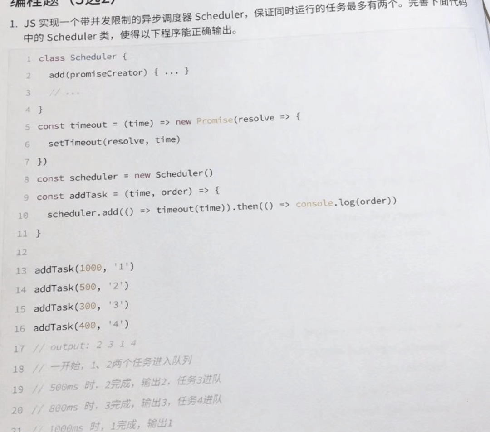

# 大厂真题

## 判断一个对象是数组的方法？
- Object.prototype.toString.call(xxx)
- Array.isArray(xxx)
- xxx instaceOf Array

## bind有什么用？连续多个bind，最后this指向是什么？
- bind的作用是改变函数执行的指向，且不会立即执行，而是返回一个新的函数，可以自主调用这个函数的执行,连续多个bind之后this指向始终指向第一个。

## DOMContentLoaded和load的区别

- 当初始的 HTML 文档被完全加载和解析完成之后，DOMContentLoaded 事件被触发，而无需等待样式表、图像和子框架的完全加载
- load 仅用于检测一个完全加载的页面，页面的html、css、js、图片等资源都已经加载完之后才会触发 load 事件

## 头条 —— 实现一个带并发限制的promise异步调度器

```js
class Scheduler {
  constructor() {
    this.queue = [];
    this.maxCount = 2;
    this.runIndex = 0;
  }
  add(promiseCreator) {
    this.queue.push(promiseCreator);
  }
  taskStart() {
    for (let i = 0; i < this.maxCount; i++) {
      this.request();
    }
  }
  request() {
    if (!this.queue || !this.queue.length || this.runIndex >= this.maxCount) {
      return;
    }
    this.runIndex++;

    this.queue.shift()().then(() => {
      this.runIndex--;
      this.request();
    });
  }
}
   
const timeout = time => new Promise(resolve => {
  setTimeout(resolve, time);
})
  
const scheduler = new Scheduler();
  
const addTask = (time,order) => {
  scheduler.add(() => timeout(time).then(()=>console.log(order)))
}
  
  
addTask(1000, '1');
addTask(500, '2');
addTask(300, '3');
addTask(400, '4');
  
scheduler.taskStart()

```