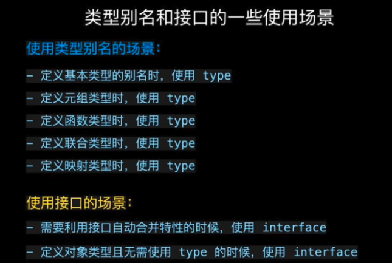

# 真题
## typescript 的特点

- 可以在编译期间发现并纠正错误
- 提高可维护性
- 提高协同开发的效率
- 支持强类型、接口、泛型、模块
## 1、手写体：使用TypeScript 实现一个 get 函数来获取它的属性值
```
const data = { name: 'tom', age: 18, address: 'xxx' }
```
解答
```
const get = <T extends object, K extends keyof T>(obj: T, key: K): T[K] => {
  return obj[key]
}
```

## 2、ts中的 any 、 unknown 的区别？
- any：变量如果是 any 类型，绕过所有类型检查，直接可使用
- unknown：变量如果是 unknow 类型，需要判断完是什么类型之后才能使用

## 3、有用过ts中的 keyof 吗？
将一个interface的所有key，汇聚成一个联合类型，可以用来对传入key的限制，比如：
```
interface Target {
  name: string,
  age: number
}

const fn = (obj: Target, key: keyof Target) => {}

const obj: Target = { name: 'sunshine', age: 18 }

fn(obj, name) // 成功
fn(obj, age) // 成功
fn(obj, height) // 报错
```

## 4、type 和 interface 区别？

### 1.相同点
#### 1.都可以用来描述对象或函数
```js
// 类型别名 type
type Point = { x: number, y: number };
type SetPoint = ( x: number, y: number ) => void;

// 接口 interface
interface Point { x: number, y: number };
interface SetPoint {
  ( x: number, y: number ): void;
} 
```

#### 2.都支持拓展 
```js
// 类型别名 type -> 通过交叉运算符 & 拓展
type T1 = { name: string };
type T2 = T1 & { honey: boolean };
const t: T2 = getBear();
t.name;
t.honey;

// 接口 interface -> 通过 extends 拓展
interface I1 { name: string };
interface I2 extends I1 {
  honey: boolean;
}

// 接口 interface 通过 extends 拓展类型别名 type
interface I2 extends T1 {
  honey: boolean;
}

// 类型别名通过交叉运算符 & 拓展接口 interface
type T2 = I1 & { honey: boolean };
```

### 2.不同点
#### 1.类型别名 type 用于基本类型、联合类型或元组类型定义，而接口 interface 不行
```js
type T1 = number;
type T2 = string | number;
type T3 = [number, number];
```

#### 2.同名接口 interface 会自动合并，而类型别名 type 不会 
```js
// 同名接口合并
interface User { name: string };
interface User { age: number };

let user: User = { name: 'leo', age: 18 };
user.name; // 'leo'
user.age;  // 18

// 同名类型别名会冲突
type User = { name: string };
type User = { age : number };
```

### 3.使用场景



