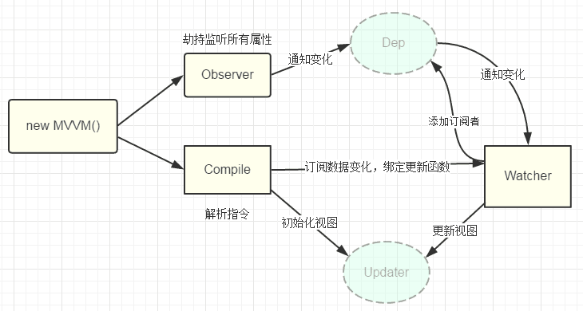

# vue基础

##  1.Vue.js是什么
Vue.js（是一套构建用户界面的 渐进式框架。与其他重量级框架不同的是，Vue 采用自底向上增量开发的设计。Vue 的核心库只关注视图层，并且非常容易学习，非常容易与其它库或已有项目整合。另一方面，Vue 完全有能力驱动采用单文件组件和Vue生态系统支持的库开发的复杂单页应用。Vue.js 的目标是通过尽可能简单的 API 实现响应的数据绑定和组合的视图组件

## 2.Vue.js特点
- 数据驱动：自动计算属性和追踪依赖的模板表达式
- 组件化：用可复用、解耦的组件来构造页面
- 轻量：代码量小，不依赖其他库
- 快速：精确有效批量DOM更新

## 3.MVVM模式
即Model-View-ViewModel

MVVM 由 Model,View,ViewModel 三部分构成，Model 层代表数据模型，也可以在Model中定义数据修改和操作的业务逻辑；View 代表UI 组件，它负责将数据模型转化成UI 展现出来，ViewModel 是一个同步View 和 Model的对象。

在MVVM架构下，View 和 Model 之间并没有直接的联系，而是通过ViewModel进行交互，Model 和 ViewModel 之间的交互是双向的， 因此View 数据的变化会同步到Model中，而Model 数据的变化也会立即反应到View 上。

ViewModel 通过双向数据绑定把 View 层和 Model 层连接了起来，而View 和 Model 之间的同步工作完全是自动的，无需人为干涉，因此开发者只需关注业务逻辑，不需要手动操作DOM, 不需要关注数据状态的同步问题，复杂的数据状态维护完全由 MVVM 来统一管理。

## 4.vue 的双向绑定的原理
vue.js 是采用数据劫持结合发布者-订阅者模式的方式，通过 Object.defineProperty()来劫持各个属性的 setter，getter，在数据变动时发布消息给订阅者，触发相应的监听回调。

::: tip
 Observer 数据监听器，能够对数据对象的所有属性进行监听，如有变动可拿到最新值并通知订阅者，内部采用Object.defineProperty的getter和setter来实现。

 Compile 指令解析器，它的作用对每个元素节点的指令进行扫描和解析，根据指令模板替换数据，以及绑定相应的更新函数。

 Watcher 订阅者， 作为连接 Observer 和 Compile 的桥梁，能够订阅并收到每个属性变动的通知，执行指令绑定的相应回调函数。

 Dep 消息订阅器，内部维护了一个数组，用来收集订阅者（Watcher），数据变动触发notify 函数，再调用订阅者的 update 方法。
:::

从图中可以看出，当执行 new Vue() 时，Vue 就进入了初始化阶段，一方面Vue 会遍历 data 选项中的属性，并用 Object.defineProperty 将它们转为 getter/setter，实现数据变化监听功能；另一方面，Vue 的指令编译器Compile 对元素节点的指令进行扫描和解析，初始化视图，并订阅Watcher 来更新视图， 此时Wather 会将自己添加到消息订阅器中(Dep),初始化完毕。

当数据发生变化时，Observer 中的 setter 方法被触发，setter 会立即调用Dep.notify()，Dep 开始遍历所有的订阅者，并调用订阅者的 update 方法，订阅者收到通知后对视图进行相应的更新。

Vue3.0 要使用 Proxy 替换原本的 API 原因在于 Proxy 无需一层层递归为每个属性添加代理，一次即可完成以上操作，性能上更好，并且原本的实现有一些数据更新不能监听到，但是 Proxy 可以完美监听到任何方式的数据改变

## 5.keep-alive
keep-alive是Vue提供的一个抽象组件，主要用于保留组件状态或避免重新渲染
<component :is='curremtView' keep-alive></component>

## 6.nextTick用法
在下次 DOM 更新循环结束之后执行延迟回调

## 7.对 Vue 生命周期的理解？
开始创建、初始化数据、编译模板、挂载Dom→渲染、更新→渲染、卸载等一系列过程
总共分为 8 个阶段创建前/后，载入前/后，更新前/后，销毁前/后

创建前/后： 在 beforeCreate 阶段，vue 实例的挂载元素 el 还没有

载入前/后：在 beforeMount 阶段，vue 实例的$el 和 data 都初始化了，但还是挂载之前为虚拟的 dom 节点，data.message 还未替换。在 mounted 阶段，vue 实例挂载完成，data.message 成功渲染

更新前/后：当 data 变化时，会触发 beforeUpdate 和 updated 方法

销毁前/后：在执行 destroy 方法后，对 data 的改变不会再触发周期函数，说明此时 vue 实例已经解除了事件监听以及和 dom 的绑定，但是 dom 结构依然存在

## 8.每个周期具体适合哪些场景
beforecreate : 可以在这加个loading事件，在加载实例时触发
created : 初始化完成时的事件写在这里，如在这结束loading事件，异步请求也适宜在这里调用
mounted : 挂载元素，获取到DOM节点 updated : 如果对数据统一处理，在这里写上相应函数
beforeDestroy : 可以做一个确认停止事件的确认框 

## 9.组件之间如何传值？
- 1.props / $emit
- 2.vuex
- 3.provide/ inject
- 4.ref / refs
- 5.$children / $parent
- 6.eventBus等

## 10.vue路由传参数
- 1.使用query方法传入的参数使用this.$route.query接受
- 2.使用params方式传入的参数使用this.$route.params接受

## 11.vuex 是什么？ 有哪几种属性？
Vuex 是一个专为 Vue.js 应用程序开发的状态管理模式。

有 5 种，分别是 state、getter、mutation、action、module

- vuex 的 store 是什么？
vuex 就是一个仓库，仓库里放了很多对象。其中 state 就是数据源存放地，对应于一般 vue 对象里面的 datastate 里面存放的数据是响应式的，vue 组件从 store 读取数据，若是 store 中的数据发生改变，依赖这相数据的组件也会发生更新它通过 mapState 把全局的 state 和 getters 映射到当前组件的 computed 计算属性
- vuex 的 getter 是什么？
getter 可以对 state 进行计算操作，它就是 store 的计算属性虽然在组件内也可以做计算属性，但是 getters 可以在多给件之间复用如果一个状态只在一个组件内使用，是可以不用 getters
- vuex 的 mutation 是什么？
更改Vuex的store中的状态的唯一方法是提交mutation
- vuex 的 action 是什么？
action 类似于 muation, 不同在于：action 提交的是 mutation,而不是直接变更状态action 可以包含任意异步操作 
vue 中 ajax 请求代码应该写在组件的 methods 中还是 vuex 的 action 中
vuex 的 module 是什么？
面对复杂的应用程序，当管理的状态比较多时；我们需要将vuex的store对象分割成模块(modules)。

## 12.vue-router 有哪几种导航钩子?

全局导航钩子:

router.beforeEach(to, from, next),

router.beforeResolve(to, from, next),

router.afterEach(to, from ,next)

组件内钩子:

beforeRouteEnter,

beforeRouteUpdate,

beforeRouteLeave

单独路由独享组件:

beforeEnter

## 13.v-model的原理？
v-model本质上就是语法糖，即利用v-model绑定数据后，其实就是既绑定了数据，又添加了一个input事件监听

## 14.vue中key的原理？
作用的话，便于diff算法的更新，key的唯一性，能让算法更快的找到需要更新的dom，需要注意的是，key要唯一，不然会出现很隐蔽性的更新问题。

## 15.使用vue渲染大量数据时应该怎么优化
Object.freeze
使用方式：this.item = Object.freeze(Object.assign({}, this.item))

## 16.provide和inject的理解
通过在父组件中inject一些数据然后再所有子组件中都可以通过provide获取使用该参数,

主要是为了解决一些循环组件比如tree, menu, list等, 传参困难, 并且难以管理的问题, 主要用于组件封装, 常见于一些ui组件库

## 17.vuex 的mutation和action的特性是什么？有什么区别？
mutation用于修改state的数据，是同步的

action 类似于 muation, 不同在于：action 提交的是 mutation,而不是直接变更状态

action 可以包含任意异步操作

## 18.为什么vue中 data 必须是一个函数？
一个组件的 data 选项必须是一个函数，因此每个实例可以维护一份被返回对象的独立的拷贝：
返回一个唯一的对象，不要和其他组件共用一个对象进行返回!!!每一个实例的data属性都是独立的；

## 19.axios封装
1.设置axios默认baseURL axios.defaults.baseURL
2.设置axios默认请求数据类型  axios.defaults.headers.common["Accept"] = "application/json"
#### 请求拦截
每次发送请求之前判断vuex中是否存在token,统一在http请求的header都加上token，这样后台根据token判断你的登录情况
#### 响应拦截
服务器返回给我们的数据，我们在拿到之前可以对他进行一些处理。例如上面的思想：如果后台返回的状态码是200，则正常返回数据，否则的根据错误的状态码类型进行一些我们需要的错误。
#### 登陆token
如果token存在说明用户已经登陆过，则更新vuex中的token状态。然后，在每次请求接口的时候，都会在请求的header中携带token.
#### 路由拦截
1.处理低版本浏览器
2.仓库中没有token,并且要去的页面不是登陆页，跳转到登陆页
3.权限页面控制和404
利用全局路由钩子beforeEach 
#### 权限控制
1 给账号增加角色 不同角色对应不同的权限
2 根据用户信息的权限返回一个权限对象
3 公共方法permission.js处理这个权限对象
4 在路由中meta设置auth. 公共侧边栏利用this.permission(meta.auth)控制页面权限

## 20.Virtual Dom 的优势在哪里？
> DOM 引擎、JS 引擎 相互独立，但又工作在同一线程（主线程）JS 代码调用 DOM API 必须 挂起 JS 引擎、转换传入参数数据、激活 DOM 引擎,引擎间切换的单位代价将迅速积累若其中有强制重绘的 DOM API 调用，重新计算布局、重新绘制图像会引起更大的性能消耗.
- 1.虚拟 DOM 不会立马进行排版与重绘操作
- 2.虚拟 DOM 进行频繁修改，然后一次性比较并修改真实 DOM 中需要改的部分，最后在真实 DOM 中进行排版与重绘，减少过多DOM节点排版与重绘损耗
- 3.虚拟 DOM 有效降低大面积真实 DOM 的重绘与排版，因为最终与真实 DOM 比较差异，可以只渲染局部

## 21.单页应用有那些优缺点？
优点：对服务器请求较少，减轻了服务器的压力，只需要一次加载，页面片段之间切换快，用户体验良好
缺点：第一次加载时耗费时间较长，不利于SEO

## 22.common.js 和 es6 中模块引入的区别？
- 1.CommonJS 模块输出的是一个值的拷贝，ES6 模块输出的是值的引用。
- 2.CommonJS 模块是运行时加载，ES6 模块是编译时输出接口。
- 3.CommonJs 是单个值导出，ES6 Module可以导出多个

## 23.vue3今年发布了，请你说一下他们之间在相应式的实现上有什么区别？Proxy 相比于 defineProperty 的优势 
vue2采用的是defineProperty去定义get，set，而vue3改用了proxy.

#### 24.Proxy的优势
- 1.可以直接监听对象而非属性
- 2.可以直接监听数组的变化
- 3.Proxy返回一个新对象，可以只操作新对象达到目的，而Object.defineProperty只能遍历对象属性直接修改

## 25.像vue-router，vuex他们都是作为vue插件，请说一下他们分别都是如何在vue中生效的？
通过vue的插件系统，用vue.mixin混入到全局，在每个组件的生命周期的某个阶段注入组件实例

## 26.请你说一下vue的设计架构
vue2采用的是典型的混入式架构，各部分分模块开发，再通过一个mixin去混入到最终暴露到全局的类上

