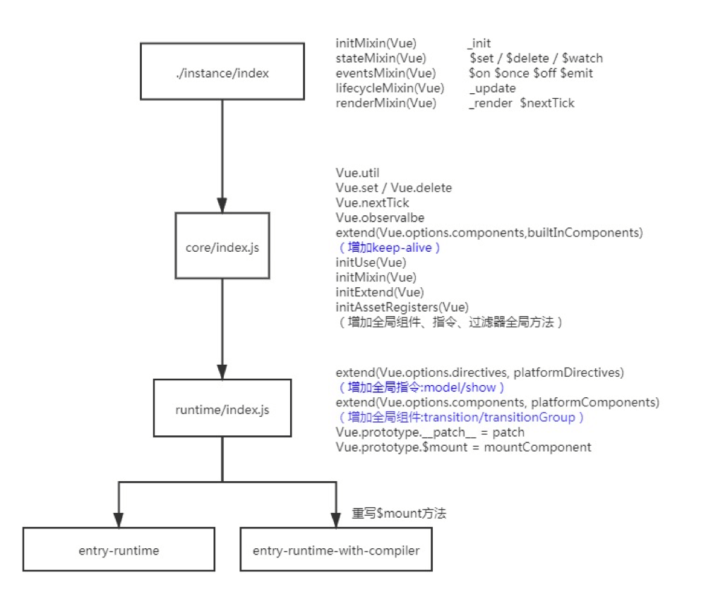
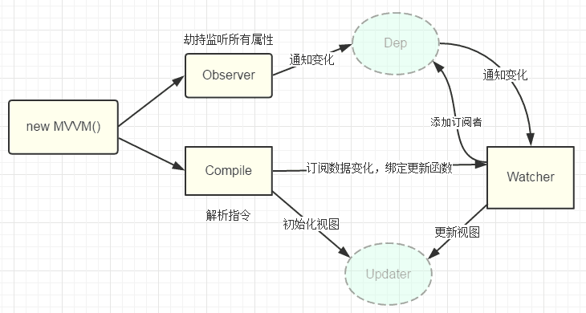
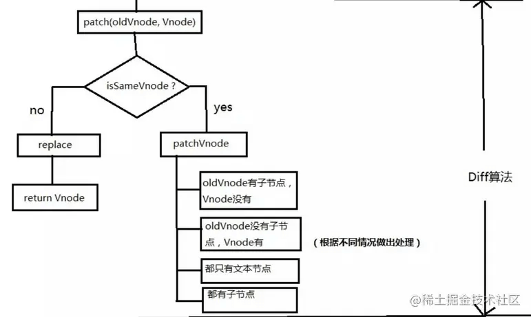
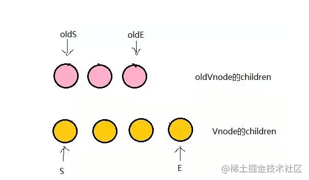

# Vue2

## 1、Vue的构造函数
- instance/index.js 真正的Vue的构造函数,并在Vue的原型上扩展方法
- core/index.js 增加全局API方法
- runtime/index.js 扩展$mount方法及平台对应的代码

## 2、vue中几个核心类
- 1.Observe数据监听器：对data里的属性添加getter/setter，进行**依赖收集**以及**派发更新**。
- 2.Dep消息订阅器：用于收集当前响应式对象的依赖关系，每个响应式对象都有一个dep实例。dep.subs=watcher[]，当数据发生变化时，触发dep.notify，该方法会遍历subs数组，调用每一个watcher的update方法。
- 3.Watcher观察者：作为连接 Observer 和 Compile 的桥梁，能够订阅并收到每个属性变动的通知Watcher类有多种，比如computed watcher，user watcher(自己在watch里定义的需要监听数据变化的watcher)。
- 4.Compile指令解析器：它的作用对每个元素节点的指令进行扫描和解析，根据指令模板替换数据，以及绑定相应的更新函数。


## 3、双向数据绑定原理

### 依赖收集
- initstate，对computed属性初始化时，触发computed watcher依赖收集
- initstate，对监听属性初始化时，触发user watcher依赖收集
- render，会触发render依赖收集

### 派发更新 Object.defineProperty
- 1.组件中对相应的数据发生了修改，会触发setter
- 2.dep.notify
- 3.遍历subs数组，调用每一个watcher的update方法

### 过程 
- 初始化阶段，一方面Vue 会遍历 data 选项中的属性，并用 Object.defineProperty 将它们转为 getter/setter，实现数据变化监听功能；另一方面，Vue 的指令编译器Compile 对元素节点的指令进行扫描和解析，初始化视图，并订阅Watcher 来更新视图， 此时Wather 会将自己添加到消息订阅器中(Dep),初始化完毕。
- 当数据发生变化时，Observer 中的 setter 方法被触发，setter 会立即调用Dep.notify()，Dep 开始遍历所有的订阅者，并调用订阅者的 update 方法，订阅者收到通知后对视图进行相应的更新。

### 代码
```js
// src/obserber/index.js
class Observer {
  // 观测值
  constructor(value) {
    this.walk(value);
  }
  walk(data) {
    // 对象上的所有属性依次进行观测
    let keys = Object.keys(data);
    for (let i = 0; i < keys.length; i++) {
      let key = keys[i];
      let value = data[key];
      defineReactive(data, key, value);
    }
  }
}
// Object.defineProperty数据劫持核心 兼容性在ie9以及以上
function defineReactive(data, key, value) {
  observe(value); // 递归关键
  // --如果value还是一个对象会继续走一遍odefineReactive 层层遍历一直到value不是对象才停止
  //   思考？如果Vue数据嵌套层级过深 >>性能会受影响
  Object.defineProperty(data, key, {
    get() {
      console.log("获取值");
      return value;
    },
    set(newValue) {
      if (newValue === value) return;
      console.log("设置值");
      value = newValue;
    },
  });
}
export function observe(value) {
  // 如果传过来的是对象或者数组 进行属性劫持
  if (
    Object.prototype.toString.call(value) === "[object Object]" ||
    Array.isArray(value)
  ) {
    return new Observer(value);
  }
}

```

## 4、Object.defineProperty 缺点？
- 不能监听数组的变化
- 无法检测到对象新增或删除的属性
- 必须遍历对象的每个属性、深层遍历嵌套的对象

## 5、数组的观测

- 1.因为对数组下标的拦截太浪费性能 对 Observer 构造函数传入的数据参数增加了数组的判断
```js
// src/obserber/index.js
import { arrayMethods } from "./array";
class Observer {
  constructor(value) {
    if (Array.isArray(value)) {
      // 这里对数组做了额外判断
      // 通过重写数组原型方法来对数组的七种方法进行拦截
      value.__proto__ = arrayMethods;
      // 如果数组里面还包含数组 需要递归判断
      this.observeArray(value);
    } else {
      this.walk(value);
    }
  }
  observeArray(items) {
    for (let i = 0; i < items.length; i++) {
      observe(items[i]);
    }
  }
}

```

- 2.每个响应式数据增加了一个不可枚举的__ob__属性 并且指向了 Observer 实例
  - 1.可以根据这个属性来防止已经被响应式观察的数据反复被观测
  - 2.响应式数据可以使用__ob__来获取 Observer 实例的相关方法
```js
// src/obserber/index.js
class Observer {
  // 观测值 给每个value添加__ob__属性
  constructor(value) {
    Object.defineProperty(value, "__ob__", {
      //  值指代的就是Observer的实例
      value: this,
      //  不可枚举
      enumerable: false,
      writable: true,
      configurable: true,
    });
  }
}
```
- 3.对数组原型重写

```js
// src/obserber/array.js
// 先保留数组原型
const arrayProto = Array.prototype;
// 然后将arrayMethods继承自数组原型
// 这里是面向切片编程思想（AOP）--不破坏封装的前提下，动态的扩展功能
export const arrayMethods = Object.create(arrayProto);
// 为什么重写七个方法？ 会改变原数组
// 其它方法如何？join concat map filter forEach	reduce every somesome flat slice
// value.__proto__  => arrayMethods => arrayMethods.__proto__ => Array.prototype

let methodsToPatch = [
  "push",
  "pop",
  "shift",
  "unshift",
  "splice",
  "reverse",
  "sort",
];
methodsToPatch.forEach((method) => {
  arrayMethods[method] = function (...args) {
    //   这里保留原型方法的执行结果
    const result = arrayProto[method].apply(this, args);
    // 这句话是关键
    // this就是被检测的数据，比如数据是{msg:[1,2,3]}，msg.push(4) this就是msg ob就是msg.__ob__ （上段代码增加，该数据已经被响应式观察）所以下面就可以使用ob.observeArray
    const ob = this.__ob__;

    // 这里的标志就是代表数组有新增操作
    let inserted;
    switch (method) {
      case "push":
      case "unshift":
        inserted = args;
        break;
      case "splice":
        inserted = args.slice(2);
      default:
        break;
    }
    // 如果有新增的元素 inserted是一个数组 调用Observer实例的observeArray对数组每一项进行观测
    if (inserted) ob.observeArray(inserted);
    // 之后咱们还可以在这里检测到数组改变了之后从而触发视图更新的操作--后续源码会揭晓
    return result;
  };
});

```

## 6、this访问data和methods

- 通过 this 直接访问到 data 里面的数据的原因是：data里的属性最终会存储到new Vue的实例（vm）上的 _data对象中，访问 this.xxx，是访问Object.defineProperty代理后的 this._data.xxx。
```js
// 初始化data数据
function initData(vm) {
  let data = vm.$options.data;
  //   实例的_data属性就是传入的data
  // vue组件data推荐使用函数 防止数据在组件之间共享
  data = vm._data = typeof data === "function" ? data.call(vm) : data || {};

  // 把data数据代理到vm 也就是Vue实例上面 我们可以使用this.a来访问this._data.a
  for (let key in data) {
    proxy(vm, `_data`, key);
  }
}
// 数据代理
function proxy(object, sourceKey, key) {
  Object.defineProperty(object, key, {
    get() {
      return object[sourceKey][key];
    },
    set(newValue) {
      object[sourceKey][key] = newValue;
    },
  });
}

```
- 通过this直接访问到methods里面的函数的原因是：因为methods里的方法通过 bind 指定了this为 new Vue的实例(vm)
```js
// initMethods
function initMethods (vm, methods) {
    var props = vm.$options.props;
    for (var key in methods) {
      vm[key] = typeof methods[key] !== 'function' ? noop : bind(methods[key], vm);
    }
}


function nativeBind (fn, ctx) {
  return fn.bind(ctx)
}
var bind = Function.prototype.bind
  ? nativeBind
  : polyfillBind

```


## 7、diff算法、虚拟dom

### 虚拟dom
- 虚拟DOM是一个纯粹的JS对象，可以通过document.createDocumentFragment 创建。
- 浏览器解析一个html大致分为五步：创建DOM tree –> 创建Style Rules -> 构建Render tree -> 布局Layout –> 绘制Painting。每次对真实dom进行操作的时候，浏览器都会从构建dom树开始从头到尾执行一遍流程。真实的dom操作代价昂贵，操作频繁还会引起页面卡顿影响用户体验，虚拟dom就是为了解决这个浏览器性能问题才被创造出来。

### diff算法
- 1.diff 只进行同级比较
- 2.根据新老 node子节点不同情况分别处理

### patchVnode的规则
  

- 1.如果新旧VNode都是静态的，同时它们的key相同（代表同一节点），那么只需要替换elm以及componentInstance即可（原地复用）。
- 2.新老节点均有children子节点且不同，则对子节点进行diff操作，调用**updateChildren**，这个updateChildren也是diff的核心。
- 3.如果只有新节点存在子节点，先清空老节点DOM的文本内容，然后为当前DOM节点加入子节点。
- 4.如果只有老节点有子节点，直接删除老节点的子节点。
- 5.当新老节点都无子节点的时候，只是文本的替换


```js
// src/vdom/patch.js

export function patch(oldVnode, vnode) {
  const isRealElement = oldVnode.nodeType;
  if (isRealElement) {
    // oldVnode是真实dom元素 就代表初次渲染
  } else {
    // oldVnode是虚拟dom 就是更新过程 使用diff算法
    if (oldVnode.tag !== vnode.tag) {
      // 如果新旧标签不一致 用新的替换旧的 oldVnode.el代表的是真实dom节点--同级比较
      oldVnode.el.parentNode.replaceChild(createElm(vnode), oldVnode.el);
    }
    // 如果旧节点是一个文本节点
    if (!oldVnode.tag) {
      if (oldVnode.text !== vnode.text) {
        oldVnode.el.textContent = vnode.text;
      }
    }
    // 不符合上面两种 代表标签一致 并且不是文本节点
    // 为了节点复用 所以直接把旧的虚拟dom对应的真实dom赋值给新的虚拟dom的el属性
    const el = (vnode.el = oldVnode.el);
    updateProperties(vnode, oldVnode.data); // 更新属性
    const oldCh = oldVnode.children || []; // 老的儿子
    const newCh = vnode.children || []; // 新的儿子
    if (oldCh.length > 0 && newCh.length > 0) {
      // 新老都存在子节点
      updateChildren(el, oldCh, newCh);
    } else if (oldCh.length) {
      // 老的有儿子新的没有
      el.innerHTML = "";
    } else if (newCh.length) {
      // 新的有儿子
      for (let i = 0; i < newCh.length; i++) {
        const child = newCh[i];
        el.appendChild(createElm(child));
      }
    }
  }
}

```


### updateChildren 更新子节点-diff 核心方法
```js

// 判断两个vnode的标签和key是否相同 如果相同 就可以认为是同一节点就地复用
function isSameVnode(oldVnode, newVnode) {
  return oldVnode.tag === newVnode.tag && oldVnode.key === newVnode.key;
}

// diff算法核心 采用双指针的方式 对比新老vnode的儿子节点
function updateChildren(parent, oldCh, newCh) {
  let oldStartIndex = 0; //老儿子的起始下标
  let oldStartVnode = oldCh[0]; //老儿子的第一个节点
  let oldEndIndex = oldCh.length - 1; //老儿子的结束下标
  let oldEndVnode = oldCh[oldEndIndex]; //老儿子的起结束节点

  let newStartIndex = 0; //同上  新儿子的
  let newStartVnode = newCh[0];
  let newEndIndex = newCh.length - 1;
  let newEndVnode = newCh[newEndIndex];

  // 根据key来创建老的儿子的index映射表  类似 {'a':0,'b':1} 代表key为'a'的节点在第一个位置 key为'b'的节点在第二个位置
  function makeIndexByKey(children) {
    let map = {};
    children.forEach((item, index) => {
      map[item.key] = index;
    });
    return map;
  }
  // 生成的映射表
  let map = makeIndexByKey(oldCh);

  // 只有当新老儿子的双指标的起始位置不大于结束位置的时候  才能循环 一方停止了就需要结束循环
  while (oldStartIndex <= oldEndIndex && newStartIndex <= newEndIndex) {
    // 因为暴力对比过程把移动的vnode置为 undefined 如果不存在vnode节点 直接跳过
    if (!oldStartVnode) {
      oldStartVnode = oldCh[++oldStartIndex];
    } else if (!oldEndVnode) {
      oldEndVnode = oldCh[--oldEndIndex];
    } else if (isSameVnode(oldStartVnode, newStartVnode)) {
      // 头和头对比 依次向后追加
      patch(oldStartVnode, newStartVnode); //递归比较儿子以及他们的子节点
      oldStartVnode = oldCh[++oldStartIndex];
      newStartVnode = newCh[++newStartIndex];
    } else if (isSameVnode(oldEndVnode, newEndVnode)) {
      //尾和尾对比 依次向前追加
      patch(oldEndVnode, newEndVnode);
      oldEndVnode = oldCh[--oldEndIndex];
      newEndVnode = newCh[--newEndIndex];
    } else if (isSameVnode(oldStartVnode, newEndVnode)) {
      // 老的头和新的尾相同 把老的头部移动到尾部
      patch(oldStartVnode, newEndVnode);
      parent.insertBefore(oldStartVnode.el, oldEndVnode.el.nextSibling); //insertBefore可以移动或者插入真实dom
      oldStartVnode = oldCh[++oldStartIndex];
      newEndVnode = newCh[--newEndIndex];
    } else if (isSameVnode(oldEndVnode, newStartVnode)) {
      // 老的尾和新的头相同 把老的尾部移动到头部
      patch(oldEndVnode, newStartVnode);
      parent.insertBefore(oldEndVnode.el, oldStartVnode.el);
      oldEndVnode = oldCh[--oldEndIndex];
      newStartVnode = newCh[++newStartIndex];
    } else {
      // 上述四种情况都不满足 那么需要暴力对比
      // 根据老的子节点的key和index的映射表 从新的开始子节点进行查找 如果可以找到就进行移动操作 如果找不到则直接进行插入
      let moveIndex = map[newStartVnode.key];
      if (!moveIndex) {
        // 老的节点找不到  直接插入
        parent.insertBefore(createElm(newStartVnode), oldStartVnode.el);
      } else {
        let moveVnode = oldCh[moveIndex]; //找得到就拿到老的节点
        oldCh[moveIndex] = undefined; //这个是占位操作 避免数组塌陷  防止老节点移动走了之后破坏了初始的映射表位置
        parent.insertBefore(moveVnode.el, oldStartVnode.el); //把找到的节点移动到最前面
        patch(moveVnode, newStartVnode);
      }
    }
  }
  // 如果老节点循环完毕了 但是新节点还有  证明  新节点需要被添加到头部或者尾部
  if (newStartIndex <= newEndIndex) {
    for (let i = newStartIndex; i <= newEndIndex; i++) {
      // 这是一个优化写法 insertBefore的第一个参数是null等同于appendChild作用
      const ele =
        newCh[newEndIndex + 1] == null ? null : newCh[newEndIndex + 1].el;
      parent.insertBefore(createElm(newCh[i]), ele);
    }
  }
  // 如果新节点循环完毕 老节点还有  证明老的节点需要直接被删除
  if (oldStartIndex <= oldEndIndex) {
    for (let i = oldStartIndex; i <= oldEndIndex; i++) {
      let child = oldCh[i];
      if (child != undefined) {
        parent.removeChild(child.el);
      }
    }
  }
}

```
 - 1.使用双指针移动来进行新老节点的对比

- 2.用 isSameVnode 来判断新老子节点的头头 尾尾 头尾 尾头 是否是同一节点 如果满足就进行相应的移动指针(头头 尾尾)或者移动 dom 节点(头尾 尾头)操作
- 3.如果全都不相等 进行暴力对比 如果找到了利用 key 和 index 的映射表来移动老的子节点到前面去 如果找不到就直接插入
- 4.对老的子节点进行递归 patch 处理
- 5.后老的子节点有多的就删掉 新的子节点有多的就添加到相应的位置

## 8、nextTick 实现原理
同步往队列里添加回调函数
promise => MutationObserver => setImmediate => setTimeout

```js
// src/observer/scheduler.js
//先同步把 watcher 都放到队列里面去 执行完队列的事件之后再清空队列

import { nextTick } from "../util/next-tick";
let queue = [];
let has = {};
function flushSchedulerQueue() {
  for (let index = 0; index < queue.length; index++) {
    //   调用watcher的run方法 执行真正的更新操作
    queue[index].run();
  }
  // 执行完之后清空队列
  queue = [];
  has = {};
}

// 实现异步队列机制
export function queueWatcher(watcher) {
  const id = watcher.id;
  //   watcher去重
  if (has[id] === undefined) {
    //  同步代码执行 把全部的watcher都放到队列里面去
    queue.push(watcher);
    has[id] = true;
    // 进行异步调用
    nextTick(flushSchedulerQueue);
  }
}
}
```
```js
// src/util/next-tick.js

let callbacks = [];
let pending = false;
function flushCallbacks() {
  pending = false; //把标志还原为false
  // 依次执行回调
  for (let i = 0; i < callbacks.length; i++) {
    callbacks[i]();
  }
}
let timerFunc; //定义异步方法  采用优雅降级
if (typeof Promise !== "undefined") {
  // 如果支持promise
  const p = Promise.resolve();
  timerFunc = () => {
    p.then(flushCallbacks);
  };
} else if (typeof MutationObserver !== "undefined") {
  // MutationObserver 主要是监听dom变化 也是一个异步方法
  let counter = 1;
  const observer = new MutationObserver(flushCallbacks);
  const textNode = document.createTextNode(String(counter));
  observer.observe(textNode, {
    characterData: true,
  });
  timerFunc = () => {
    counter = (counter + 1) % 2;
    textNode.data = String(counter);
  };
} else if (typeof setImmediate !== "undefined") {
  // 如果前面都不支持 判断setImmediate
  timerFunc = () => {
    setImmediate(flushCallbacks);
  };
} else {
  // 最后降级采用setTimeout
  timerFunc = () => {
    setTimeout(flushCallbacks, 0);
  };
}

export function nextTick(cb) {
  // 除了渲染watcher  还有用户自己手动调用的nextTick 一起被收集到数组
  callbacks.push(cb);
  if (!pending) {
    // 如果多次调用nextTick  只会执行一次异步 等异步队列清空之后再把标志变为false
    pending = true;
    timerFunc();
  }
}
```

## 9、computed

#### 对计算属性进行属性劫持

- defineComputed 重新定义计算属性,劫持get方法,计算属性依赖的值,需要根据依赖值是否发生变化来判断计算属性是否需要重新计算;
- createComputedGetter 判断计算属性依赖的值是否变化,Watcher增加dirty标志,如果标志变为 true 代表需要调用 watcher.evaluate重新计算;
```js
//  src/state.js

// 定义普通对象用来劫持计算属性
const sharedPropertyDefinition = {
  enumerable: true,
  configurable: true,
  get: () => {},
  set: () => {},
};

// 重新定义计算属性  对get和set劫持
function defineComputed(target, key, userDef) {
  if (typeof userDef === "function") {
    // 如果是一个函数  需要手动赋值到get上
    sharedPropertyDefinition.get = createComputedGetter(key);
  } else {
    sharedPropertyDefinition.get = createComputedGetter(key);
    sharedPropertyDefinition.set = userDef.set;
  }
  //   利用Object.defineProperty来对计算属性的get和set进行劫持
  Object.defineProperty(target, key, sharedPropertyDefinition);
}

// 重写计算属性的get方法 来判断是否需要进行重新计算
function createComputedGetter(key) {
  return function () {
    const watcher = this._computedWatchers[key]; //获取对应的计算属性watcher
    if (watcher) {
      if (watcher.dirty) {
        watcher.evaluate(); //计算属性取值的时候 如果是脏的  需要重新求值
      }
      return watcher.value;
    }
  };
}

```

```js
// src/observer/watcher.js

export default class Watcher {
  constructor(vm, exprOrFn, cb, options) {
    this.lazy = options.lazy; //标识计算属性watcher
    this.dirty = this.lazy; //dirty可变  表示计算watcher是否需要重新计算 默认值是true
    // 非计算属性实例化就会默认调用get方法 进行取值  保留结果 计算属性实例化的时候不会去调用get
    this.value = this.lazy ? undefined : this.get();
  }
  get() {
    pushTarget(this); // 在调用方法之前先把当前watcher实例推到全局Dep.target上
    const res = this.getter.call(this.vm); //计算属性在这里执行用户定义的get函数 访问计算属性的依赖项 从而把自身计算Watcher添加到依赖项dep里面收集起来
    popTarget(); // 在调用方法之后把当前watcher实例从全局Dep.target移除
    return res;
  }
  update() {
    // 计算属性依赖的值发生变化 只需要把dirty置为true  下次访问到了重新计算
    if (this.lazy) {
      this.dirty = true;
    } else {
      // 每次watcher进行更新的时候  可以让他们先缓存起来  之后再一起调用
      // 异步队列机制
      queueWatcher(this);
    }
  }
  //   计算属性重新进行计算 并且计算完成把dirty置为false
  evaluate() {
    this.value = this.get();
    this.dirty = false;
  }
  depend() {
    // 计算属性的watcher存储了依赖项的dep
    let i = this.deps.length;
    while (i--) {
      this.deps[i].depend(); //调用依赖项的dep去收集渲染watcher
    }
  }
}
```
- 1.实例化的时候如果是计算属性 不会去调用 get 方法访问值进行依赖收集
- 2.update 方法只是把计算 watcher 的 dirty 标识为 true 只有当下次访问到了计算属性的时候才会重新计算
- 3.新增 evaluate 方法专门用于计算属性重新计算
- 4.新增 depend 方法 让计算属性的依赖值收集外层 watcher

## 10、watch

#### 侦听属性的初始化
```js
// src/state.js
// 统一初始化数据的方法
export function initState(vm) {
  // 获取传入的数据对象
  const opts = vm.$options;
  if (opts.watch) {
    //侦听属性初始化
    initWatch(vm);
  }
}

// 初始化watch
function initWatch(vm) {
  let watch = vm.$options.watch;
  for (let k in watch) {
    const handler = watch[k]; //用户自定义watch的写法可能是数组 对象 函数 字符串
    if (Array.isArray(handler)) {
      // 如果是数组就遍历进行创建
      handler.forEach((handle) => {
        createWatcher(vm, k, handle);
      });
    } else {
      createWatcher(vm, k, handler);
    }
  }
}
// 创建watcher的核心
function createWatcher(vm, exprOrFn, handler, options = {}) {
  if (typeof handler === "object") {
    options = handler; //保存用户传入的对象
    handler = handler.handler; //这个代表真正用户传入的函数
  }
  if (typeof handler === "string") {
    //   代表传入的是定义好的methods方法
    handler = vm[handler];
  }
  //   调用vm.$watch创建用户watcher
  return vm.$watch(exprOrFn, handler, options);
}

```
#### $watch
```js
//  src/state.js
import Watcher from "./observer/watcher";
Vue.prototype.$watch = function (exprOrFn, cb, options) {
  const vm = this;
  //  user: true 这里表示是一个用户watcher
  let watcher = new Watcher(vm, exprOrFn, cb, { ...options, user: true });
  // 如果有immediate属性 代表需要立即执行回调
  if (options.immediate) {
    cb(); //如果立刻执行
  }
};

//原型方法$watch 就是创建自定义 watch 的核心方法 把用户定义的 options 和 user:true 传给构造函数 Watcher
```

### 1
```js
// src/observer/watcher.js

import { isObject } from "../util/index";
export default class Watcher {
  constructor(vm, exprOrFn, cb, options) {

    this.user = options.user; //标识用户watcher

    // 如果表达式是一个函数
    if (typeof exprOrFn === "function") {
      this.getter = exprOrFn;
    } else {
      this.getter = function () {
        //用户watcher传过来的可能是一个字符串   类似a.a.a.a.b
        let path = exprOrFn.split(".");
        let obj = vm;
        for (let i = 0; i < path.length; i++) {
          obj = obj[path[i]]; //vm.a.a.a.a.b
        }
        return obj;
      };
    }
    // 实例化就进行一次取值操作 进行依赖收集过程
    this.value = this.get();
  }
  run() {
    const newVal = this.get(); //新值
    const oldVal = this.value; //老值
    this.value = newVal; //现在的新值将成为下一次变化的老值
    if (this.user) {
      // 如果两次的值不相同  或者值是引用类型 因为引用类型新老值是相等的 他们是指向同一引用地址
      if (newVal !== oldVal || isObject(newVal)) {
        this.cb.call(this.vm, newVal, oldVal);
      }
    } else {
      // 渲染watcher
      this.cb.call(this.vm);
    }
  }
}
```
- 1.实例化的时候为了兼容用户 watch 的写法 会将传入的字符串写法转成 Vue 实例对应的值 并且调用 get 方法获取并保存一次旧值
- 2.run 方法判断如果是用户 watch 那么执行用户传入的回调函数 cb 并且把新值和旧值作为参数传入进去


